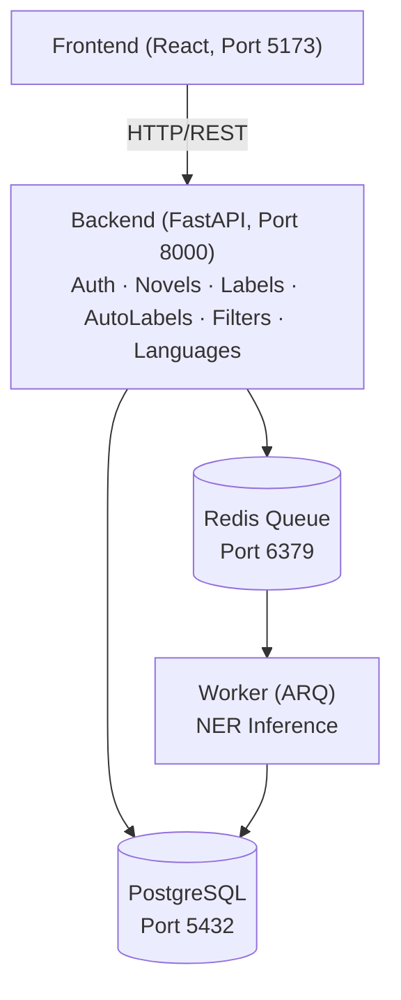
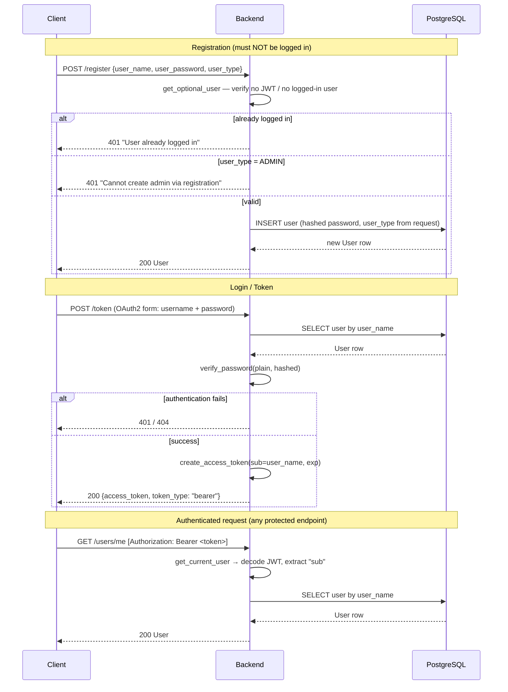
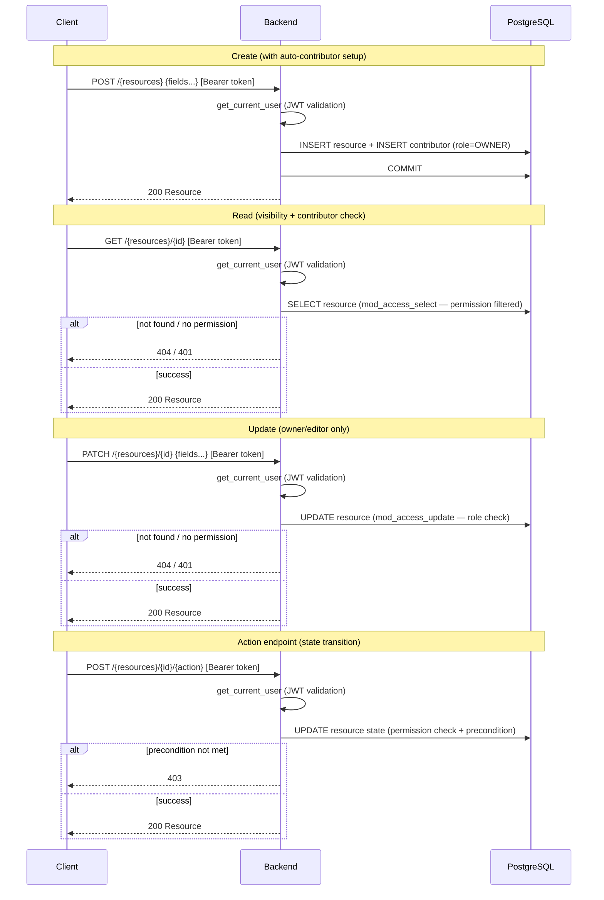

# System Architecture

**Last Updated**: March 20, 2026  
**Status**: Complete

This document describes the high-level architecture of NovelTL - a collaborative platform for novel translation using Named Entity Recognition (NER) and LLM-assisted workflows.

---

## Table of Contents

1. [Project Goals](#project-goals)
2. [Motivation](#motivation)
3. [System Architecture](#system-architecture)
4. [Service Descriptions](#service-descriptions)
5. [Communication Patterns](#communication-patterns)
6. [Deployment Architecture](#deployment-architecture)
7. [Security Architecture](#security-architecture)
8. [Data Flow Examples](#data-flow-examples)

---

## Project Goals

NovelTL provides tooling to assist in the following tasks:
- Store and organize documents to be translated
- Use Named Entity Recognition (NER) models to automatically label data from documents
- Provide a platform for users to manually add/edit labels (including those generated from NER)
- View statistics and aggregate data about labels for specific documents
- Use label data in translation software (e.g., LLMs) to ensure consistent translations

## Motivation

Large Language Models (LLMs) are effective for translating short documents, but face challenges with longer works like novels - specifically, maintaining consistency in translating character names, locations, and other named entities across hundreds of chapters.

To solve this problem, NovelTL provides:
1. **Automated entity detection** - NER models identify all named entities
2. **Human verification** - Users can review and correct labels
3. **Translation memory** - Glossaries ensure consistent entity translations
4. **LLM integration** - Feed verified entities to translation models

The project is tailored specifically to novel translations, which explains many of the naming conventions.

## System Architecture

### Microservices Overview

NovelTL is divided into distinct backend services:



### Technology Stack

**Backend:**
- **FastAPI** - Python web framework, async request handling
- **SQLAlchemy** - ORM for PostgreSQL interactions
- **Pydantic** - Data validation and settings management
- **Alembic** - Database migrations
- **ARQ** - Async Redis Queue for background tasks
- **PyTorch + Transformers** - NER model inference

**Frontend:**
- **React 19** - UI framework
- **React Router** - Client-side routing
- **React Hook Form** - Form state management and validation
- **Axios** - HTTP client
- **Vite** - Build tool and dev server

**Infrastructure:**
- **PostgreSQL** - Primary database
- **Redis** - Task queue and caching
- **Docker Compose** - Multi-container orchestration
- **Dev Containers** - Consistent development environment

## Service Descriptions

### 1. Auth Service

Handles user authentication and authorization.

**Responsibilities:**
- User registration and login
- JWT token generation and validation
- Password hashing (argon2)
- User type management (admin vs. user)

**User Types:**
- **Admin** - Full access to modify anything in database
- **User** - Restricted functionality based on permissions

### 2. Novels Service

Stores novel metadata and chapter content.

**Responsibilities:**
- Novel CRUD operations
- Chapter management with revision history
- Visibility levels (Private, Restricted, Unlisted, Public)
- Contributor management (Owner, Editor, Viewer)
- Parent-child relationships (e.g., translation links to original)

**Key Concepts:**
- **Novels** - Top-level containers
- **Chapters** - Chapter metadata (number, novel reference)
- **Revisions** - Immutable chapter content versions
- **Contributors** - Users with specific roles on novels

### 3. Labels Service

Manages manual and AI-generated entity labels.

**Responsibilities:**
- Label group management
- Label CRUD operations with position tracking
- Label contributor permissions
- Overlap detection (no overlapping labels per chapter)

**Key Concepts:**
- **Label Groups** - Collections of labels for a novel
- **Label Data** - Labels for a specific chapter revision
- **Labels** - Individual entity markers (word, position, type, score)

### 4. AutoLabels Service

Orchestrates background NER processing.

**Responsibilities:**
- Queue autolabel requests to Redis
- Track job status (PENDING → PROCESSING → DONE/FAILED)
- Cache results to avoid duplicate inference
- Rate limiting to prevent abuse

**Key Concepts:**
- **AutoLabel** - Stored NER inference result
- **Job ID** - Unique identifier for optimistic locking
- **State Machine** - PENDING, PROCESSING, DONE, FAILED

See [background-jobs.md](background-jobs.md) for detailed implementation.

### 5. Filters Service

Provides extensible label processing framework.

**Responsibilities:**
- Flag label instances for review
- Retrieve context around labels
- Automated decision-making (or manual review)
- Apply filter operations to label groups

**Key Concepts:**
- **Filter Pipeline** - 4-phase processing (flag, context, decide, apply)
- **Score Filter** - Remove low-confidence labels
- **Future Filters** - Merge, split, deduplication

See [filter-system.md](filter-system.md) for detailed implementation.

### 6. Languages Service

Manages supported languages for novels.

**Responsibilities:**
- Language code management (ISO 639-1)
- Language metadata storage

## Communication Patterns

### Client ↔ Backend

- **Protocol**: HTTP/REST
- **Authentication**: JWT Bearer tokens
- **Data Format**: JSON
- **API Docs**: OpenAPI/Swagger (automatic via FastAPI)

### Backend ↔ Database

- **ORM**: SQLAlchemy (async-capable)
- **Connection Pool**: Managed by SQLAlchemy engine
- **Transactions**: Service layer manages commit/rollback

### Backend ↔ Worker

- **Queue**: Redis (ARQ framework)
- **Pattern**: Producer-consumer
- **Job Format**: Serialized task parameters
- **Failure Handling**: Retry logic, error logging

### Worker ↔ Database

- **Direct Connection**: Worker has own SQLAlchemy session
- **Isolation**: Separate session per task
- **Locking**: Optimistic locking via job IDs

## Deployment Architecture

### Development (Docker Compose)

```yaml
services:
  dev:         # Development container with code mounted
  db:          # PostgreSQL database
  test_db:     # Separate PostgreSQL for tests
  redis:       # Redis for task queue
  worker:      # Background NER worker
  backend:     # FastAPI server
  frontend:    # Vite dev server (separate in practice)
```

### Production Considerations

Production deployment is not currently in scope. Placeholder ideas for future reference:

- **Horizontal Scaling**: Multiple backend/worker instances behind load balancer
- **Database**: Managed PostgreSQL (e.g., AWS RDS, Google Cloud SQL)
- **Redis**: Managed Redis (e.g., ElastiCache, Google Memorystore)
- **Static Assets**: CDN for frontend build
- **Monitoring**: Prometheus + Grafana
- **Logging**: Centralized logging (e.g., ELK stack)

## Security Architecture

### Authentication Flow

1. User sends credentials to `/token` endpoint
2. Backend validates credentials, generates JWT
3. Client stores JWT in localStorage
4. Client includes JWT in `Authorization` header for all requests
5. Backend validates JWT on each request

### Authorization Patterns

- **Novel Access**: Visibility level + contributor check
- **Label Access**: Label group contributors
- **Admin Bypass**: Admins can access most resources

See [permissions.md](permissions.md) for detailed access control.

## Data Flow Examples

### Authentication



### Typical Resource CRUD Pattern

Most services follow the same pattern. The diagram below shows the generic flow — specific permission helpers and error branches vary by resource. Not all read/update/delete endpoints are shown; see [api-design.md](api-design.md) for the full endpoint catalog.



Resources following this pattern: **Novels**, **Chapters**, **Revisions** (with publish/make-primary/finalize actions), **Label Groups**, **Label Data**, **Users** (admin CRUD).

**Languages** are simpler: seeded via script, exposed as public read-only endpoints (no auth required).

### Specialized Flows

These flows have unique patterns documented in their respective docs:

- **AutoLabel creation + background worker lifecycle** — See [background-jobs.md](background-jobs.md)
- **Filter pipeline (flag → context → decide → apply)** — See [filter-system.md](filter-system.md)
- **Label stream operations (PATCH /label-datas/{id})** — Applies per-operation permission checks (`label_mod_access_insert/update/delete`); see [api-design.md](api-design.md)

## Relevant Files

- `backend/src/main.py` - FastAPI application entry point
- `backend/src/config.py` - Configuration settings
- `backend/src/database.py` - Database connection setup
- `backend/src/auth/` - Authentication service
- `backend/src/novels/` - Novels service
- `backend/src/labels/` - Labels service
- `backend/src/autolabels/` - AutoLabels service
- `backend/src/filters/` - Filters service
- `backend/src/languages/` - Languages service
- `compose.yaml` - Docker Compose service definitions
- `frontend/src/` - React frontend application

## See Also

- [database-schema.md](database-schema.md) - Detailed database models and relationships
- [api-design.md](api-design.md) - REST API patterns and conventions
- [permissions.md](permissions.md) - Access control and visibility system
- [sourcework-model.md](sourcework-model.md) - Planned SourceWork grouping model and permission boundaries
- [background-jobs.md](background-jobs.md) - AutoLabel worker implementation
- [filter-system.md](filter-system.md) - Filter abstraction and pipeline
