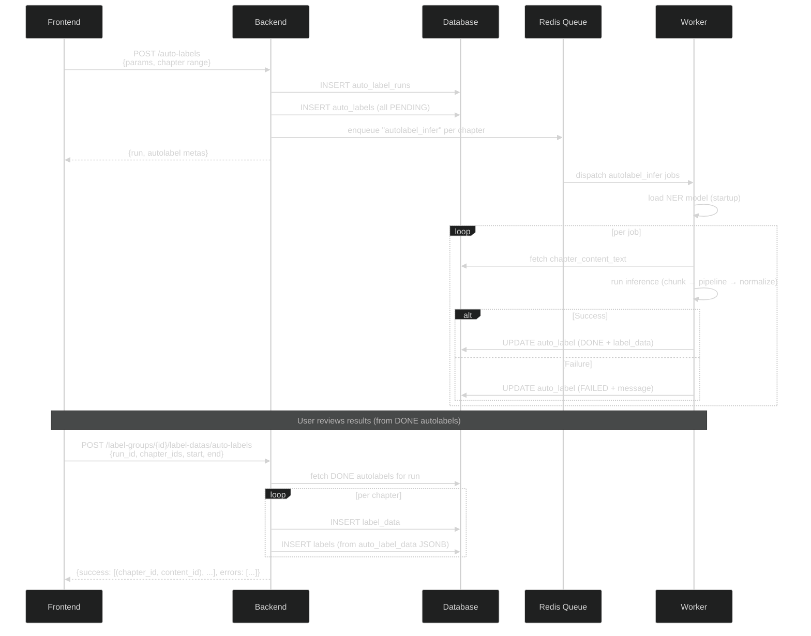

# Autolabels

**Last updated:** 2026-07-06

This document describes the autolabel service: the backend NER inference pipeline, the frontend UI for creating and managing autolabel runs, and how the frontend integrates with the controller ecosystem.

## Overview

The autolabel service runs named entity recognition (NER) models against novel chapters and stores the detected entities as autolabel data. Users can review the results and promote accepted autolabels into a label group, where they become regular labels in the chapter editor.

The backend handles model inference via a background worker queue. The frontend provides a UI panel within the [editor](editor/README.md) for creating runs, monitoring progress, and promoting results.

## Backend architecture

See [backend/src/autolabels/](../backend/src/autolabels/) for the implementation.

### Data flow



### Database models

- **`auto_label_runs`** — a batch of autolabel work. Fields: `run_id`, `novel_id`, `triggered_by`, `model_name`, `model_params` (JSONB).
- **`auto_labels`** — one per chapter content in a run. Fields: `auto_label_id`, `auto_label_status` (PENDING/PROCESSING/DONE/FAILED), `auto_label_data` (JSONB — list of label objects), `chapter_content_id`, `run_id`. Unique on `(chapter_content_id, run_id)`.

### API endpoints

| Method | Path | Purpose |
|--------|------|---------|
| `GET` | `/auto-label-runs?novelId=&mine=` | List runs for a novel |
| `GET` | `/auto-label-runs/{runId}/auto-labels?start=&end=` | List autolabel metadata for a run |
| `GET` | `/auto-labels/{autoLabelId}` | Get single autolabel with full label data |
| `POST` | `/auto-labels` | Create a run and dispatch workers |
| `POST` | `/label-groups/{labelGroupId}/label-datas/auto-labels` | Promote autolabels to labels |

## Frontend architecture

The autolabel frontend lives within the editor's layered architecture (Controller → Managers → Hooks → Panels). See [the editor docs](editor/README.md) for the overall architecture.

### Controller integration

Autolabels need several operations through the controller's request lifecycle (idempotency keys, retries, reservation management):

**User events:**

| Event | Payload | What happens |
|-------|---------|-------------|
| `createAutoLabelRun` | `{ params, chapterFilter }` | Creates a new run on the backend and dispatches workers. The controller publishes `autoLabelRunCreated` with the new run data when the response arrives. |
| `refreshAutoLabelRuns` | `{}` | Reloads the full run list from the server, replacing the local index. The controller publishes `autoLabelRunsRefreshed`. |
| `reloadAutoLabelRun` | `{ runId }` | Reloads autolabel metadata for a single run (per-chapter statuses, chapter IDs, error messages). The controller publishes `autoLabelRunReloaded`. |
| `loadAutoLabelData` | `{ autoLabelId }` | Fetches a single autolabel's full label data payload from the server. The controller publishes `autoLabelDataLoaded`. |
| `promoteAutoLabelRun` | `{ runId, labelGroupId, chapterFilter }` | Promotes autolabel results into a label group. Creates `LabelData` + `Label` entries server-side. The controller publishes `autoLabelRunPromoted` so the label group manager reloads and the autolabel manager updates UI. |

**Trigger events:**

| Trigger | Payload | Consumers |
|---------|---------|-----------|
| `autoLabelRunCreated` | `{ run, autoLabels }` | `autolabelManager` → updates hook with new run |
| `autoLabelRunsRefreshed` | `{}` | `autolabelManager` → replaces the run list in hook state |
| `autoLabelRunReloaded` | `{ runId }` | `autolabelManager` → reads updated autolabel metadata from DM getters, re-evaluates match/preview state |
| `autoLabelDataLoaded` | `{ autoLabelId }` | `autolabelManager` → reads label data from DM getters, populates `autolabelPreviews` |
| `autoLabelRunPromoted` | `{ runId, labelGroupId, chapterFilter, success: [...], errors: [...] }` | `labelGroupManager` → reloads label data for the promoted group; `autolabelManager` → clears promotion state, restores editor mode |

**Trigger events consumed by `autolabelManager`:**

`handleControllerEvent` reacts to: `autoLabelRunCreated`, `autoLabelRunsRefreshed`, `autoLabelRunReloaded`, `autoLabelDataLoaded`, `autoLabelRunPromoted`, `textChanged`, `chapterOpened`, and `errorOccured`.

On `textChanged` and `chapterOpened`: the manager re-evaluates whether the current chapter still matches the selected run's autolabel. If the selected run no longer matches (different `chapterContentId`), the preview layer is cleared. If it now matches, the manager fires `loadAutoLabelData` for the matching autolabel.

On `errorOccured`: the manager resets any in-flight loading/promotion state and restores editor mode.

**ID repository:**

Autolabel runs use the `autoLabelRun` kind (an `IdentifiableKind`). Individual autolabels use the `autoLabel` kind and are individually tracked in the data manager via `AutoLabelIndex`, keyed by `AProvId`. Autolabel metadata is stored in run-level `Slot` data; label data payloads are stored in the per-autolabel slot's data field and loaded on demand.

**Reservations:**

| Operation | Reservations | Notes |
|-----------|-------------|-------|
| `createAutoLabelRun` | `[chapterContent, "locked"]` (for each matching chapter) | Locks chapter content to prevent concurrent text edits while the run is being created. The run ID itself is allocated inside `postSend`. On failure, autolabel IDs are detached and the run index entry is removed. |
| `refreshAutoLabelRuns` | `[autoLabelRun, "locked"]` (all currently-indexed runs) | Prevents concurrent promote/reload during snapshot refresh. |
| `reloadAutoLabelRun` | Phase 1: `[autoLabelRun, "locked"]`. Phase 2: `[autoLabel, "detaching"/"killing"]` (old autolabels, if any). | Two-phase: load new metadata, then detach old IDs. Follows the `reloadGroup` pattern. |
| `loadAutoLabelData` | `[autoLabelRun, "locked"]`, `[autoLabel, "locked"]` | Locks both the parent run and the autolabel while fetching label data. |
| `promoteAutoLabelRun` | `[labelGroup, "updating"]`, `[autoLabelRun, "locked"]`, `[chapterContent, "locked"]` (each in chapter filter) | Prevents concurrent label edits and text edits during promotion. Pending label ops for the group are flushed before the request. |

### State management

**`useAutoLabelState` hook** (pure state — no API calls):

| Field | Purpose |
|-------|---------|
| `runs` | List of `AutoLabelRunView` objects. Each run includes: run metadata (ID, model, creation time), an overall status derived from individual autolabels (see below), the full list of individual autolabels (per-chapter status, chapter content ID, chapter ID, error messages), and a `loading` flag. |
| `selectedRunId` | Currently selected run from the accordion (`ALRProvId \| null`) |
| `autolabelPreviews` | Per-chapter-content-ID map of `LabelBase[]` for rendering in CodeMirror. Only populated for the current chapter when it matches the selected run. Deferred to later implementation. |
| `refreshing` / `promoting` | Loading booleans for the global refresh and promote operations. Rendered by the panel as disabled/shimmer states. |
| `chapterMatchMap` | Per-run map of chapter ID to `"match"` / `"outdated"` status, used by the right-panel run list. |

Match/outdated status is displayed in the right-panel run UI, not in the left chapter list. `autolabelManager` rebuilds `chapterMatchMap` from run autolabel metadata and the currently loaded chapter content IDs when run metadata changes, chapters open, or text changes.

**Run overall status** (derived from individual autolabel statuses):

| Condition | Overall status |
|-----------|---------------|
| At least one autolabel is PROCESSING | `PROCESSING` |
| No PROCESSING, at least one PENDING | `PENDING` |
| All DONE | `DONE` |
| All FAILED | `FAILED` |
| Mix of DONE and FAILED, rest DONE | `DONE` (run completed, partial success) |

**`autolabelManager`** (stateless adapter):

| Method | Direction | Purpose |
|--------|-----------|---------|
| `createRun(params, filter)` | → controller | Sends `createAutoLabelRun` user event |
| `selectRun(runId)` | → controller, then → hook | Sets `selectedRunId`, fires `reloadAutoLabelRun` user event. On `autoLabelRunReloaded` trigger: if the current chapter is open and a matching autolabel exists whose label data is not yet loaded, fires `loadAutoLabelData`. On `autoLabelDataLoaded`: populates `autolabelPreviews`. |
| `deselectRun()` | → hook | Clears `selectedRunId` and `autolabelPreviews`. Match indicators remain available in the run list but no run is active. |
| `promote(runId, labelGroupId, filter)` | → controller | Sets editor to view mode, sends `promoteAutoLabelRun` user event. On response, restores previous mode. |
| `refreshAllRuns()` | → controller | Fires `refreshAutoLabelRuns` user event. Also called on a 30s polling interval. |
| `reloadRun(runId)` | → controller | Fires `reloadAutoLabelRun` user event (used by per-run [↻] button). |
| `handleControllerEvent(event)` | ← controller | Reacts to `autoLabelRunCreated`, `autoLabelRunsRefreshed`, `autoLabelRunReloaded`, `autoLabelDataLoaded`, `autoLabelRunPromoted`, `textChanged`, `chapterOpened`, and `errorOccured`. |

### Editor integration

**Inline autolabel rendering:**

When a run is selected and the current chapter has a matching autolabel (same `chapterContentId`), the detected labels are rendered as a second decoration layer in CodeMirror with lighter styling, distinct from the colored-background regular labels. The autolabel preview data is maintained in `useAutoLabelState.autolabelPreviews` and passed to `CodeMirrorEditor` as a separate prop — it does not go through the SegmentManager. The preview clears when:
- The run is deselected
- A different run is selected
- A `textChanged` trigger fires and the current chapter content ID no longer matches the autolabel's

**Run list match indicators:**

The right-panel run list shows match/outdated indicators computed from each run's autolabel metadata and the current chapter content IDs:

| Indicator | Meaning |
|-----------|---------|
| Green dot (•) | An autolabel exists for the current chapter content version (IDs match exactly) |
| Yellow dot (○) / `(outdated)` | An autolabel exists for this chapter but references an older content version (text was edited since the run) |
| None | No autolabel exists for this chapter in the run |

The autolabel metadata includes `chapterId` alongside `chapterContentId`, returned by the `GET /auto-label-runs/{runId}/auto-labels` endpoint as `AutoLabelMetaWithCid` (a wrapper containing `autoLabelMeta: AutoLabelMeta` and `chapterId: UUID`).

**Promotion mode lock:**

During promotion, the editor is forced into view mode (editing and labeling disabled) until the response returns. The previous mode is restored afterward.

## UI specification

The autolabel UI lives in the editor's RightPanel, replacing the existing placeholder. It has three sections from top to bottom.

### Create Auto Labels section (top, inline)

```
┌─────────────────────────────────┐
│ Create Auto Labels              │
│                                 │
│ Model: [Select a model...  ▼]   │
│ Chapters: [  _  ] – [  _  ]    │  ← empty = all chapters
│                                 │
│ ▶ Advanced Settings  (disabled) │  ← collapsed, no model selected
│                                 │
│              [Cancel]  [Create] │
└─────────────────────────────────┘
```

**After selecting cluener:**

```
┌─────────────────────────────────┐
│ Create Auto Labels              │
│                                 │
│ Model: [cluener             ▼]  │
│ Chapters: [  1  ] – [ 50  ]    │
│                                 │
│ ▼ Advanced Settings             │
│   ┌───────────────────────────┐ │
│   │ Chunk Size:     [500]     │ │
│   │ Force Chunk:    [✓]       │ │
│   │ Separators:               │ │
│   │   [\n]  [HIGH  ▼]  [–]   │ │
│   │   [。]  [MED   ▼]  [–]   │ │
│   │   [，]  [LOW   ▼]  [–]   │ │
│   │               [+ Add]     │ │
│   └───────────────────────────┘ │
│                                 │
│              [Cancel]  [Create] │
└─────────────────────────────────┘
```

- **Model dropdown** — selects the NER model. When no model is selected, the Advanced Settings accordion is collapsed and unclickable.
- **Chapter range inputs** — start and end chapter numbers, blank means all chapters. The data manager maps chapter numbers to server chapter IDs before sending.
- **Advanced Settings accordion** — expands when a model is selected. Renders model-specific parameters from a schema-driven form. For cluener: chunk size, force chunk toggle, separator priority configuration (key + priority dropdown + remove button, with add button for new separators).
- **Confirm** — sends `createAutoLabelRun` user event to the controller.
- **Cancel** — clears the form.

### Run accordion list (middle)

```
┌─────────────────────────────────┐
│ Runs               [Reload All] │  ← global reload
│                                 │
│ ▶ Run #1 (cluener)          [↻] │  ← collapsed, processing; per-run reload
│   2/5 done · PROCESSING · 1h ago │
│                                 │
│ ▼ Run #2 (cluener)      • [↻]   │  ← expanded + selected, green dot
│   5/5 done · DONE · 3h ago      │     = current chapter content matches
│   Ch 1: DONE     ✓              │
│   Ch 2: DONE     ✓              │  ← current chapter: render labels
│   Ch 3: DONE     ✓              │     inline in CodeMirror (lighter)
│   Ch 4: FAILED   (chunk err)    │
│   Ch 5: FAILED   (timeout)      │  ← some DONE, some FAILED → overall DONE
│                                 │
│ ▶ Run #3 (do_nothing)    ○ [↻]  │  ← collapsed, yellow dot = outdated
│   3/10 done · DONE · 2d ago     │     (same chapter, older content version)
│                                 │
│ ▶ Run #4 (cluener)         [↻]  │  ← collapsed, all failed
│   0/3 done · FAILED · 5m ago    │
└─────────────────────────────────┘
```

A `[Reload All]` button at the top refreshes the entire run list and all per-run autolabel data. Each run also has a per-run `[↻]` reload button that fetches that run's autolabel statuses individually.

Each run header shows:
- **Model name**, **progress badge** (color-coded by overall status using the derivation rules above), **progress count** (DONE / total), **creation time**
- **Green dot (•)** — the currently open chapter's content version has a matching autolabel in this run
- **Yellow dot (○)** — an autolabel exists for the current chapter but for an older content version (text was edited since the run)

When **expanded**, the run shows a chapter status list. Each row: chapter number, status badge, and error message if failed. The DONE checkmark (✓) indicates chapters whose labels can be previewed.

**Selection behavior:**
- Clicking a run selects it: expands the accordion and renders autolabel labels inline in CodeMirror with lighter styling (a second decoration layer). At most one run is active.
- Clicking the already-selected run deselects it — the accordion collapses and the inline overlay clears.
- Editing text fires `textChanged` → `autolabelManager` recalculates match/outdated status. If the selected run no longer matches, the preview layer is cleared and the dot changes from green to yellow.

### Promote section (bottom, always visible)

```
┌─────────────────────────────────┐
│ Promote                         │
│                                 │
│ [Run #2 ▼]  →  [Characters ▼]  │  ← run → label group, synced with
│                                 │     accordion selection
│ Chapters: [  1  ] – [  5  ]    │
│                                 │
│              [Promote]           │
└─────────────────────────────────┘
```

**During promotion:**

```
┌─────────────────────────────────┐
│ Promote                         │
│                                 │
│ [Run #2 ▼]  →  [Characters ▼]  │
│ Chapters: [  1  ] – [  5  ]    │
│                                 │
│         [Promoting...]          │  ← disabled, editor locked
└─────────────────────────────────┘
```

- **Run dropdown** — selects which run to promote from. Synced with the accordion selection: changing it selects the corresponding run in the accordion (and vice versa).
- **Arrow (→)** — visual direction indicator: "from run → into label group."
- **Label group dropdown** — target group to promote into. Defaults to the currently active label group (read from `useTrackedLabelGroups`). Changing it calls `labelGroupManager.setActive`, so the editor immediately switches to show that group's labels. After promotion, the newly imported labels appear in the active group.
- **Chapter range** — filters which chapters from the run to promote.
- **Promote button** — sets editor mode to view (blocking edits and labeling), sends `promoteAutoLabelRun` user event. On response: `autoLabelRunPromoted` trigger fires, `labelGroupManager` reloads the promoted group, previous mode is restored.

The chapter range inputs in the Promote section are owned by the panel as local React state, not stored in the hook.

### Schema-driven params form

Model parameters are rendered from a schema. The effect schemas defined in the generated API client provide the parameter structure. The form dynamically renders fields based on the selected model's parameter type (discriminated union on `model_name`). Implementation approach to be determined — may use `@rjsf/core` + `@rjsf/shadcn` with JSON schemas extracted from the backend OpenAPI spec, or a custom renderer consuming effect schema metadata.
