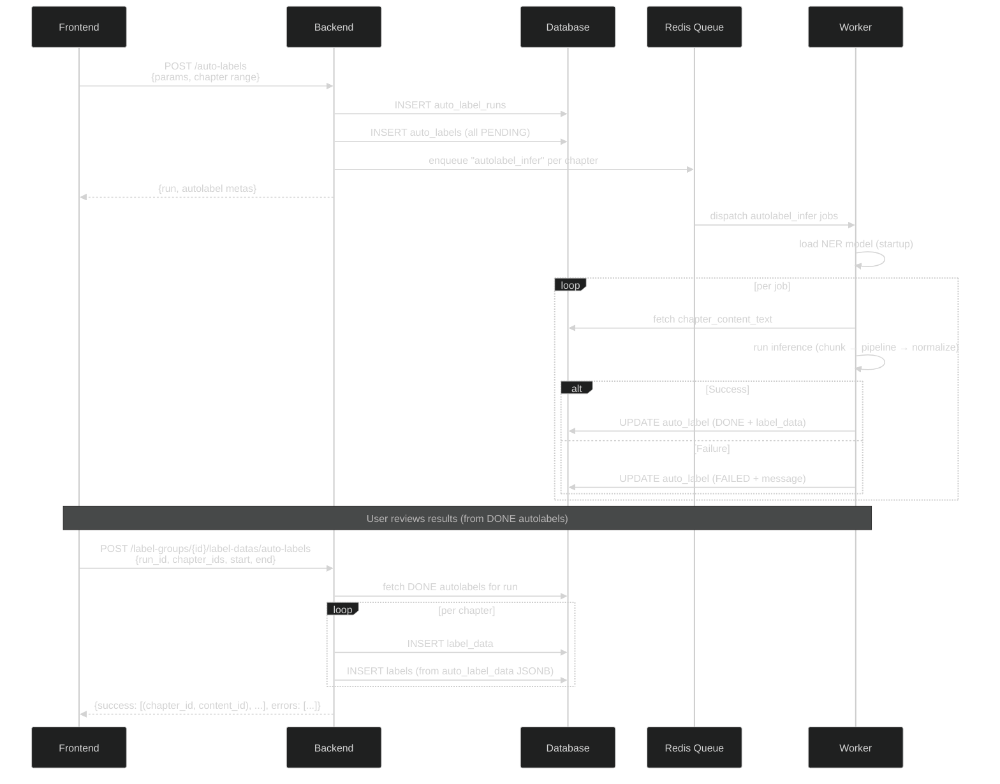

# Autolabels

**Last updated:** 2026-07-04

This document describes the autolabel service: the backend NER inference pipeline, the frontend UI for creating and managing autolabel runs, and how the frontend integrates with the controller ecosystem.

## Overview

The autolabel service runs named entity recognition (NER) models against novel chapters and stores the detected entities as autolabel data. Users can review the results and promote accepted autolabels into a label group, where they become regular labels in the chapter editor.

The backend handles model inference via a background worker queue. The frontend provides a UI panel within the [editor](editor/README.md) for creating runs, monitoring progress, and promoting results.

## Backend architecture

See [backend/src/autolabels/](../backend/src/autolabels/) for the implementation.

### Data flow



### Database models

- **`auto_label_runs`** — a batch of autolabel work. Fields: `run_id`, `novel_id`, `triggered_by`, `model_name`, `model_params` (JSONB).
- **`auto_labels`** — one per chapter content in a run. Fields: `auto_label_id`, `auto_label_status` (PENDING/PROCESSING/DONE/FAILED), `auto_label_data` (JSONB — list of label objects), `chapter_content_id`, `run_id`. Unique on `(chapter_content_id, run_id)`.

### API endpoints

| Method | Path | Purpose |
|--------|------|---------|
| `GET` | `/auto-label-runs?novelId=&mine=` | List runs for a novel |
| `GET` | `/auto-label-runs/{runId}/auto-labels?start=&end=` | List autolabel metadata for a run |
| `GET` | `/auto-labels/{autoLabelId}` | Get single autolabel with full label data |
| `POST` | `/auto-labels` | Create a run and dispatch workers |
| `POST` | `/label-groups/{labelGroupId}/label-datas/auto-labels` | Promote autolabels to labels |

## Frontend architecture

The autolabel frontend lives within the editor's layered architecture (Controller → Managers → Hooks → Panels). See [the editor docs](editor/README.md) for the overall architecture.

### Controller integration

Autolabels need two operations through the controller's request lifecycle (idempotency keys, retries, reservation management):

**User events:**

| Event | Payload | What happens |
|-------|---------|-------------|
| `createAutoLabelRun` | `{ params, chapterFilter, isPublic? }` | Creates a new run on the backend and dispatches workers. The controller publishes `autoLabelRunCreated` with the new run data when the response arrives. |
| `promoteAutoLabels` | `{ runProvId, labelGroupProvId, chapterFilter }` | Promotes autolabel results into a label group. Creates `LabelData` + `Label` entries server-side. The controller publishes `autoLabelsPromoted` so the label group manager reloads and the autolabel manager updates UI. |

**Trigger events:**

| Trigger | Payload | Consumers |
|---------|---------|-----------|
| `autoLabelRunCreated` | `{ runProvId, run }` | `autolabelManager` → updates hook with new run |
| `autoLabelsPromoted` | `{ runProvId, labelGroupProvId, successCount, errorCount }` | `labelGroupManager` → reloads label data for the promoted group; `autolabelManager` → updates UI |

**Trigger events consumed by `autolabelManager`:**

In addition to its own triggers, `autolabelManager.handleControllerEvent` also listens for `textChanged` from the controller. On a text change: the manager recalculates per-run match/outdated statuses for the current chapter (since the chapter content ID has changed), clears the autolabel preview layer if the selected run no longer matches, and updates the green/outdated dot indicators in the chapter list.

**Backend API changes needed:**

The `GET /auto-label-runs/{runId}/auto-labels` endpoint currently returns `AutoLabelMeta` which includes `chapterContentId` but not `chapterId`. To distinguish a **match** (same chapter content version) from **outdated** (same chapter, different content version after text edits), the endpoint must also return the chapter ID for each autolabel. This requires joining through `chapter_contents` → `chapters` on the backend.

**ID repository:**

Autolabel runs use the `autoLabelRun` kind (an `IdentifiableKind`). Individual autolabels use the `autoLabel` kind but are not individually tracked by the data manager — their metadata is stored as raw data on the run entry.

**Reservations:**

| Operation | Reservations | Notes |
|-----------|-------------|-------|
| `createAutoLabelRun` | `[autoLabelRun, "creating"]` | Pure creation, no existing resources touched |
| `promoteAutoLabels` | `[labelGroup, "locked"]`, `[autoLabelRun, "locked"]` | Prevents concurrent label edits during promotion. Pending label ops for the group are flushed before the request. |

### State management

**`useAutoLabelState` hook** (pure state — no API calls):

| Field | Purpose |
|-------|---------|
| `runs` | List of `AutoLabelRunView` objects. Each run includes: run metadata (ID, model, creation time), an overall status derived from individual autolabels (see below), and the full list of individual autolabels (per-chapter status, chapter content ID, chapter ID, error messages). |
| `selectedRunId` | Currently selected run from the accordion (`ALRProvId \| null`) |
| `autolabelPreviews` | Per-chapter-content-ID map of `LabelBase[]` for rendering in CodeMirror. Only populated for the current chapter when it matches the selected run. |
| `chapterMatchMap` | Per-run map of chapter number → match status: `"match"` (content ID matches), `"outdated"` (same chapter, older content version), or absent (no autolabel). Drives the green/outdated dots in the chapter list. |
| `promotionChapterFilter` | Chapter range filter for the promote form |

**Run overall status** (derived from individual autolabel statuses):

| Condition | Overall status |
|-----------|---------------|
| At least one autolabel is PROCESSING | `PROCESSING` |
| No PROCESSING, at least one PENDING | `PENDING` |
| All DONE | `DONE` |
| All FAILED | `FAILED` |
| Mix of DONE and FAILED, rest DONE | `DONE` (run completed, partial success) |

**`autolabelManager`** (stateless adapter):

| Method | Direction | Purpose |
|--------|-----------|---------|
| `createRun(params, filter)` | → controller | Sends `createAutoLabelRun` user event |
| `selectRun(runId)` | → hook | Sets `selectedRunId`, fetches autolabel data for current chapter, populates `autolabelPreviews` and `chapterMatchMap` |
| `deselectRun()` | → hook | Clears `selectedRunId`, `autolabelPreviews`, `chapterMatchMap` |
| `promote(runId, labelGroupId, filter)` | → controller | Sends `promoteAutoLabels` user event |
| `refreshAllRuns()` | → hook | Fetches full run list and statuses from API (manual + 30s polling) |
| `reloadRun(runId)` | → hook | Fetches individual autolabel statuses for a single run on demand |
| `handleControllerEvent(event)` | ← controller | Reacts to `autoLabelRunCreated`, `autoLabelsPromoted`, and `textChanged` |

### Editor integration

**Inline autolabel rendering:**

When a run is selected and the current chapter has a matching autolabel (same `chapterContentId`), the detected labels are rendered as a second decoration layer in CodeMirror with lighter styling, distinct from the colored-background regular labels. The autolabel preview data is maintained in `useAutoLabelState.autolabelPreviews` and passed to `CodeMirrorEditor` as a separate prop — it does not go through the SegmentManager. The preview clears when:
- The run is deselected
- A different run is selected
- A `textChanged` trigger fires and the current chapter content ID no longer matches the autolabel's

**Chapter list match indicators:**

When a run is selected, the chapter list in the LeftPanel shows per-chapter indicators driven by `chapterMatchMap`:

| Indicator | Meaning |
|-----------|---------|
| Green dot (•) | An autolabel exists for the current chapter content version (IDs match exactly) |
| Yellow dot (○) / `(outdated)` | An autolabel exists for this chapter but references an older content version (text was edited since the run) |
| None | No autolabel exists for this chapter in the selected run |

This mapping requires the backend to include the `chapterId` alongside `chapterContentId` in autolabel metadata (see backend API changes above).

**Promotion mode lock:**

During promotion, the editor is forced into view mode (editing and labeling disabled) until the response returns. The previous mode is restored afterward.

## UI specification

The autolabel UI lives in the editor's RightPanel, replacing the existing placeholder. It has three sections from top to bottom.

### Create Auto Labels section (top, inline)

```
┌─────────────────────────────────┐
│ Create Auto Labels              │
│                                 │
│ Model: [Select a model...  ▼]   │
│ Chapters: [  _  ] – [  _  ]    │  ← empty = all chapters
│                                 │
│ ▶ Advanced Settings  (disabled) │  ← collapsed, no model selected
│                                 │
│              [Cancel]  [Create] │
└─────────────────────────────────┘
```

**After selecting cluener:**

```
┌─────────────────────────────────┐
│ Create Auto Labels              │
│                                 │
│ Model: [cluener             ▼]  │
│ Chapters: [  1  ] – [ 50  ]    │
│                                 │
│ ▼ Advanced Settings             │
│   ┌───────────────────────────┐ │
│   │ Chunk Size:     [500]     │ │
│   │ Force Chunk:    [✓]       │ │
│   │ Separators:               │ │
│   │   [\n]  [HIGH  ▼]  [–]   │ │
│   │   [。]  [MED   ▼]  [–]   │ │
│   │   [，]  [LOW   ▼]  [–]   │ │
│   │               [+ Add]     │ │
│   └───────────────────────────┘ │
│                                 │
│              [Cancel]  [Create] │
└─────────────────────────────────┘
```

- **Model dropdown** — selects the NER model. When no model is selected, the Advanced Settings accordion is collapsed and unclickable.
- **Chapter range inputs** — start and end chapter numbers, blank means all chapters. The data manager maps chapter numbers to server chapter IDs before sending.
- **Advanced Settings accordion** — expands when a model is selected. Renders model-specific parameters from a schema-driven form. For cluener: chunk size, force chunk toggle, separator priority configuration (key + priority dropdown + remove button, with add button for new separators).
- **Confirm** — sends `createAutoLabelRun` user event to the controller.
- **Cancel** — clears the form.

### Run accordion list (middle)

```
┌─────────────────────────────────┐
│ Runs               [Reload All] │  ← global reload
│                                 │
│ ▶ Run #1 (cluener)          [↻] │  ← collapsed, processing; per-run reload
│   2/5 done · PROCESSING · 1h ago │
│                                 │
│ ▼ Run #2 (cluener)      • [↻]   │  ← expanded + selected, green dot
│   5/5 done · DONE · 3h ago      │     = current chapter content matches
│   Ch 1: DONE     ✓              │
│   Ch 2: DONE     ✓              │  ← current chapter: render labels
│   Ch 3: DONE     ✓              │     inline in CodeMirror (lighter)
│   Ch 4: FAILED   (chunk err)    │
│   Ch 5: FAILED   (timeout)      │  ← some DONE, some FAILED → overall DONE
│                                 │
│ ▶ Run #3 (do_nothing)    ○ [↻]  │  ← collapsed, yellow dot = outdated
│   3/10 done · DONE · 2d ago     │     (same chapter, older content version)
│                                 │
│ ▶ Run #4 (cluener)         [↻]  │  ← collapsed, all failed
│   0/3 done · FAILED · 5m ago    │
└─────────────────────────────────┘
```

A `[Reload All]` button at the top refreshes the entire run list and all per-run autolabel data. Each run also has a per-run `[↻]` reload button that fetches that run's autolabel statuses individually.

Each run header shows:
- **Model name**, **progress badge** (color-coded by overall status using the derivation rules above), **progress count** (DONE / total), **creation time**
- **Green dot (•)** — the currently open chapter's content version has a matching autolabel in this run
- **Yellow dot (○)** — an autolabel exists for the current chapter but for an older content version (text was edited since the run)

When **expanded**, the run shows a chapter status list. Each row: chapter number, status badge, and error message if failed. The DONE checkmark (✓) indicates chapters whose labels can be previewed.

**Selection behavior:**
- Clicking a run selects it: expands the accordion and renders autolabel labels inline in CodeMirror with lighter styling (a second decoration layer). At most one run is active.
- Clicking the already-selected run deselects it — the accordion collapses and the inline overlay clears.
- Editing text fires `textChanged` → `autolabelManager` recalculates match/outdated status. If the selected run no longer matches, the preview layer is cleared and the dot changes from green to yellow.

### Promote section (bottom, always visible)

```
┌─────────────────────────────────┐
│ Promote                         │
│                                 │
│ [Run #2 ▼]  →  [Characters ▼]  │  ← run → label group, synced with
│                                 │     accordion selection
│ Chapters: [  1  ] – [  5  ]    │
│                                 │
│              [Promote]           │
└─────────────────────────────────┘
```

**During promotion:**

```
┌─────────────────────────────────┐
│ Promote                         │
│                                 │
│ [Run #2 ▼]  →  [Characters ▼]  │
│ Chapters: [  1  ] – [  5  ]    │
│                                 │
│         [Promoting...]          │  ← disabled, editor locked
└─────────────────────────────────┘
```

- **Run dropdown** — selects which run to promote from. Synced with the accordion selection: changing it selects the corresponding run in the accordion (and vice versa).
- **Arrow (→)** — visual direction indicator: "from run → into label group."
- **Label group dropdown** — target group to promote into. Defaults to the currently active label group (read from `useTrackedLabelGroups`). Changing it calls `labelGroupManager.setActive`, so the editor immediately switches to show that group's labels. After promotion, the newly imported labels appear in the active group.
- **Chapter range** — filters which chapters from the run to promote.
- **Promote button** — sets editor mode to view (blocking edits and labeling), sends `promoteAutoLabels` user event. On response: `autoLabelsPromoted` trigger fires, `labelGroupManager` reloads the promoted group, previous mode is restored.

### Schema-driven params form

Model parameters are rendered from a schema. The effect schemas defined in the generated API client provide the parameter structure. The form dynamically renders fields based on the selected model's parameter type (discriminated union on `model_name`). Implementation approach to be determined — may use `@rjsf/core` + `@rjsf/shadcn` with JSON schemas extracted from the backend OpenAPI spec, or a custom renderer consuming effect schema metadata.
