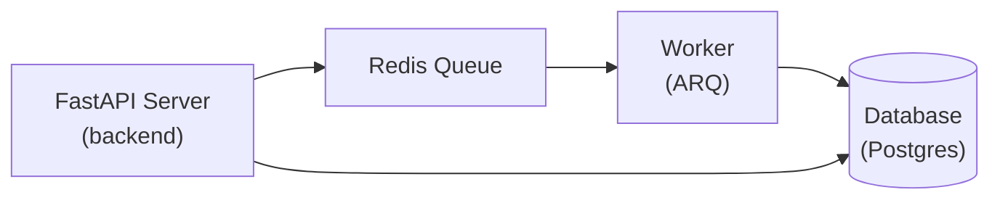
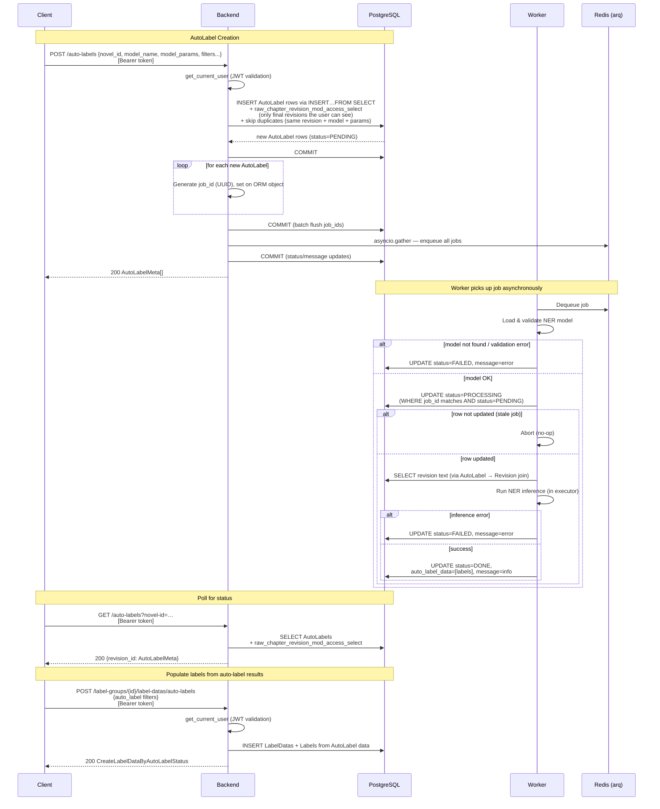
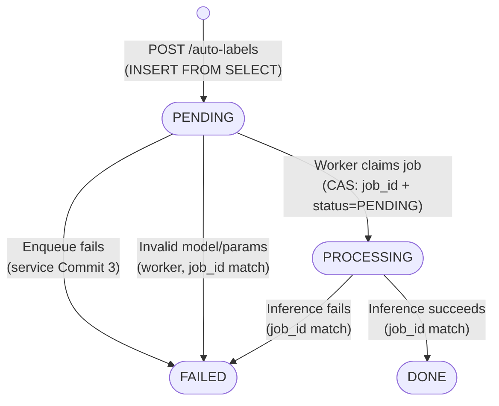

# Background Jobs System

**Last Updated**: March 7, 2026  
**Status**: Complete

This document describes the AutoLabel background processing system - a distributed framework for running ML inference on chapter text with race condition handling, job deduplication, and automatic retries.

---

## Table of Contents

1. [Overview](#overview)
2. [Architecture](#architecture)
3. [Interfaces and Abstractions](#interfaces-and-abstractions)
4. [State Machine](#state-machine)
5. [Concurrency Control](#concurrency-control)
6. [Deduplication Strategy](#deduplication-strategy)
7. [Failure Handling](#failure-handling)
8. [Performance Characteristics](#performance-characteristics)
9. [Data Model](#data-model)
10. [Testing Challenges](#testing-challenges)
11. [API Endpoints](#api-endpoints)

---

## Overview

The AutoLabel system processes computationally expensive NER (Named Entity Recognition) tasks asynchronously using a worker queue architecture. It handles:
- **Long-running tasks** - ML inference can take 5-30 seconds per chapter
- **Concurrent requests** - Multiple users labeling the same content
- **Result caching** - Avoid redundant inference for same (chapter, model, params)
- **Failure recovery** - Graceful handling of errors and timeouts

## Architecture

### Component Diagram



### Communication Flow



The numbered steps below summarize the sequence above:

1. **Client Request** → Backend API (`POST /auto-labels`)
2. **Backend** → Creates/updates `AutoLabel` records in database
3. **Backend** → Enqueues job to Redis with unique `job_id`
4. **Worker** → Polls Redis queue and picks up job
5. **Worker** → Validates job still needed (via `job_id` matching)
6. **Worker** → Runs ML inference in background thread
7. **Worker** → Writes results back to database (atomic update)

## Interfaces and Abstractions

The autolabeling system uses Protocol-based abstractions for dependency injection, testability, and extensibility.

### AutoLabelDispatcher Protocol

Abstracts job queue operations. The backend doesn't know whether jobs go to Redis, RabbitMQ, or an in-memory queue.

**Protocol** ([autolabels/utils.py](../backend/src/autolabels/utils.py)):
- `async def enqueue(job_id, auto_label_id, model_name, model_params) -> None`
- Raises `QueueFullException` or `EnqueueFailedException`

**Implementation:** `ArqDispatcher` wraps ARQ/Redis, handling connection errors, timeouts, and OOM conditions.

**Usage:** Injected via FastAPI dependency `get_arq_dispatcher()`.

**Benefits:** Swappable implementations for testing (mock dispatcher) or migrating queue systems.

### NERModel Protocol

Abstracts ML model inference. Workers don't depend on specific implementations (HuggingFace, spaCy, custom models).

**Protocol** ([autolabels/worker/interfaces.py](../backend/src/autolabels/worker/interfaces.py)):
- Generic type `NERModel[P]` where `P` is model-specific parameter schema
- Attributes: `model_name`, `is_deterministic`
- Methods:
  - `predict(text, params) -> tuple[list[Label], Any]` - Run inference, return labels + metadata
  - `get_tokenizer() -> Tokenizer` - Get associated tokenizer
  - `normalize(text) -> str` - Normalize text for comparison
  - `validate(params) -> NERModelParamsBase` - Validate raw parameter dict

**Implementation:** `CluenerModel` wraps HuggingFace transformers pipeline.

**Model Registry:** `get_ner_model(model_name)` retrieves cached model instances. Models are lazy-loaded and cached for worker lifetime.

**Adding Models:** Define parameter schema, implement `NERModel[YourParams]` protocol, register in `model_cache`.

### Tokenizer Protocol

Abstracts text tokenization for chunk size calculations.

**Protocol** ([autolabels/worker/interfaces.py](../backend/src/autolabels/worker/interfaces.py)):
- `tokenize(text) -> list[str]` - Split text into tokens
- `tokenize_words(text) -> list[tuple[str, int]]` - Split into (word, token_count) pairs

**Purpose:** ML models have token limits (e.g., 512 for BERT). Tokenizer helps `chunk_text()` split at semantic boundaries while respecting limits. See below.

### Text Chunking Utilities

**Problem:** BERT-based models have 512-token limit. Chapters can be 5000+ characters.

**Solution:** `chunk_text()` ([autolabels/worker/utils.py](../backend/src/autolabels/worker/utils.py)) is a generator that splits text using configurable separator priorities. The default separators (defined in `CluenerModelParams`) are:
- `HIGH`: Line breaks (`\n`)
- `MED`: Sentence-ending punctuation (`。`, `！`, `？`, `.`, `!`, `?`)
- `LOW`: Clause-level punctuation (`，`, `；`, `：`, `,`, `;`, `:`)

Yields `(chunk_text, start_offset)` tuples for offset tracking when re-mapping label positions.

**Key Insight:** Preserves entity boundaries by preferring paragraph/sentence breaks over arbitrary mid-text splits.


## State Machine

Each `AutoLabel` record transitions through four states defined in `AutoLabelProgress` (string enum: `'pending'`, `'processing'`, `'done'`, `'failed'`).



> **Notes:**
> - Duplicate requests are blocked by `NOT EXISTS` + unique constraint — no new record is created.
> - FAILED is a terminal state. `regenerate_auto_labels()` is a stub with no router endpoint.
> - Stale workers (job_id mismatch) silently no-op on any transition attempt.

### State Definitions

| State | Value | Description |
|-------|-------|-------------|
| **PENDING** | `'pending'` | Record created, job enqueued (or about to be). Waiting for worker pickup. |
| **PROCESSING** | `'processing'` | Worker has claimed the job via atomic CAS and is actively running inference. |
| **DONE** | `'done'` | Inference completed successfully. Results stored in `auto_label_data` (JSONB). |
| **FAILED** | `'failed'` | Terminal state. Inference or enqueue failed. Error message in `auto_label_message`. **No retry mechanism exists.** |

### State Transitions

The worker uses a `base_update` that filters on `auto_label_id` AND `auto_label_last_job_id` (optimistic lock). Only the PENDING→PROCESSING transition additionally guards on `auto_label_status`.

| From | To | Where | Trigger | Guards |
|------|----|-------|---------|--------|
| _(none)_ | PENDING | `service.insert_auto_labels` | User calls `POST /auto-labels` | `NOT EXISTS` check skips revisions that already have an AutoLabel with matching `(revision_id, model, params)` |
| PENDING | PENDING | `service.insert_auto_labels` | Job ID assigned + message updated | Status unchanged; `auto_label_last_job_id` set from `NULL` to UUID (Commit 2) then message → `"Job queued."` (Commit 3) |
| PENDING | FAILED | `service.insert_auto_labels` | `dispatcher.enqueue()` raises exception | No job_id guard (direct ORM update). Sets message `"Job failed to queue."` |
| PENDING | FAILED | `worker.autolabel_infer` | Invalid model name or param validation error | `base_update`: job_id match required, **no status guard** |
| PENDING | PROCESSING | `worker.autolabel_infer` | Worker claims job | **Atomic CAS**: requires `auto_label_id` match + `auto_label_last_job_id` match + `auto_label_status == PENDING`. If `rowcount == 0`, worker returns silently. |
| PROCESSING | DONE | `worker.autolabel_infer` | Inference succeeds | `base_update`: job_id match, **no status guard** |
| PROCESSING | FAILED | `worker.autolabel_infer` | Text retrieval fails, inference error, or commit failure on DONE write | `base_update`: job_id match, **no status guard** |

### Rejected / No-Op Transitions

These scenarios result in no state change:

| Scenario | What Happens | Mechanism |
|----------|-------------|-----------|
| **User re-requests an existing autolabel** (any status) | `NOT EXISTS` subquery excludes the revision. No new row inserted. Returns `200 []`. | `service.insert_auto_labels` |
| **Stale worker tries to claim job** (job_id mismatch) | `UPDATE` affects 0 rows. Worker returns silently, no error logged. | CAS in `worker.autolabel_infer` |
| **Stale worker tries to write DONE/FAILED** (job_id mismatch) | `UPDATE` affects 0 rows. Worker returns silently. Newer results preserved. | `base_update` in `worker.autolabel_infer` |
| **Race condition: two inserts for same revision** | One succeeds; the other hits `UniqueConstraint` → `AutoLabelDuplicateException` → HTTP 400. | DB unique constraint on `(revision_id, model, params)` |

### Three-Commit Window in `insert_auto_labels`

The service performs three separate commits when creating autolabels, which creates brief windows of inconsistency:

1. **Commit 1** — INSERT rows with `status=PENDING`, `last_job_id=NULL`, `message="Waiting to be queued."`
2. **Commit 2** — SET `auto_label_last_job_id` = UUID for each row (ORM attribute update)
3. **Commit 3** — After `asyncio.gather(enqueue_tasks)`: set `message="Job queued."` on success, or `status=FAILED` + `message="Job failed to queue."` on failure

Between Commits 1 and 2, records exist with `last_job_id=NULL`. This is safe because the arq enqueue hasn't happened yet, so no worker can pick up the job.

Between Commits 2 and 3, the worker could theoretically start processing. If so, Commit 3's message update (`"Job queued."`) would overwrite the worker's message via the ORM session. The status field is not touched in the success path, so the worker's status change survives.

### Known Limitations

1. **FAILED is terminal.** `regenerate_auto_labels()` exists as a stub but is not wired to any endpoint. A failed autolabel cannot be retried via the API — only through direct DB manipulation.
2. **DONE write has no status guard.** The `base_update` for the success path doesn't check `auto_label_status == PROCESSING`. In theory, if a concurrent process set the record to FAILED (while the job_id still matched), the DONE write would overwrite it. In practice this is unlikely since only one worker holds the matching job_id.
3. **Silent worker failures.** When `rowcount == 0` on the PENDING→PROCESSING CAS, the worker returns without logging. Stale jobs silently disappear.
4. **Message clobbering.** Commit 3 in the service can overwrite worker-set messages if the worker is faster than the enqueue gather.

## Concurrency Control

### The Race Condition Problem

AutoLabel requests face multiple concurrency challenges:

**Scenario 1: Double-Submit**
```
User clicks "Autolabel" twice rapidly
→ Two requests create two jobs for same chapter
→ Without protection: both workers run inference, wasting compute
```

**Scenario 2: Stale Worker**
```
Worker 1 picks up job_id=A at t=0
User retries at t=1, creates job_id=B
Worker 2 starts job_id=B, completes first
Worker 1 completes later with job_id=A
→ Without protection: Worker 1 overwrites Worker 2's results
```

**Scenario 3: Distributed Workers**
```
Multiple worker containers in production
Worker 1 and Worker 2 both poll Redis simultaneously
Both pick up same job
→ Without protection: duplicate work
```

### Solution: Optimistic Locking with Job IDs

Every job request generates a unique `job_id` (UUID v4). All database updates use this as an optimistic lock:

```python
# From backend/src/autolabels/worker/tasks.py
base_update = update(AutoLabel).where(
    AutoLabel.auto_label_id == auto_label_id
).where(
    AutoLabel.auto_label_last_job_id == job_id  # ← Optimistic lock
)
```

**Critical Insight:** If the worker's `job_id` doesn't match the database, the `UPDATE` statement affects 0 rows:

```python
result = db.execute(stmt)
if result.rowcount == 0:
    # Job ID mismatch - another worker already updated this, or job was cancelled
    return  # Exit silently without error
```

This prevents:
- Overwriting newer results with stale data
- Multiple workers processing identical jobs
- Data corruption from race conditions

### Example: Optimistic Lock in Action

```
t=0: User requests autolabel
     DB: auto_label_id=42, job_id=NULL, status=PENDING
     Backend: job_id=A, enqueue to Redis
     DB UPDATE: job_id=A, status=PENDING

t=1: Worker 1 picks up job_id=A
     DB UPDATE: WHERE job_id=A → status=PROCESSING ✅ (1 row updated)

t=2: User clicks retry
     Backend: job_id=B, enqueue to Redis
     DB UPDATE: job_id=B, status=PENDING

t=3: Worker 2 picks up job_id=B
     DB UPDATE: WHERE job_id=B → status=PROCESSING ✅ (1 row updated)

t=4: Worker 2 completes inference
     DB UPDATE: WHERE job_id=B → status=DONE, results=... ✅ (1 row updated)

t=5: Worker 1 completes inference (slower)
     DB UPDATE: WHERE job_id=A → status=DONE, results=... ❌ (0 rows updated)
     Worker 1 detects rowcount==0, exits silently
```

Worker 2's results are preserved, Worker 1's stale results are discarded.

## Deduplication Strategy

**Problem:** Users might request autolabels for the same chapters multiple times.

**Solution:** Unique constraint on `(raw_chapter_revision_id, auto_label_model_name, auto_label_model_params)`

From `backend/src/autolabels/service.py`:

```python
# Check if autolabel already exists before inserting
q = q.where(not_(exists(select(AutoLabel).where(and_(
    AutoLabel.raw_chapter_revision_id == RawChapterRevision.raw_chapter_revision_id,
    AutoLabel.auto_label_model_name == request.auto_label_model_name,
    AutoLabel.auto_label_model_params == request.auto_label_model_params
)))))
```

**Prevents:**
- Duplicate autolabel records for same (chapter, model, params)
- Queue buildup from repeated requests
- Wasting worker resources on identical jobs

**Behavior:**
- If autolabel already exists (any status), it won't be created again
- Users can check existing autolabel status via `GET /auto-labels/{auto_label_id}` or `GET /auto-labels?novel_id=...`
- To retry failed jobs, future implementation will add explicit retry endpoint

## Failure Handling

### Validation Errors

Caught before inference begins:

```python
try:
    ner_model = get_ner_model(model_name)
    params = ner_model.validate(model_params)
except ValidationError as e:
    # Mark FAILED with descriptive message
    stmt = base_update.values(
        auto_label_status=AutoLabelProgress.FAILED,
        auto_label_message=f"'{model_name}' is not a valid model name."
    )
    db.execute(stmt)
    db.commit()
    raise e  # Re-raise for logging
```

**Example validation failures:**
- Invalid model name
- Missing required parameters
- Parameter type mismatch

### Inference Errors

Caught during ML model execution:

```python
try:
    result = await ner_model.predict(text, params)
except Exception as e:
    stmt = base_update.values(
        auto_label_status=AutoLabelProgress.FAILED,
        auto_label_message=str(e)
    )
    db.execute(stmt)
    db.commit()
    raise e
```

**Example inference failures:**
- Out of memory (long chapters, large models)
- Model loading errors
- Invalid text encoding

### Database Connection Failures

If database connection fails during result write:
- Transaction rolls back automatically
- Job remains in `PROCESSING` state
- User can manually retry or wait for timeout recovery (future feature)

### Network/Redis Failures

If Redis connection fails:
- Backend rejects request with 503 Service Unavailable
- Existing jobs in queue unaffected
- Workers continue processing queued jobs

## Performance Characteristics

Listed below are some estimates on performance.

### Latency Breakdown

| Phase | Duration | Notes |
|-------|----------|-------|
| Request → Queue | 5-10ms | Database write + Redis enqueue |
| Queue → Worker Pickup | 100ms-2s | Depends on worker polling interval |
| Inference | 500ms-30s | Varies by chapter length (1K-10K chars), model size |
| Result Write | 10-50ms | Database update with JSONB write |

**Total:** 500ms to 32 seconds, depending on chapter length and queue depth.

### Throughput

- **Bottleneck:** ML inference (GPU/CPU bound)
- **Single worker:** 2-120 chapters/minute (depends on model)
- **Scalability:** Linear with number of worker containers

### Scaling Strategies

**Horizontal Scaling:**
- Workers are stateless - add more containers
- Redis handles 100k+ jobs/second easily
- Database can handle many worker connections

**Vertical Scaling:**
- Larger GPU → faster inference (2-10x speedup)
- More CPU cores → parallel batch processing

**Not implemented (future):**
- Worker pools with different model types
- Priority queues for urgent vs. batch jobs

## Data Model

### AutoLabel Table Schema

```python
class AutoLabel(Base):
    auto_label_id: int  # Primary key
    auto_label_data: list[dict]  # JSONB - ML inference results
    auto_label_model_name: str  # e.g., "dslim/bert-base-NER"
    auto_label_model_params: dict  # JSONB - model hyperparameters
    auto_label_status: AutoLabelProgress  # State machine
    auto_label_last_job_id: str  # UUID for optimistic locking
    auto_label_message: str | None  # Error messages for FAILED state
    raw_chapter_revision_id: int  # Foreign key to chapter
```

### Unique Constraint: Result Caching

```python
UniqueConstraint(
    raw_chapter_revision_id, 
    auto_label_model_name, 
    auto_label_model_params, 
    name="uq_model_name_params"
)
```

**Ensures:** One autolabel per (chapter, model, params) tuple. Running the same model with identical parameters on the same chapter returns the cached result instead of re-running inference.

**Example:**
```sql
-- First request: creates new record
INSERT INTO auto_labels (revision_id=123, model='bert-ner', params='{}')

-- Second request (same chapter, model, params): returns existing
SELECT * FROM auto_labels WHERE revision_id=123 AND model='bert-ner' AND params='{}'
-- If status=DONE, return results immediately
-- If status=PENDING/PROCESSING, inform user job is in progress
-- If status=FAILED, allow retry
```

### JSONB Data Format

**auto_label_data** - Array of entity dictionaries:
```json
[
  {"word": "张三", "start": 10, "end": 12, "entity_group": "PER", "score": 0.95},
  {"word": "北京", "start": 20, "end": 22, "entity_group": "LOC", "score": 0.89}
]
```

**auto_label_model_params** - Model-specific configuration:
```json
{
  "aggregation_strategy": "simple",
  "threshold": 0.5,
  "device": -1
}
```
Can be nested. The byte size of this JSONB value is limited by `MAX_PARAMS_SIZE_BYTES` (see `backend/src/autolabels/constants.py`).

## Testing Challenges

### Problem: Isolated Test Environment

Tests require:
- Separate test database (`test_db` instead of `db`)
- Separate Redis database (Redis DB `1` instead of `0`)
- Isolated worker process

But worker imports `SessionLocal` from `src.autolabels.worker.config`, which hardcodes connection to production database.

### Solution: Monkeypatching

From `docs/concepts/monkeypatching.md`:

```python
# In tests/conftest.py
import src.autolabels.worker.tasks as tasks_module

# Replace module-level SessionLocal with test version
tasks_module.SessionLocal = test_session_maker
```

This replaces the worker's database connection **before** tasks execute, enabling isolated testing.

**See:** [concepts/monkeypatching.md](concepts/monkeypatching.md) for detailed explanation.

## API Endpoints

### Create AutoLabel Request

```http
POST /auto-labels
Authorization: Bearer <token>
Content-Type: application/json

{
  "novel_id": 1,
  "auto_label_model_name": "cluener",
  "auto_label_model_params": {"chunk_size": 500},
  "raw_chapter_revision_ids": [1, 2, 3, 4, 5]
}

Response: 200 OK
[
  {
    "auto_label_id": 10,
    "auto_label_status": "pending",
    "auto_label_model_name": "cluener",
    "auto_label_model_params": {"chunk_size": 500},
    "auto_label_message": "Job queued.",
    "raw_chapter_revision_id": 1,
    "auto_label_last_job_id": "a1b2c3d4-..."
  }
]
```

**Required fields:**
- `novel_id` — Novel to create autolabels for.
- `auto_label_model_name` — Model identifier string (e.g. `"cluener"`).
- `auto_label_model_params` — Model-specific parameter dict (see below). The dict is validated and defaults are applied server-side.

**Optional chapter filters** (all default to `null` = no filter):
- `raw_chapter_ids` — Restrict to revisions belonging to these raw chapter IDs.
- `raw_chapter_revision_ids` — Restrict to these specific revision IDs.
- `start` — Restrict to revisions with `raw_chapter_num >= start` (inclusive).
- `end` — Restrict to revisions with `raw_chapter_num < end` (exclusive).
- `is_primary` — Restrict to revisions with this `is_primary` flag value.
- `is_public` — Restrict to revisions with this `is_public` flag value.

**`auto_label_model_params` for `cluener`** (all optional — server fills in defaults if omitted):

| Field | Type | Default | Description |
|-------|------|---------|-------------|
| `chunk_size` | `int` (1–512) | `500` | Max token count per chunk passed to the model. |
| `separators` | `dict[str, "HIGH"\|"MED"\|"LOW"]` | See [Text Chunking Utilities](#text-chunking-utilities) | Single-character separators and their split priority. |
| `force_chunk` | `bool` | `false` | If no separator is found in a window, chunk mid-sentence anyway. |

**Behavior:**
- Only creates autolabels for `is_final=true` revisions that the user can access.
- Revisions that already have an autolabel with the same `(model_name, model_params)` are silently skipped.
- Returns `200 []` if all requested revisions were skipped (no error).

### Query AutoLabel by ID

```http
GET /auto-labels/{auto_label_id}
Authorization: Bearer <token>

Response: 200 OK
{
  "auto_label_id": 10,
  "auto_label_status": "done",
  "auto_label_data": [
    {"word": "张三", "start": 10, "end": 12, "entity_group": "PER", "score": 0.95}
  ],
  "auto_label_model_name": "cluener",
  "auto_label_model_params": {"chunk_size": 500},
  "auto_label_message": null,
  "raw_chapter_revision_id": 1,
  "auto_label_last_job_id": "a1b2c3d4-..."
}
```

### Query AutoLabels for Novel

```http
GET /auto-labels?novel-id=1&model-names=cluener
Authorization: Bearer <token>

Response: 200 OK
{
  "1": {
    "auto_label_id": 10,
    "auto_label_status": "done",
    "auto_label_model_name": "cluener",
    "auto_label_model_params": {"chunk_size": 500},
    "raw_chapter_revision_id": 1,
    "auto_label_last_job_id": "...",
    "auto_label_message": null
  }
}
```

**Query Parameters:**
- `novel-id` (required) - Novel to query autolabels for
- `raw-chapter-ids` (optional) - Filter by chapter IDs
- `raw-chapter-revision-ids` (optional) - Filter by revision IDs
- `start` (optional) - Start chapter number
- `end` (optional) - End chapter number  
- `model-names` (optional) - Filter by model names

**Note:** Returns lightweight metadata without `auto_label_data` for performance.

## Relevant Files

- `backend/src/autolabels/models.py` - AutoLabel ORM model
- `backend/src/autolabels/service.py` - API business logic, rate limiting
- `backend/src/autolabels/router.py` - FastAPI endpoints
- `backend/src/autolabels/worker/tasks.py` - ARQ worker task implementation
- `backend/src/autolabels/worker/config.py` - Worker database connection
- `backend/src/autolabels/worker/interfaces.py` - NER model interface
- `backend/src/autolabels/constants.py` - AutoLabelProgress enum
- `backend/src/redis.py` - Redis connection management
- `compose.yaml` - Worker service definition
- `tests/autolabels/` - AutoLabel tests with monkeypatching

## See Also

- [architecture.md](architecture.md) - Service communication overview
- [database-schema.md](database-schema.md) - AutoLabel table schema
- [api-design.md](api-design.md) - AutoLabel API endpoints
- [concepts/monkeypatching.md](concepts/monkeypatching.md) - Testing worker isolation
- [GitHub Issues](https://github.com/lzguan/NovelTL_Dev/issues) - Known issues (worker session management, etc.)
