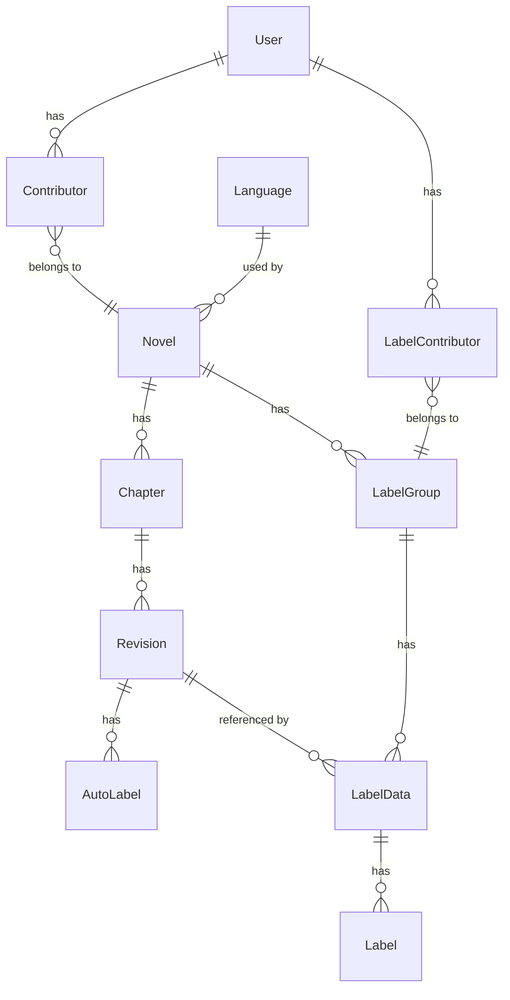

# Database Schema

**Last Updated**: March 20, 2026  
**Status**: Complete

This document describes the PostgreSQL database schema for NovelTL, including tables, relationships, constraints, and design rationale.

---

## Table of Contents

1. [Overview](#overview)
2. [Entity Relationship Diagram](#entity-relationship-diagram)
3. [Tables](#tables)
4. [Indexing Strategy](#indexing-strategy)
5. [Common Query Patterns](#common-query-patterns)
6. [Migration History](#migration-history)
7. [Design Rationale](#design-rationale)

---

## Overview

The database is organized around five main entity groups:
1. **Users** - Authentication and user management
2. **Novels** - Novel metadata and chapter revisions
3. **Labels** - Manual and AI-generated entity labels
4. **AutoLabels** - Cached NER inference results
5. **Languages** - Supported language metadata

## Entity Relationship Diagram



## Tables

### users

Stores user authentication and profile information.

| Column | Type | Constraints | Description |
|--------|------|-------------|-------------|
| `user_id` | INTEGER | PRIMARY KEY | Unique user identifier |
| `user_name` | VARCHAR(31) | NOT NULL | Username for login |
| `user_hashed_password` | VARCHAR(256) | NOT NULL | Argon2 hashed password |
| `user_type` | VARCHAR(10) | NOT NULL | 'admin' or 'user' (CHECK constraint) |
| `created_at` | TIMESTAMP | NOT NULL | Account creation time |
| `updated_at` | TIMESTAMP | NOT NULL | Last update time |

**Indexes:**
- Primary key on `user_id`

**Constraints:**
- `UNIQUE (user_name)` (name: `uq_user_name`)

**Notes:**
- Passwords are hashed with argon2-cffi before storage
- `user_type` determines permission levels (admins have elevated access)

### languages

Stores supported language codes and metadata.

| Column | Type | Constraints | Description |
|--------|------|-------------|-------------|
| `language_code` | VARCHAR(2) | PRIMARY KEY | ISO 639-1 code (e.g., 'en', 'zh') |
| `language_name` | VARCHAR(31) | NOT NULL | Human-readable name |
| `created_at` | TIMESTAMP | NOT NULL | Creation time |
| `updated_at` | TIMESTAMP | NOT NULL | Last update time |

**Constraints:**
- `CHECK (char_length(language_code) = 2)` (name: `chk_language_code_length`)
- `UNIQUE (language_name)` (name: `language_name_unique`)

**Notes:**
- Seeded with common languages via `backend/scripts/seed_languages.py`

### novels

Stores novel metadata and visibility settings.

| Column | Type | Constraints | Description |
|--------|------|-------------|-------------|
| `novel_id` | INTEGER | PRIMARY KEY | Unique novel identifier |
| `novel_title` | VARCHAR(255) | NOT NULL | Novel title |
| `novel_description` | TEXT | NULL | Synopsis/description |
| `novel_author` | VARCHAR(31) | NULL | Author name |
| `novel_visibility` | INTEGER | NOT NULL | Visibility level (0-3) |
| `novel_type` | VARCHAR(16) | NOT NULL | 'original', 'translation', 'other' (CHECK constraint) |
| `novel_parent_id` | INTEGER | NULL, FK → novels | Parent novel (for translations) |
| `language_code` | VARCHAR(2) | NOT NULL, FK → languages | Novel language |
| `created_at` | TIMESTAMP | NOT NULL | Creation time |
| `updated_at` | TIMESTAMP | NOT NULL | Last update time |

**Visibility Levels:**
- `0` = Private (only contributors)
- `1` = Restricted (contributors + alias matching)
- `2` = Unlisted (accessible by ID, not in search)
- `3` = Public (fully accessible)

**Relationships:**
- Self-referencing FK: `novel_parent_id` → `novels.novel_id` (for translation chains)
- FK: `language_code` → `languages.language_code`

**Notes:**
- Novels can form parent-child hierarchies (e.g., translation links to original)
- `novel_type` distinguishes original works from translations

### novel_contributors

Association table for many-to-many relationship between users and novels.

| Column | Type | Constraints | Description |
|--------|------|-------------|-------------|
| `novel_id` | INTEGER | PRIMARY KEY, FK → novels | Novel reference |
| `user_id` | INTEGER | PRIMARY KEY, FK → users | User reference |
| `contributor_role` | VARCHAR(10) | NOT NULL | 'owner', 'editor', 'viewer' (CHECK constraint) |
| `created_at` | TIMESTAMP | NOT NULL | Contribution start time |
| `updated_at` | TIMESTAMP | NOT NULL | Last update time |

**Composite Primary Key:** (`novel_id`, `user_id`)

**Roles:**
- **owner** - Full control (delete novel, manage contributors)
- **editor** - Edit chapters, manage labels
- **viewer** - Read-only access to private novels

### chapters

Stores chapter metadata (chapter number within a novel).

| Column | Type | Constraints | Description |
|--------|------|-------------|-------------|
| `chapter_id` | INTEGER | PRIMARY KEY | Unique chapter identifier |
| `chapter_num` | INTEGER | NOT NULL | Chapter number (1, 2, 3, ...) |
| `novel_id` | INTEGER | NOT NULL, FK → novels | Parent novel |
| `created_at` | TIMESTAMP | NOT NULL | Creation time |
| `updated_at` | TIMESTAMP | NOT NULL | Last update time |

**Unique Constraint:** (`chapter_num`, `novel_id`) - one chapter per number per novel

**Notes:**
- Acts as a container for chapter revisions
- `chapter_num` allows chapters to be ordered

### revisions

Stores versioned chapter content. Revisions are immutable once marked public/final.

| Column | Type | Constraints | Description |
|--------|------|-------------|-------------|
| `revision_id` | INTEGER | PRIMARY KEY | Unique revision identifier |
| `revision_title` | VARCHAR(255) | NOT NULL | Chapter title |
| `revision_text` | TEXT | NOT NULL | Full chapter text |
| `revision_is_public` | BOOLEAN | NOT NULL | Public visibility flag |
| `revision_is_final` | BOOLEAN | NOT NULL | Immutability flag |
| `revision_is_primary` | BOOLEAN | NOT NULL | Primary revision flag |
| `chapter_id` | INTEGER | NOT NULL, FK → chapters | Parent chapter |
| `created_at` | TIMESTAMP | NOT NULL | Creation time |
| `updated_at` | TIMESTAMP | NOT NULL | Last update time |

**Indexes:**
- `ix_one_primary_revision_per_chapter` - Partial unique index on (`chapter_id`) WHERE `revision_is_primary = TRUE`

**Constraints:**
- `CHECK (revision_is_public OR NOT revision_is_primary)` (name: `primary_must_be_public_check`) - Primary revisions must be public

**Flags:**
- **is_public** - Visible to users with novel access (vs. contributors-only)
- **is_final** - Immutable, cannot be edited or deleted
- **is_primary** - Main/canonical revision for this chapter

**Notes:**
- Multiple revisions allow editing without breaking existing labels
- Labels reference specific revisions, not chapters
- Only one revision per chapter can be marked primary (enforced by partial unique index)

### label_groups

Groups labels for a novel. Users can have multiple label groups per novel.

| Column | Type | Constraints | Description |
|--------|------|-------------|-------------|
| `label_group_id` | INTEGER | PRIMARY KEY | Unique label group identifier |
| `label_group_name` | VARCHAR(31) | NOT NULL | User-defined name |
| `novel_id` | INTEGER | NOT NULL, FK → novels | Associated novel |
| `created_at` | TIMESTAMP | NOT NULL | Creation time |
| `updated_at` | TIMESTAMP | NOT NULL | Last update time |

**Relationships:**
- FK: `novel_id` → `novels.novel_id`

### label_group_contributors

Association table for label group contributors.

| Column | Type | Constraints | Description |
|--------|------|-------------|-------------|
| `label_group_id` | INTEGER | PRIMARY KEY, FK → label_groups | Label group reference |
| `user_id` | INTEGER | PRIMARY KEY, FK → users | User reference |
| `label_contributor_role` | VARCHAR(10) | NOT NULL | 'owner', 'editor', 'viewer' (CHECK constraint) |
| `created_at` | TIMESTAMP | NOT NULL | Contribution start time |
| `updated_at` | TIMESTAMP | NOT NULL | Last update time |

**Composite Primary Key:** (`label_group_id`, `user_id`)

**Notes:**
- Similar role system to novel contributors
- Future feature: `publicly_editable` flag on label groups

### label_datas

Container for labels within a label group for a specific chapter revision.

| Column | Type | Constraints | Description |
|--------|------|-------------|-------------|
| `label_data_id` | INTEGER | PRIMARY KEY | Unique label data identifier |
| `label_group_id` | INTEGER | NOT NULL, FK → label_groups | Parent label group |
| `revision_id` | INTEGER | NOT NULL, FK → revisions | Chapter revision |
| `created_at` | TIMESTAMP | NOT NULL | Creation time |
| `updated_at` | TIMESTAMP | NOT NULL | Last update time |

**Unique Constraint:** (`label_group_id`, `revision_id`) - one label data per chapter revision per group

**Notes:**
- Links label group to specific chapter revision
- Allows same label group to label multiple chapter revisions

### labels

Individual entity labels (position, word, type, confidence).

| Column | Type | Constraints | Description |
|--------|------|-------------|-------------|
| `label_id` | INTEGER | PRIMARY KEY | Unique label identifier |
| `label_entity_group` | VARCHAR(64) | NOT NULL, DEFAULT 'MISC' | Entity type (PER, LOC, ORG, etc.) |
| `label_score` | FLOAT | NOT NULL, DEFAULT 1.0 | Confidence score (0.0-1.0) |
| `label_word` | VARCHAR(128) | NOT NULL | Labeled text |
| `label_start` | INTEGER | NOT NULL | Start character index (inclusive) |
| `label_end` | INTEGER | NOT NULL | End character index (exclusive) |
| `label_dirty` | BOOLEAN | NOT NULL, DEFAULT TRUE | Manual edit flag |
| `label_data_id` | INTEGER | NOT NULL, FK → label_datas | Parent label data |
| `created_at` | TIMESTAMP | NOT NULL | Creation time |
| `updated_at` | TIMESTAMP | NOT NULL | Last update time |

**Constraints:**
- `CHECK (label_score >= 0.0 AND label_score <= 1.0)` (name: `chk_score_bounds`)
- `CHECK (label_start < label_end)` (name: `chk_label_start_lt_label_end`)
- **EXCLUSION** constraint (name: `no_overlapping_labels_per_group`): No overlapping labels per label_data_id
  ```sql
  EXCLUDE USING gist (
    label_data_id WITH =,
    int4range(label_start, label_end, '[)') WITH &&
  )
  ```

**Notes:**
- `label_dirty = TRUE` for manually created/edited labels
- `label_dirty = FALSE` for AI-generated labels pulled from AutoLabels
- Exclusion constraint prevents overlapping character ranges

### auto_labels

Cached NER inference results.

| Column | Type | Constraints | Description |
|--------|------|-------------|-------------|
| `auto_label_id` | INTEGER | PRIMARY KEY | Unique autolabel identifier |
| `auto_label_data` | JSONB | NULL | NER inference results |
| `auto_label_model_name` | VARCHAR(128) | NOT NULL | Model identifier |
| `auto_label_model_params` | JSONB | NOT NULL | Model hyperparameters |
| `auto_label_status` | VARCHAR(10) | NOT NULL, DEFAULT 'pending' | 'pending', 'processing', 'done', 'failed' (CHECK constraint) |
| `auto_label_last_job_id` | VARCHAR(36) | NULL | UUID for optimistic locking |
| `auto_label_message` | TEXT | NULL | Error message (if FAILED) |
| `revision_id` | INTEGER | NOT NULL, FK → revisions | Target chapter |
| `created_at` | TIMESTAMP | NOT NULL | Creation time |
| `updated_at` | TIMESTAMP | NOT NULL | Last update time |

**Constraints:**
- `UNIQUE (revision_id, auto_label_model_name, auto_label_model_params)` (name: `uq_model_name_params`) - Ensures one cached result per (chapter, model, params) combination

**JSONB Schemas:**
- `auto_label_data`: Array of `{word, start, end, entity_group, score}`
- `auto_label_model_params`: Model-specific parameters (e.g., `{threshold: 0.5}`)

**Notes:**
- `auto_label_last_job_id` used for optimistic locking (see [background-jobs.md](background-jobs.md))
- Results cached to avoid redundant NER inference
- Status defaults to 'pending' when created

## Indexing Strategy

**Current Indexes:**
- All primary keys have implicit indexes
- All foreign keys recommended to have indexes (some missing - see [GitHub Issues](https://github.com/lzguan/NovelTL_Dev/issues))
- Unique constraints create implicit indexes

**Recommended Additions:**
- `chapters(chapter_num)` - For chapter ordering queries
- `novel_contributors(user_id)` - For "my novels" queries
- `labels(label_entity_group)` - For filtering by entity type
- `labels(label_score)` - For score-based filtering

## Common Query Patterns

### Get user's accessible novels
```sql
SELECT novels.* FROM novels
JOIN novel_contributors ON novels.novel_id = novel_contributors.novel_id
WHERE novel_contributors.user_id = :user_id
  AND novel_contributors.contributor_role IN ('owner', 'editor', 'viewer');
```

### Get labels for chapter revision
```sql
SELECT labels.* FROM labels
JOIN label_datas ON labels.label_data_id = label_datas.label_data_id
WHERE label_datas.revision_id = :revision_id
  AND label_datas.label_group_id = :group_id
ORDER BY labels.label_start;
```

### Check for cached autolabel
```sql
SELECT * FROM auto_labels
WHERE revision_id = :revision_id
  AND auto_label_model_name = :model
  AND auto_label_model_params = :params::jsonb
  AND auto_label_status = 'DONE';
```

## Migration History

Migrations managed by Alembic. Key migrations:
- `06741dac5042` - Initial schema (Dec 2025)

To create new migrations:
```bash
cd backend
alembic revision --autogenerate -m "Description"
alembic upgrade head
```

## Design Rationale

### Why revision-based chapters?

Labels reference specific character positions in text. If chapter text changes, positions become invalid. Revisions solve this by:
1. Making chapter content immutable once labeled
2. Allowing new revisions without breaking existing labels
3. Supporting A/B testing of chapter edits

### Why separate label_groups and label_datas?

- **Label Group** - User's labeling project for entire novel
- **Label Data** - Labels for one specific chapter
- Separation allows:
  - Bulk operations on entire label group
  - Efficient queries for single chapter
  - Different users to label same novel independently

### Why JSONB for AutoLabel storage?

NER model output schemas vary. JSONB provides:
- Flexibility for different model formats
- Efficient querying (GIN indexes)
- No migration needed for new model types
- Direct JSON return to frontend

### Why exclusion constraint on labels?

Overlapping labels create ambiguity:
- Which entity does a character belong to?
- How to render overlapping highlights in UI?

Exclusion constraint enforces non-overlapping ranges at database level, preventing bugs.

## Relevant Files

- `backend/src/models.py` - Base model with timestamps
- `backend/src/auth/models.py` - User model
- `backend/src/novels/models.py` - Novel, Chapter, Revision models
- `backend/src/labels/models.py` - Label models
- `backend/src/autolabels/models.py` - AutoLabel model
- `backend/src/languages/models.py` - Language model
- `backend/alembic/versions/` - Migration scripts
- `backend/alembic.ini` - Alembic configuration

## See Also

- [architecture.md](architecture.md) - How services interact with database
- [permissions.md](permissions.md) - How visibility and contributors work
- [background-jobs.md](background-jobs.md) - AutoLabel state machine details
- [api-design.md](api-design.md) - How database models map to API schemas
- [conventions.md](conventions.md) - Naming conventions for models
