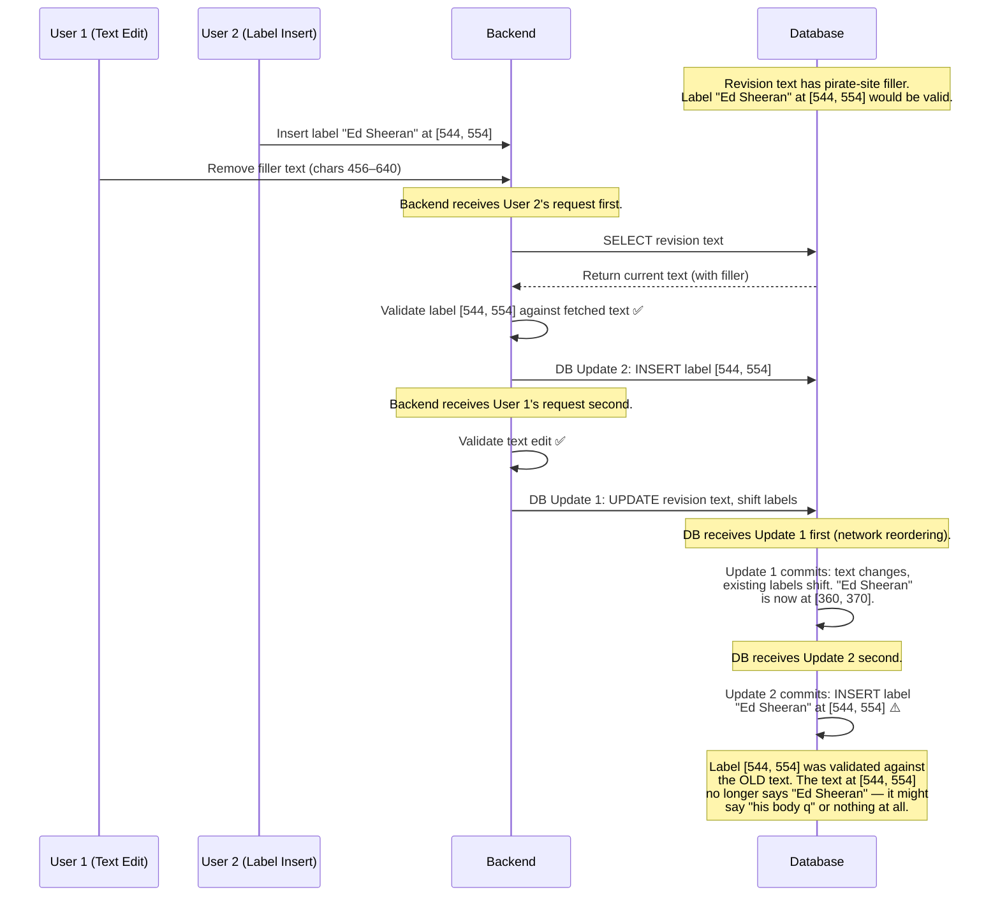
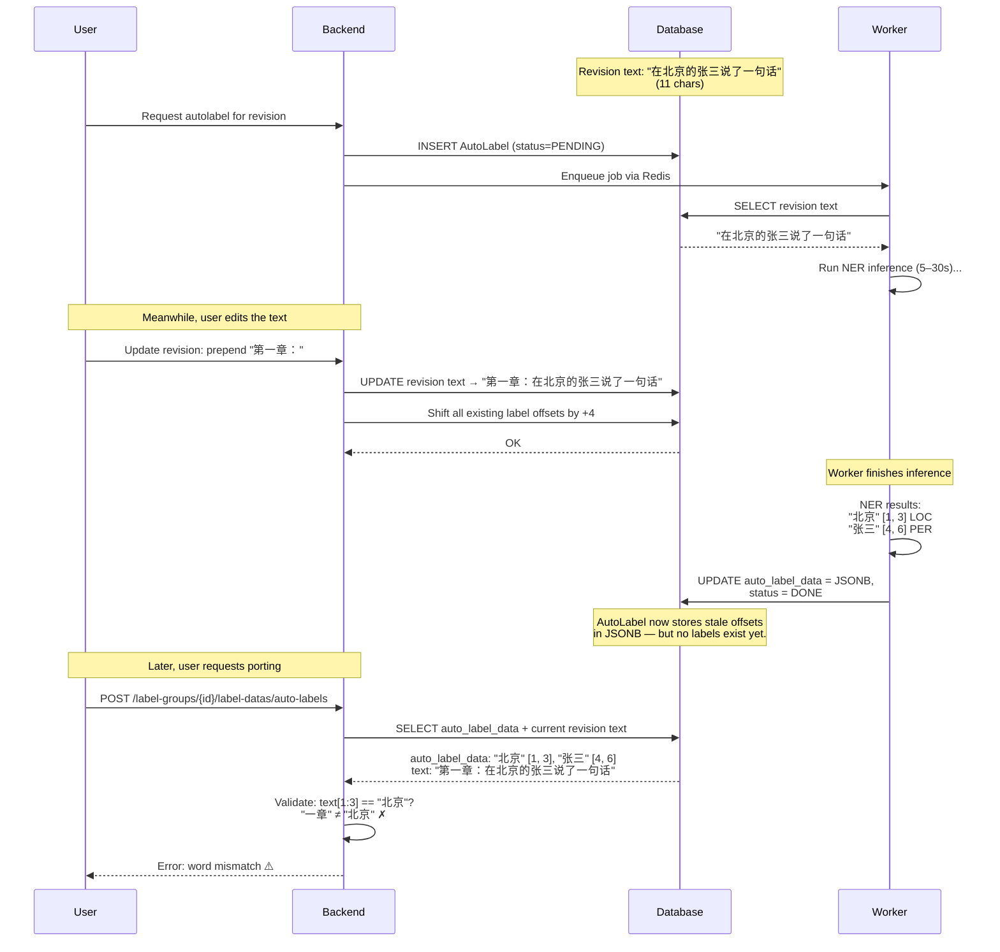
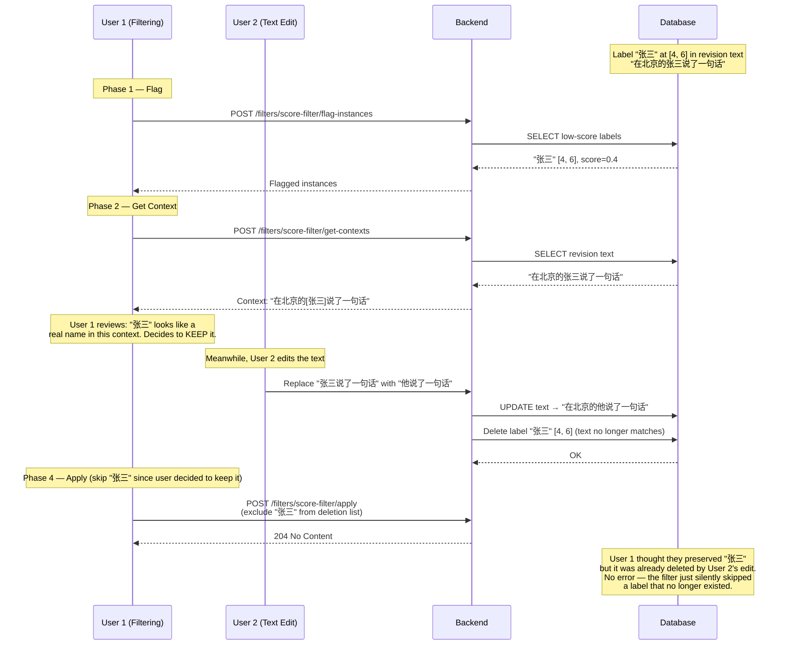
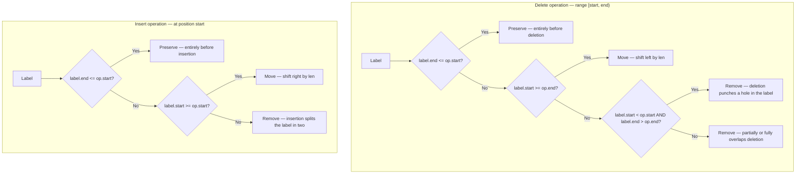
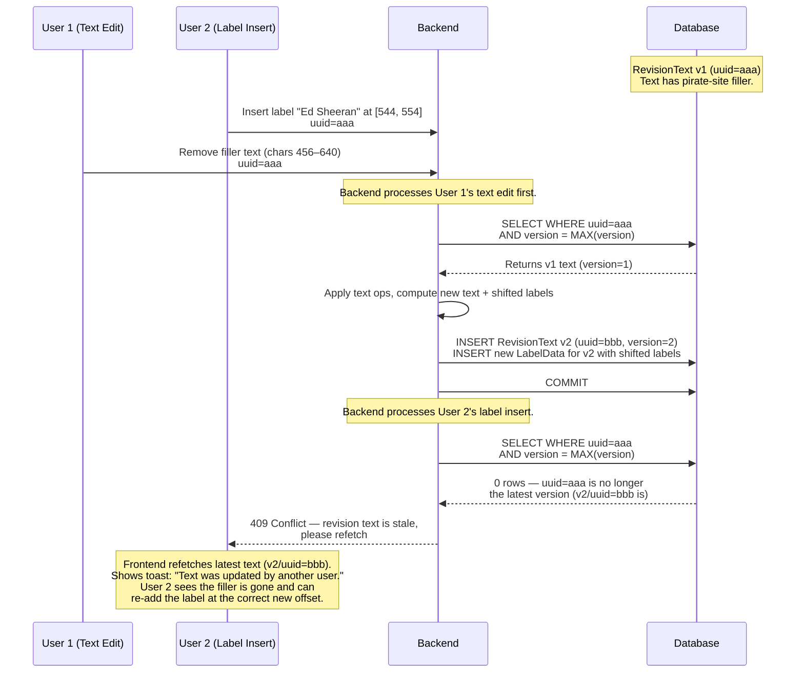
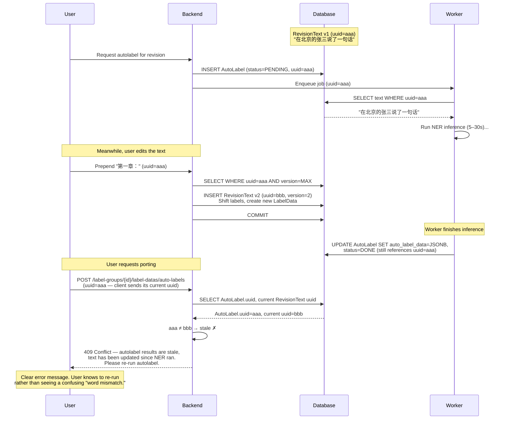
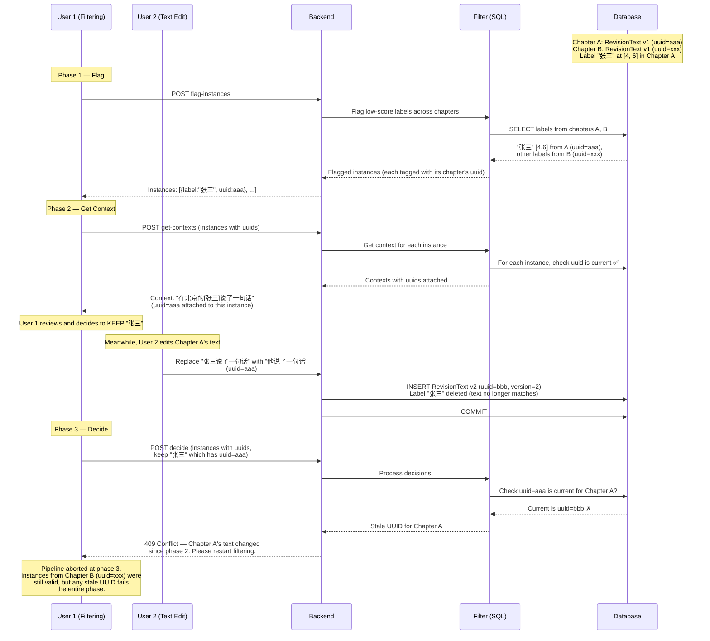
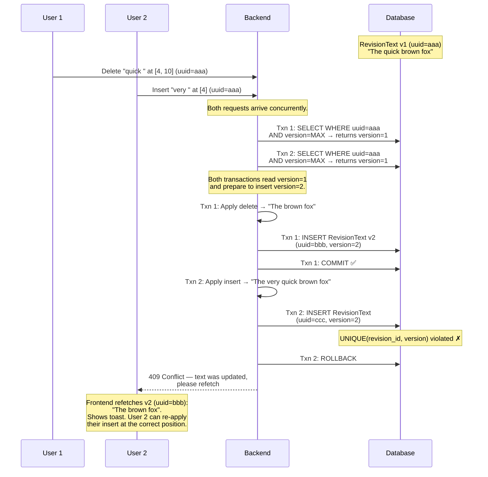
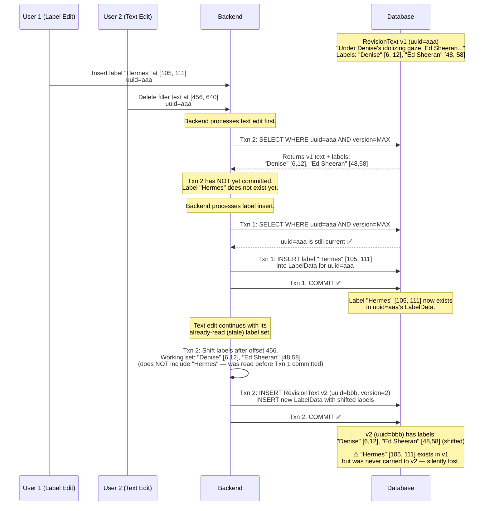
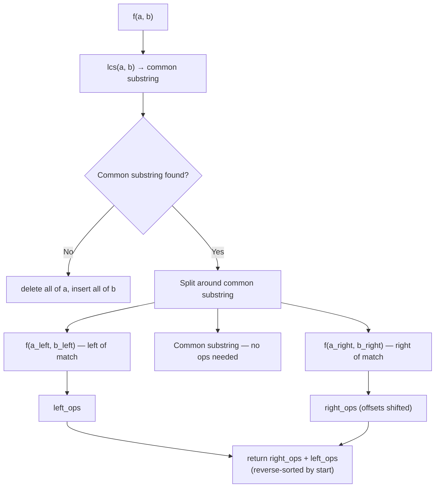

# Removing `is_final` flag

**Last Updated**: April 26, 2026
**Status**: Draft

---

This doc outlines the migration from forcing revisions to be immutable before editing labels to being able to mutate revisions even after adding labels. It will try to outline the design decisions, patterns, and algorithms involved in the implementation of this feature.

## Table of Contents

1. [Background](#background)
2. [Implementation](#implementation)
   - [Updating labels after inserting text](#updating-labels-after-inserting-text)
     - [Event based updates](#event-based-updates)
     - [Diff based updates](#diff-based-updates)
   - [Concurrency control](#concurrency-control)
     - [Security](#security)
     - [Autolabels](#autolabels)
     - [Filters](#filters)
3. [Relevant Files](#relevant-files)
4. [See Also](#see-also)
5. [Appendix A — Scrapped: Recursive longest common substring approach](#appendix-a--scrapped-recursive-longest-common-substring-approach)

## Background

We briefly describe the current implementation and state some assumptions about the use case. Currently, the `Revision` data model comes equipped with an `is_final` class. This is initialized to `False` by default and acts as a lock against database updates - when set to `False`, it is impossible to label the revision; when set to `True`, it is impossible to edit the chapter. Furthermore, once set to `True`, it cannot be set to `False` again. This greatly simplifies the system design - once a chapter is finalized, we have an easy way to check that all labels are valid for that revision. Furthermore, we do not need to add any concurrency features to ensure that the database contains only valid data - the backend ensures that inserted labels match text boundaries and the database handles race conditions and label overlaps. This ensures that the backend has a consistent view of the data at all times, even if multiple simultaneous users may have slight inconsistencies with their view of the labels.

There are a couple of assumptions we have made in designing the data model this way:
1. We prioritize having a consistent view of the data on the server.
2. Users generally do not try to modify the novel text very often because text will often be taken straight from third party sources and hence they will not need modified much.
3. It is fine if users have a somewhat inconsistent view of the label data, so long as their view on the chapter text is correct.

Assumption 2 is in fact a erraneous assumption and there are many instances where it would go wrong. For example, pirate sites frequently inject intrusive text in the middle of chapters, which can make its way into the labeling system and eventually the translation system. This can throw readers off and furthermore if this tool is being used to auto translate chapters to be published, keeping that filler text in the raw text greatly increases the time needed to prune filler text since translations of the filler text can vary a lot. Instead, it would be easiest to figure out a pattern in the filler text, search for all such instances, and get rid of them before even the labeling stage. (Notice that the filtering service is perfect for this task - it just needs one slight modification before being able to do this).

Furthermore, forcing the user to mark all chapters as final adds one step of friction in the translation pipeline. This may not be a major obstacle timewise, but it is still unpleasant to have to expose this feature to the user.

The above descriptions should hopefully clarify why removing the `is_final` flag is warranted. There are many challenges in this however. Consider the following scenarios:

---

### Example 1
Consider the following excerpt (_Lord of the Mysteries_, Chapter 563):
> Under **[Denise]**'s idolizing and curious gaze, **[Ed Sheeran]** picked up a pen on the table beside her and scribbled a line of words.
>
> It was the **[Hermes]** language used for a sacrificial offering.
>
> In order to make the scam a success, **[Ed Sheeran]** had acquired a lot of religious knowledge and even went to a university's **[Department of History]** to sit in on archeology courses.
>
> Holding the paper in front of Denise, he proudly recited the words he had written in Hermes, "**[The Fool]** that doesn't belong to this era.
>
> "The mysterious ruler above the gray fog.
>
> "The **[King of Yellow and Black]** who wields good luck."
>
> Following that, with half-closed eyes and open arms, he said dreamily, "I feel the blessings of **[God]**."
>
> ~~Read the latest chapters at SuperUltraNovelz.biz! Support us by disabling AdBlock! If you are reading this on another site, it has been stolen! Visit SuperUltraNovelz.biz for the real experience!!!~~
>
> At this moment, a streak of silver lightning descended from the sky and landed right on **[Ed Sheeran**]'s head.
>
> With a sizzling sound, the tiny electric bolts snaking across his body scurried. With **[God]**'s blessing, he fell to the ground and his body quickly charred while his muscles twitched violently.
>
> After a few seconds, he stopped all movement, including breathing as **[Denise]** exclaimed, "**[Lord Ed Sheeran]** is indeed **[God's Blessed]**."

The label data for this excerpt would look something like:

| # | Text | Start | End | Label Group | Label |
|---|------|-------|-----|-------------|-------|
| 1 | Denise | 6 | 12 | Character | Denise |
| 2 | Ed Sheeran | 48 | 58 | Character | Ed Sheeran |
| 3 | Hermes | 105 | 111 | Language | Hermes |
| 4 | Ed Sheeran | 168 | 178 | Character | Ed Sheeran |
| 5 | Department of History | 232 | 252 | Organization | Department of History |
| 6 | The Fool | 305 | 313 | Title | The Fool |
| 7 | King of Yellow and Black | 380 | 404 | Title | King of Yellow and Black |
| 8 | God | 452 | 455 | Entity | God |
| 9 | Ed Sheeran | 544 | 554 | Character | Ed Sheeran |
| 10 | God | 610 | 613 | Entity | God |
| 11 | Denise | 704 | 710 | Character | Denise |
| 12 | Lord Ed Sheeran | 724 | 739 | Title | Lord Ed Sheeran |
| 13 | God's Blessed | 752 | 765 | Title | God's Blessed |

Now suppose the user deletes the injected pirate-site filler text (the ~~strikethrough~~ paragraph). Every label after offset 456 is now invalid — the text they point to has shifted. Labels 9–13 all need their `start` and `end` offsets adjusted by the length of the removed text. Labels 1–8 are unaffected.

### Example 2

Suppose two users wish to work on a specific chapter revision at the same time. User 1 wants to edit the revision text (e.g., removing the pirate-site filler from Example 1), while User 2 wants to add a label to the text *after* the filler. Both users see the same revision text when they start.

The backend validates each request against the current state of the database, then sends the write to the DB. But network timing means the order of validation and the order of DB commits can differ:



This is a [TOCTOU](https://en.wikipedia.org/wiki/Time-of-check_to_time-of-use) (time-of-check to time-of-use) race condition. The backend checked User 2's label against a version of the text that no longer existed by the time the DB committed the insert. The label is now invalid — it points to garbage text — and no error was raised.

### Example 3

The AutoLabel pipeline (see [background-jobs.md](background-jobs.md)) has three stages: (1) the backend enqueues a job, (2) the worker runs NER and stores results as JSONB in `auto_label_data`, and (3) the client later requests the backend to "port" those results into actual labels. At porting time, the backend validates each label by checking `text[start:end] == label_word`. This catches *obvious* staleness — but the race window is orders of magnitude wider than Example 2 (seconds to minutes for inference, potentially hours before the user ports), and wasted compute is unavoidable.



Unlike Example 2, the porting validation *does* catch the obvious case — the labels are rejected, not silently inserted. But this is still problematic:

1. **Wasted compute.** The NER inference (5–30s of GPU time per chapter) produced results that are entirely unusable. The user must re-run the job after editing.
2. **Confusing UX.** The autolabel shows status=DONE with valid-looking data, but porting fails with a cryptic mismatch error. The user sees "successful" NER results they can't use.
3. **Edge cases slip through.** If the edit happens to leave the same characters at the same positions (e.g., replacing "张三" with another two-character name "李四"), the validation passes but the labels are semantically wrong — they point to the right offsets but were generated from different text.

### Example 4

The [filter system](filter-system.md) processes labels in four separate API calls (flag → context → decide → apply). Phases 2 and 4 are the relevant ones here: the user fetches sentence context around each label (phase 2), reviews the labels in context, makes decisions, and then applies the filter (phase 4). If the revision text changes between phases 2 and 4, the user's decisions were based on context that no longer exists.



This example is less about data corruption and more about **misleading the user**. User 1 made a careful decision based on context they reviewed — but that context was stale. The outcome isn't necessarily wrong (the label *was* invalid after the text edit), but User 1 has no way of knowing their decision was meaningless. In a more dangerous variant, the text edit could shift offsets such that the apply phase deletes a *different* label than the one the user reviewed.

---

With these examples out of the way, we should have a good example of the problems we need to solve.

## Implementation

There are two core problems here: firstly, when inserting/removing text, we need to update certain labels for that text correspondingly; second, we must now pay attention to race conditions. We will try to isolate these problems as much as possible.

### Updating labels after inserting text

We make the following assumptions about the use case.
- Updates to revisions happen relatively infrequently (O(1) updates to each chapter revision over its lifetime)
- Updates tend to be in the form a small number of removing chunks of text or inserting chunks of text at specific locations

**Definition 1:** A label row in the database is _valid_ if the revision text in the row in the revisions table corresponding to the label row satisfies `revision_text[label_start:label_end] == label_text`.

Our goal here is to create update/preserve as many "semantically valid" but invalid labels to a valid state after an update to the revision. We consider two different approaches:

---

#### Event based updates

Seeing as most updates will be in the forms outlined above, we can restrict updates on the frontend to the following operations:

- Type/paste text at cursor
- Delete text at cursor
- Delete highlighted text

We can compose these operations to achieve most functionality that we need. We will summarize these operations with the following definition:

**Definition 2:** A text operation is an object with the following data:

```json
{
    "op" : "insert" | "delete",
    "start" : int,
    "text" : str
}
```

From this data we have a validator for deletions: we check that `revision_text[start:start+len(text)] == text`. For both operations, we check for boundary conditions.

The advantage with this approach is that if the user is intentional with their updates, then no labels will be unintentionally removed. It is very clear what labels should be removed: labels that are split up by an insert, labels that have part of their text removed, and labels that have their text completely removed should be the only cases that get removed in the end. Now the backend can process a sequence of text operations and obtain a new version of the revision text, without unintentionally changing any labels. Specifically, we have the following algorithm:

Input: `revision_text : str`, `ops : list[TextOp]`, `labels : list[Label]`

Output: modified `revision_text`, modified `labels`

```
for `op` in `ops`
    if op.op == "delete":
        op.end = op.start + len(op.text)
        labels_to_remove = [label for label in labels
            if (op.start <= label.start < op.end or op.start < label.end <= op.end)
            or (label.start < op.start and label.end > op.end)]
        labels_to_move = [label for label in labels if label.start >= op.end]
        labels_to_preserve = [label for label in labels if label.end <= op.start]
        for label in labels_to_move:
            label.start -= len(op.text)
            label.end -= len(op.text)
        revision_text = revision_text[:op.start] + revision_text[op.end:]
        labels = labels_to_preserve + labels_to_move
    else:
        labels_to_remove = [label for label in labels if label.start < op.start < label.end]
        labels_to_move = [label for label in labels if label.start >= op.start]
        labels_to_preserve = [label for label in labels if label.end <= op.start]
        for label in labels_to_move:
            label.start += len(op.text)
            label.end += len(op.text)
        revision_text = revision_text[:op.start] + op.text + revision_text[op.start:]
        labels = labels_to_preserve + labels_to_move
```

The following diagram illustrates how labels are categorized in both operations:



> **Note — labels containing the full deletion range:** If a deletion punches a hole in the middle of a label (i.e., `label.start < op.start` and `label.end > op.end`), the label text is no longer contiguous and the label is removed. An alternative would be to shrink the label's `end` by `len(op.text)`, but this changes the labeled word in a way that may be semantically wrong, so removal is the cleaner choice.

> **Note — insert-at-boundary asymmetry:** Inserting at exactly `label.start` moves the label (it goes into `labels_to_move`). Inserting at exactly `label.end` preserves it unchanged. This asymmetry is intentional but worth noting — typing immediately after a labeled word won't expand the label, but typing immediately before it will push it rightward.

> **Note — frontend optimistic updates:** Because the event-based algorithm is deterministic and runs on well-defined ops, the frontend can apply the same offset-adjustment logic locally before sending ops to the backend. Labels update instantly in the UI as the user types; the backend apply is just confirmation. This is the same optimistic pattern already used for label edits in the workspace — extending it to text edits shifting label positions gives a strong UX win with no visible latency.

To make this happen, we will need to attach certain event listeners to the frontend. The exact implementation is pending.

---

#### Diff based updates

Consider a scenario where a user decides to perform some edits on another platform and copy paste the results back into the editor. We will maintain the same assumption that edits tend to be composed of few additions and deletions in a small number of places. Notice that using event based updates will remove all labels, which may be unintentional. Hence we consider a different method of updating labels for editing text.

The idea here is given an original string and a modified string, return a sequence of text operations that preserves as many labels as possible. We use the longest common subsequence (LCS) to find the optimal alignment between the two strings. The LCS identifies the maximum set of characters that appear in both strings in the same order. When the matched characters are chunked into contiguous runs, each run is a block of unchanged text — and any labels falling entirely within an unchanged block are preserved. The gaps between blocks become the delete/insert operations.

##### Why LCS over longest common substring

An earlier approach (see [Appendix A](#appendix-a--scrapped-recursive-longest-common-substring-approach)) used recursive longest common substring, which greedily anchors on the single largest contiguous match at each level. This is a heuristic — the greedy choice at each level is not guaranteed to be globally optimal, and can miss better alignments that preserve more text. LCS finds the globally optimal character alignment and therefore preserves the maximum amount of text, which in turn preserves the maximum number of labels.

##### Implementation via `diff-match-patch-es`

[`diff-match-patch-es`](https://github.com/antfu/diff-match-patch-es) is a TypeScript rewrite of Google's `diff-match-patch` library. It implements Myers' diff algorithm (optimal minimum edit script) and works correctly on CJK text and all BMP Unicode characters (standard Chinese characters, Japanese brackets `「」『』`, etc.) without modification. The only known issues are with characters outside the BMP (some emoji, rare CJK Extension B+ characters), which are not relevant for novel text.

`diff(oldText, newText)` returns an array of `[operation, text]` tuples:

| Operation | Value | Meaning |
|-----------|-------|---------|
| `DIFF_EQUAL` | `0` | Text unchanged in both strings |
| `DIFF_DELETE` | `-1` | Text exists in old but not new |
| `DIFF_INSERT` | `1` | Text exists in new but not old |

The EQUAL chunks are the anchored common subsequence blocks; DELETE and INSERT chunks between them are the edits. To convert this into `TextOp`s for the event-based label shifting algorithm:

```typescript
import { diff, DIFF_EQUAL, DIFF_DELETE, DIFF_INSERT } from 'diff-match-patch-es'

function diffToOps(oldText: string, newText: string): TextOp[] {
    const diffs = diff(oldText, newText, { timeout: 0 })

    const ops: TextOp[] = []
    let offset = 0
    for (const [op, text] of diffs) {
        if (op === DIFF_EQUAL) {
            offset += text.length
        } else if (op === DIFF_DELETE) {
            ops.push({ op: 'delete', start: offset, text })
            // don't advance offset — text is removed
        } else if (op === DIFF_INSERT) {
            ops.push({ op: 'insert', start: offset, text })
            offset += text.length
        }
    }
    return ops.reverse()
}
```

The ops are reversed so they are sorted by descending `start` position — applying them in this order ensures earlier offsets are not affected by later operations, matching the contract of the event-based update algorithm.

> **Note — do NOT use `cleanupSemantic`.** This post-processing function merges small coincidental equalities into larger edits for human readability, which would destroy small matching blocks that could otherwise anchor labels. We want to preserve every EQUAL chunk, no matter how small.

> **Note — `timeout`:** Setting `timeout: 0` guarantees an optimal result. The default timeout is 1 second — if the diff takes longer, the library falls back to a valid but non-optimal result. For chapter-length text (~5K–50K characters) with small edits, `timeout: 0` should be fast enough. If performance becomes an issue, a non-zero timeout still produces a correct diff, just with potentially fewer labels preserved.

> **Note — complexity:** Myers' algorithm is `O(N * D)` where `N` is the sum of input lengths and `D` is the edit distance. For typical chapter edits (small `D`), this is effectively linear. Worst case (completely different texts) is `O(N^2)`, but this is also the case where there are no labels to preserve.

This work can be done on the frontend, which allows us to reduce load on the backend.

---

There is no one implementation that is completely favourable over the other. Diff based updates can potentially preserve more labels but also takes a potentially long time to compute in bad cases. Meanwhile event based updates can lose more labels in edge cases. We can combine the strengths of these two approaches by choosing a hybrid approach — event-based updates are the default, but if a single operation replaces more than ~80% of the text (e.g., a full paste-over), switch to diff mode. We can add a popup for the user to confirm (along the lines of "Detected a large amount of labels were removed. Would you like to recalculate their positions?") before running diff based updates.

### Concurrency control

At first glance, the TOCTOU problem seems to be a concurrency issue - we need to lock the chapter content before changing the label data and vice versa. This can potentially spiral out of control when more resources become interconnected in the future. Furthermore, using locks can be catastrophic when the backend fails in the middle of holding a lock. Instead, we adopt a version control system in the database, where we store revision history and force a single revision's content to be immutable. For this, we need a new table called `RevisionText`. Each `RevisionText` will have an integer pkey, a UUID unique identifier, a version integer, and an fkey to the `Revision`. The version integer increments each time a new `RevisionText` is added for a given `Revision`. Hence we only need to `WHERE revision_id = :id ORDER BY version DESC LIMIT 1` to get the most recent revision text. We need to make an additional change to `LabelData` where the owning object is now `RevisionText` rather than `Revision`.

> **Note — why a separate `RevisionText` table rather than versioning inline:** Editing text and editing revision metadata (title, notes, etc.) are separate concerns. The `RevisionText` table decouples them so that metadata updates don't create spurious text versions, and text history is preserved as a first-class feature.

> **Note — why a `version` integer rather than relying on pkey ordering:** A dedicated `version` column is explicit intent ("this is for concurrency control"), while pkey-as-version is implicit and fragile (gaps in sequences, reliance on ordering). Use UUID for external-facing lookups and `version` for the optimistic check internally.

Now on the client side, there are two possible operations that have concurrency issues: updates to label data and updates to revision text. We handle these in different ways.

Firstly, when the client requests the chapter text, the backend hands them the current `Revision` schema along with a UUID denoting the `RevisionText` version. We can add this UUID to the `Revision` schema. The client treats this as the latest version of the chapter text and each time the client wishes to make updates to label data, it sends this UUID back in addition to the all the other data necessary. To perform the validity check, the backend then queries `RevisionText` with the restrictions `WHERE revision_texts.uuid = uuid AND revision_texts.revision_id = revision_id AND revision_texts.version = (SELECT MAX(r.version) FROM revision_texts AS r WHERE r.revision_id = revision_id)`. The backend expects exactly one row and if no rows are returned, then either the uuid is invalid or the revision text is stale since another more recent one has been inserted with greater version. In that case, the frontend must refresh its revision text and act accordingly. The label update is lost and the client must redo this, but the data integrity on the backend is maintained.

Updating revision text is even easier. A client must send a sequence of text operations to the backend, along with the uuid denoting its current version of the text. The backend then requests that text with the same restrictions as for updating label data. Then the backend creates a new `RevisionText` with default pkey, generated uuid, incremented version, same `revision_id`, and newly calculated revision text. The backend then retrieves all the relevant labels for the old uuid and updates them accordingly, and finally creates a new `LabelData` for the new uuid and new labels for the `LabelData` according to algorithms outlined in the event based updates section.

> **Note — transaction isolation:** The optimistic concurrency check (`WHERE uuid = :uuid AND version = (SELECT MAX(...))`) can race: two concurrent transactions could both pass this check before either commits, creating two new `RevisionText` rows with only one set of label adjustments applied. To prevent this, add a **unique constraint on `(revision_id, version)`**. The backend reads the current max version, validates the client's UUID, then inserts with `version = max_version + 1`. If two transactions race, one insert succeeds and the other hits a unique constraint violation, which the backend catches and returns as a 409. This fits the append-only model cleanly — no row locks needed since `RevisionText` rows are never updated in place.

> **Note — frontend retry UX:** When a label update or text edit fails because the version is stale, the frontend should: (1) silently refetch the latest revision text and version, (2) show a toast notification ("Text was updated by another user — your changes were rebased"), and (3) if the operation was a text edit, re-apply the user's ops against the new text using the diff-based algorithm. For filter pipelines (Example 4), if the version advances mid-pipeline, abort with a clear message ("Revision text changed — please restart filtering") rather than letting the user complete all 4 phases only to fail at apply.

> **Note — cleanup strategy:** The append-only design means the `RevisionText` table grows without bound. A background cron job should prune entries older than the most recent _k_ versions per revision (e.g., keep last 10). This is not urgent but should be tracked as a known gap.

There are several other things we need to consider, outlined below.

---

#### Security

We should only allow the client to fetch `RevisionText` by uuid, not by pkey. This is to ensure that a client cannot guess the id of a new `RevisionText` with `LabelData` currently in the process of being populated and perform some malicious actions. If the client manages to guess it, then hats off to them I guess.

> **Note — about PKEYs** At the time this doc was drafted, pkeys were still INTEGER types. They have since been migrated to UUIDs, so this concern has been fixed in a slightly different than stated. 

#### Autolabels

The client sends the UUID when requesting autolabels, and this UUID is forwarded to the worker. The worker records which version it ran against. At port time, the backend compares the worker's version against the current version — if `worker_version < current_version`, reject immediately without checking offsets. This is cheaper and catches all staleness, not just cases where characters happen to differ at the same positions.

When revision text changes, in-flight AutoLabel jobs (status `PENDING` or `PROCESSING`) are running inference against stale text. The chosen approach is to let them complete but mark results as stale — the frontend checks the version at port time, which already happens via the validation above. Cancelling in-flight jobs (adding a `CANCELLED` status, having the worker check the UUID before writing results) is a possible optimization to avoid wasted compute, but is not required for correctness.

#### Filters

Filters are more complex than the other cases because a single filter operation can span multiple chapters — the backend returns instances from many different revisions, each with its own `RevisionText` UUID. A phase request therefore carries not one UUID but a *list* of instances, each tagged with the UUID of the `RevisionText` it came from.

The staleness check must happen inside the filter implementation itself, since filters are the ones performing SQL calls. When a filter phase processes its instances, it must verify that each instance's UUID still matches the current `RevisionText` UUID for that revision. If *any* instance has a stale UUID, the phase should abort with a clear error indicating which revision(s) changed, rather than letting the user complete all 4 phases only to fail at apply. This turns a confusing silent failure (Example 4) into an immediate, actionable error.

---

We can consider some examples where the different operations get interleaved with revision text updates. When there are no revision text updates this system should be stable.

#### Example 2 revisited — concurrent text edit and label insert

This is the same scenario as Example 2 (User 1 edits text, User 2 inserts a label), but now with the versioned `RevisionText` system in place. The key difference: User 2's label insert must include the UUID of the `RevisionText` it was validated against, and the backend checks that this UUID is still current before committing.



The race condition from Example 2 is eliminated. User 2's insert is rejected because their UUID no longer matches the latest version. No invalid label is ever written to the database.

#### Example 3 revisited — autolabel with stale text

Same scenario as Example 3 (user edits text while NER inference is running), but now the worker records the version it ran against.



The client always sends its UUID — consistent with every other operation. The backend compares it against both the AutoLabel's stored UUID and the current version, catching staleness immediately without needing to compare text content at each offset.

#### Example 4 revisited — filter pipeline with mid-pipeline text edit

Same scenario as Example 4 (text changes between filter phases 2 and 4), but now each instance carries the `RevisionText` UUID of the chapter it came from. The filter implementation checks each instance's UUID against the current version when processing a phase.



Instead of User 1 silently losing their careful review decisions (as in the original Example 4), the filter implementation detects the stale UUID during its SQL calls and aborts. The error identifies *which* chapter changed, so the user knows what happened. Note that even though Chapter B's instances were still valid, the phase fails as a whole — partial application across chapters would leave the filter in an inconsistent state.

#### Example 5 — concurrent text edits by two users

Two users both try to edit the revision text at the same time. This scenario wasn't covered by the original examples but is important for the unique constraint on `(revision_id, version)`.



The unique constraint on `(revision_id, version)` ensures that even if two text edits race and both read the same version, only one insert succeeds. The other hits a constraint violation and is cleanly rejected — no locks needed.

#### Example 6 — label update followed by concurrent text edit

This scenario exposes a race between label updates and text edits that target the same version. The label update succeeds (it doesn't create a new version), but a concurrent text edit reads the label set *before* the label update commits — so the new label is silently lost when labels are carried forward to the new version.



Both operations succeed with no errors. The label update is valid (uuid=aaa was current when it committed), and the text edit is valid (it inserted a new version). But the text edit's label carry-forward was based on a stale read of the label set.

However, this is actually acceptable — **data integrity is preserved**. The "Hermes" label still exists in v1's LabelData and is valid for that version. The next time any user accesses this chapter, the frontend receives v2 (the latest version) along with its UUID. If User 1 (who added "Hermes") still has uuid=aaa cached, their next label operation will be rejected with a 409, prompting a refetch. At that point they'll see v2's label set (without "Hermes") and can re-add it at the correct offset. No data is corrupted — the label was simply not carried forward, and the version system ensures the user discovers this on their next interaction.

**Mitigation — frontend mode lock:** As an additional UX improvement, the frontend should **block text editing while label update requests are in flight**. When the user switches from label editing mode to text editing mode, the frontend must wait for all pending label requests to complete (or fail) before allowing the text edit to be submitted. This ensures the backend has a consistent label set before any text edit reads and shifts it, avoiding the "lost label" scenario for the common single-user case. The reverse (blocking label edits during text edits) is already handled by the version check — a text edit creates a new version, and in-flight label updates against the old version will be rejected with a 409.

## Appendix A — Scrapped: Recursive longest common substring approach

> This section documents a previously considered approach that was replaced by LCS-based diffing via `diff-match-patch-es`. It is preserved for historical reference.

The original idea was to recursively find the longest common substring between the old and new text, anchor on it, and process the left and right halves. This is a greedy heuristic — it does not guarantee a globally optimal alignment and can miss better decompositions that preserve more labels.

We assumed a function `lcs(a : str, b : str) -> (range1 : tuple[int, int], range2 : tuple[int, int])` which takes two strings and returns the range of the common substring in string `a` and the range of the common substring in `b`, or `((0,0), (0,0))` if no such range is found. We defined a function `f(a : str, b : str) -> list[TextOp]` as follows:

```
def f(a, b):
    if len(a) == 0 and len(b) == 0:
        return []
    if len(a) == 0:
        return [{"op" : "insert", "start" : 0, "text" : b}]
    if len(b) == 0:
        return [{"op" : "delete", "start" : 0, "text" : a}]
    range1, range2 = lcs(a, b)
    if range1[1] - range1[0] == 0:
        return [{"op" : "delete", "start" : 0, "text" : a}, {"op" : "insert", "start" : 0, "text" : b}]
    left_ops = f(a[:range1[0]], b[:range2[0]])
    right_ops = f(a[range1[1]:], b[range2[1]:])

    for op in right_ops:
        op["start"] += range1[1]
    return right_ops + left_ops
```



`f` always returns ops sorted in reverse order by `start`. Correctness follows by induction: if `left_ops` turn `a[:range1[0]]` into `b[:range2[0]]` and `right_ops` turn `a[range1[1]:]` into `b[range2[1]:]`, then applying all ops (right first, then left) transforms `a` into `b`.

**Why this was scrapped:** The greedy choice of the single longest common substring at each recursion level is not guaranteed to be globally optimal. LCS (longest common subsequence) finds the optimal alignment, preserving the maximum number of characters and therefore the maximum number of labels. Additionally, `diff-match-patch-es` provides an optimized, well-tested implementation of Myers' diff, making the custom recursive approach unnecessary.

**Complexity of the scrapped approach:** Assuming `lcs` takes `O(n+m)` via suffix arrays, the recursion gives `O((n+m) log(n+m))` when the common substring splits the input roughly evenly, but degrades to `O((n+m)^2)` in adversarial cases.

---

## Relevant Files

- `backend/src/novels/models.py` — `Revision` model (where `is_final` lives today)
- `backend/src/labels/models.py` — `LabelData` model (will need new FK to `RevisionText`)
- `backend/src/labels/service.py` — label CRUD operations
- `backend/src/autolabels/` — AutoLabel worker and porting logic
- `backend/src/filters/` — 4-phase filter pipeline

## See Also

- [background-jobs.md](background-jobs.md) — AutoLabel worker system, state machine
- [filter-system.md](filter-system.md) — 4-phase filter pipeline design
- [database-schema.md](database-schema.md) — Current data model
- [permissions.md](permissions.md) — Access control (unchanged by this work)
