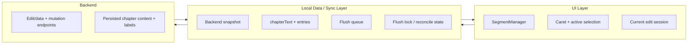
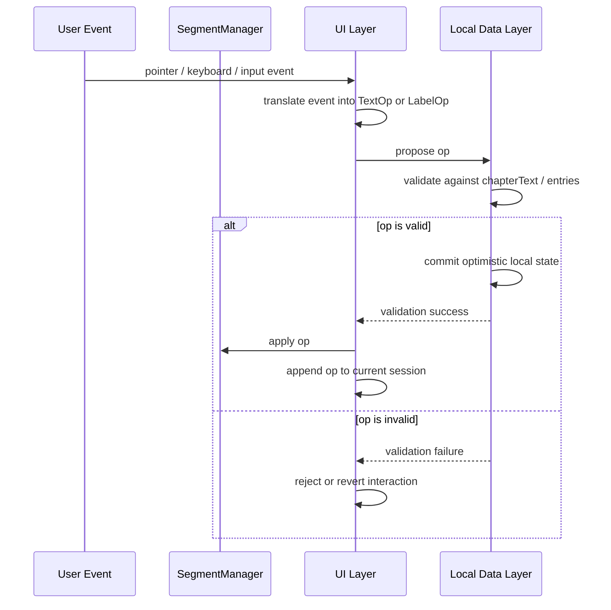
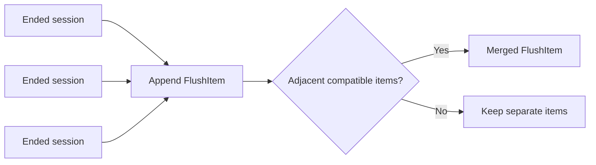
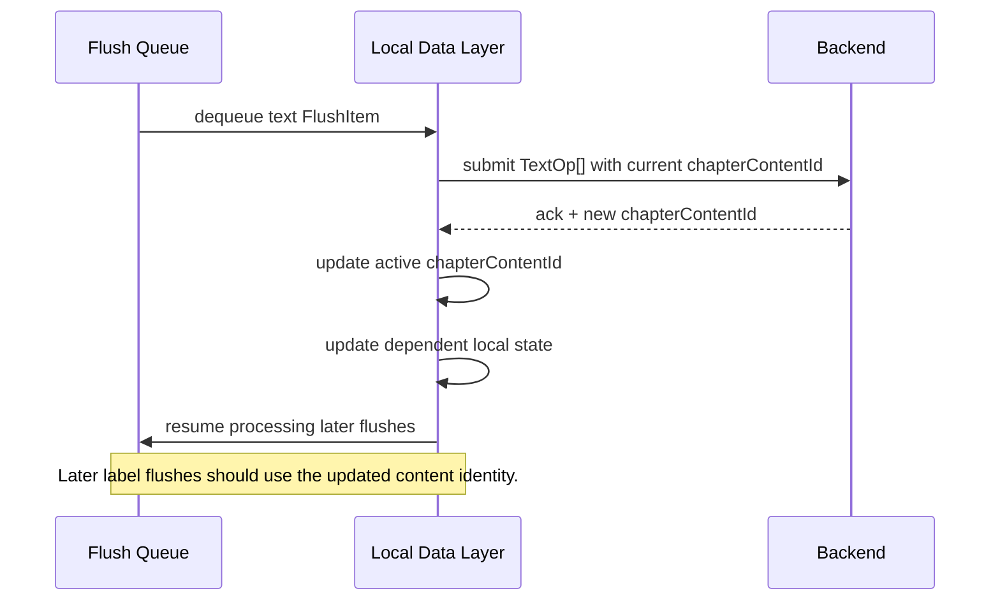

# Editing Architecture

**Last Updated**: April 26, 2026
**Status**: Draft

This document describes the proposed architecture for the new chapter editing page under `frontend/src/edit/`. It is intentionally a design doc for the current direction, not a statement that the full system is already implemented.

The goal is to define:

- which layer owns which state
- how text and label edits move through the system
- how optimistic local state relates to backend state
- why text flushes require stronger synchronization than label flushes

Read [labeled-text-library.md](labeled-text-library.md) first if you need the lower-level behavior of the text/segment manager.

---

## Table of Contents

1. [Overview](#overview)
2. [Current Backend Contract](#current-backend-contract)
3. [Layer Model](#layer-model)
4. [State Model](#state-model)
5. [Event Flow](#event-flow)
6. [Session Model](#session-model)
7. [Flush Queue Model](#flush-queue-model)
8. [Text Flush Reconciliation](#text-flush-reconciliation)
9. [Failure and Reload Strategy](#failure-and-reload-strategy)
10. [Non-Goals](#non-goals)
11. [Open Questions](#open-questions)
12. [Relevant Files](#relevant-files)
13. [See Also](#see-also)

---

## Overview

The editing page is converging on a three-layer design:

1. UI layer
2. local data/synchronization layer
3. backend

The important architectural decision is that the labeled text library is only the UI editing primitive. It is not the full page state machine.

In particular:

- `SegmentManager` owns the live mutable text+label editing surface
- the page owns editor mode, active entry selection, optimistic local state, and backend synchronization
- the backend remains authoritative for persisted chapter content and labels



## Current Backend Contract

The current page-shaped read endpoint is:

- `GET /edit-chapter-data/{chapter_id}`

implemented in [backend/src/editing/router.py](/workspaces/NovelTL_Dev/backend/src/editing/router.py:1).

The response shape is defined by [backend/src/editing/schemas.py](/workspaces/NovelTL_Dev/backend/src/editing/schemas.py:1) and currently includes:

- `chapter`
- `chapter_content`
- `role`
- `label_group_list`
- `label_data_list`

This is the initial backend snapshot for the editor.

## Layer Model

### 1. UI layer

This layer exists to support real-time interaction.

It should own:

- `SegmentManager`
- caret state
- the current uncommitted edit session
- event translation from DOM/editor events into `TextOp` or `LabelOp`

It should not own:

- backend flush queue
- persisted optimistic snapshots
- active backend version metadata

### 2. Local data/synchronization layer

This is the editor's actual application state.

It should own:

- latest backend snapshot
- optimistic local text snapshot
- optimistic local label snapshot
- queued sessions waiting to flush
- flush locking / reconciliation state
- reload/error coordination

This layer is the bridge between the live UI surface and the backend.

### 3. Backend

The backend owns persisted chapter content, label data, permissions, and final acknowledgement of writes.

The frontend should assume backend writes can fail or require reconciliation.

## State Model

The current direction suggests three categories of state.

### Backend snapshot

This is the last authoritative data loaded from the server.

- `novel`
- `chapterList`
- `editChapterData`

This state should be replaced on reload.

### Optimistic local committed state

This is the frontend's synchronized working copy.

- `chapterText`
- `entries`
- `flushQueue`
- `flushLock`

`entries` are not just a cache in the loose sense. They are better thought of as the optimistic local committed label snapshot that the page believes to be true after applying completed local sessions.

A likely entry shape is:

```ts
type Entry = {
  labelGroup: LabelGroup
  labelData: LabelData | null
  labels: Label[]
  visible: boolean
  mutable: boolean
  dirty: boolean
}
```

### Live UI state

This is the transient interaction layer.

- `manager`
- `caret`
- `activeIndex`
- `mode`
- `sessionMode`
- `textEditSession`
- `labelEditSession`

This state can move faster than backend synchronization.

## Event Flow

The intended event flow is:

1. UI event occurs
2. UI layer translates the event into an op
3. local data layer validates the op against the current optimistic model
4. if valid, local data layer updates:
   - `chapterText` for text edits
   - `entries` for label edits
5. UI layer applies the same change to `SegmentManager`
6. op is appended to the current edit session

That ordering matters.

The page should not treat the manager as the only truth. The manager is the live editing mechanism, while the local data layer is the page's committed optimistic model.



## Session Model

The proposed session model is:

- `sessionMode: "edit" | "label" | null`
- `textEditSession: TextOp[]`
- `labelEditSession: LabelOp[]`

Sessions are short-lived buffers of contiguous user activity.

Likely session boundaries:

- inactivity timeout
- switching between text-edit and label-edit mode
- switching the active label entry

When a session ends:

1. commit its changes into the optimistic local model
2. append a flush item to the queue
3. clear the session buffer

The UI manager continues to provide the real-time surface during the session itself.

## Flush Queue Model

The queue should not be modeled as raw `(TextOp[] | LabelOp[])[]`.

It should be a tagged queue with enough metadata to flush safely later.

Suggested shape:

```ts
type FlushItem =
  | {
      kind: "text"
      ops: TextOp[]
      chapterContentId: string
    }
  | {
      kind: "label"
      ops: LabelOp[]
      labelDataId: string
      chapterContentId: string
    }
```

This gives the queue enough context to know:

- what type of flush is being performed
- which backend object it targets
- which content snapshot the ops were derived from

The local synchronization layer may also merge adjacent compatible items before flush:

- contiguous text sessions can be merged into one text flush
- contiguous label sessions for the same target can be merged into one label flush



## Content Identity Reconciliation

Text flushes are not special because they need a different queue model. They are ordinary flush items like anything else.

What is special is their acknowledgement path: a successful text flush may return a new `chapterContentId` or otherwise require the frontend to update its active content identity before later dependent writes proceed.

That means a successful text flush may create a reconciliation barrier:

1. flush text ops
2. receive ack from backend
3. update `chapterContentId` and any dependent local state
4. resume queue processing against the new content identity

This matters because later label flushes may depend on the current content identity.

If label writes built against the old `chapterContentId` continue to flush blindly after a text write, the frontend can target stale backend objects or stale coordinates.

So the working rule is:

- flush items remain uniform
- the text-flush success path may update content identity
- later dependent flushes should proceed against that updated identity



## Failure and Reload Strategy

The frontend should treat backend flush errors and reconciliation timeouts as synchronization failures, not just incidental request errors.

A likely policy is:

1. stop dequeueing further flushes
2. mark the editor as needing reload/reconciliation
3. request a fresh `EditChapterData` snapshot
4. decide later whether pending local sessions can be replayed or must be discarded

At minimum, the UI should make the blocked state explicit instead of silently continuing on stale assumptions.

## Non-Goals

This architecture does not currently attempt to solve:

- multi-user real-time collaboration
- CRDT/OT merging
- cryptographic backend verification
- transparent replay of arbitrary failed edit histories

The immediate goal is a single-user optimistic editor with explicit reconciliation around text-version changes.

## Open Questions

- Should `entries` be fully derived from `editChapterData` plus local overlays, or become the long-lived optimistic SSOT after initial load?
- How should label edits be transformed or invalidated after a text flush changes the chapter content version?
- Should the backend expose dedicated batch endpoints for text and label session flushes?
- Should content identity later include a text hash in addition to `chapterContentId`?
- What exact policy should govern automatic reload after flush timeout or error?

## Relevant Files

- `frontend/src/edit/pages/EditNovelPage.tsx` - Current editor page under development
- `frontend/src/api/editing.ts` - Frontend API wrapper for aggregate edit data
- `frontend/src/types/editing.ts` - Frontend edit payload types
- `frontend/src/lib/utils.ts` - Shared loader hook currently used by the page
- `frontend/src/components/labeled-text-lib/` - Lower-level text/label rendering and mutation library
- `backend/src/editing/router.py` - Aggregate edit-data read endpoint
- `backend/src/editing/schemas.py` - Backend response contract for the edit page

## See Also

- [labeled-text-library.md](labeled-text-library.md) - Current labeled text library implementation doc
- [labeled-text-library-outdated.md](labeled-text-library-outdated.md) - Deprecated original labeled text library design doc
- [editable-with-labels.md](editable-with-labels.md) - Existing backend/editor consistency notes
- [workspace-implementation.md](workspace-implementation.md) - Older workspace architecture doc
