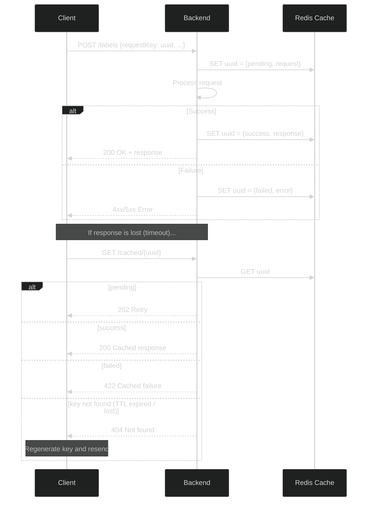

# Editor backend

**Last updated:** 2026-06-02

This is the first in a series of chapters that describes how editor works. This document details the backend architecture for the controller.

## Modifying data

The implementation on the backend for text/label editing is inspired by [Operational Transforms](https://en.wikipedia.org/wiki/Operational_transformation). This project uses a custom built protocol and a custom implementation.

We have also considered having the user send the entire text/label data to save. This has the caveat that the backend has no certainty that the user has seen any of the existing data on the frontend as a certificate that the user know what is going on already. Hence we have decided to limit the amount of communication that the frontend can send to the backend. This also has the added benefit of smaller HTTP payloads, but it makes the implementation more challenging.

### Identifying text ranges

Recall in the data model for a label, a given label can be specified by its text range and its label data. For label identification, we will always mandate any API request to send the text in the corresponding text range. As an example, if we have the text "abcdefg" and we wish to identify the text "def", the corresponding identifier would look something like 
```json
{
    "chapterContentId": "[uuid of chapter content]",
    "start": 3,
    "text": "def"
}
```
We will call such an identifier a **text position identifier**.

If we need to specify a label group/label data as well, we will replace the `chapterContentId` field with a `labelDataId` field. We will then call such an identifier a **label identifier**.

Note that for both identifiers, the keys in an identifier may vary slightly; for example, in a label operation we may see `start` and `text` replaced by `labelStart` and `labelText`. Read the schemas for details on exactly what is used where.

The backend will then validate any operation that sends an identifier with the following expression:
```python
text[labelStart : labelStart + len(labelText)] == labelText
```

As an example, if we need to validate that there exists a label with said identifier in some label data, then we can perform an SQL query of the form 
```sql
SELECT * FROM labels 
WHERE labels.label_start = [labelStart] 
AND labels.label_text = [labelText] 
AND labels.label_data_id = [labelDataId];
```
and check if our query returns nonempty data.

This identification method will apply to both text operations and label operations. Namely, this ensures two things:

1. The end user knows what data is at the position that they wish to modify at the time that they send the request.
2. We will see that (with some modification) this guarantees that any text/label operation is reversible.

These identifiers will be used throughout both the frontend and backend extensively to validate operations.

### Label operations

See [backend/src/labels](../../backend/src/labels/) for details.


A label operation is either an add operation, a delete operation, or an update operation. Specifically, 

- An add operation is simply a JSON payload that has fields for a label identifier and fields for metadata associated with the label.
- An update operation is a JSON payload that has fields for a label identifier corresponding to an existing label and metadata for the new desired label. This includes metadata to update the label position, which means that an update operation should contain an optional second label identifier.
- A delete operation is simply a JSON payload with a label identifier.

Broadly speaking, processing a single label operation will always follow the following format:

1. Fetch chapter content + corresponding label data from database into memory
2. Check if label operation is valid (is there an existing label with the given identifier? does performing this operation leave the data in an invalid state?)
3. Send an SQL request to the database
4. Commit to database

Note that errors can happen on step 4 due to race conditions when users simultaneously edit a single label data. In that case, we rollback the transaction and throw an error. In fact, in this case, users may experience desynchronization even while the data model stays consistent on the backend and furthermore, their respective operations may still succeed if they are not working on the same part of a label data. For now we will keep this "feature" as a necessary evil. 

Performing a single operation at a time is relatively inefficient - consider what would happen if the user performs a lot of label operations in a lot of different places - the frontend would need to send one HTTP request for each desired label operation. We hence adopt the practice of receiving lists of label operations instead of single label operations. Hence steps 2 and 3 in the algorithm above are really coralled into a for loop over all label operations in an HTTP request.

The specific algorithm can be found at the endpoint `PATCH /label-datas/${labelDataId}`. 

### Text operations

There are two types of text operations a user can perform:

- An add operation takes a text position and a text and simply inserts that text at that position.
- A delete operation takes a text position identifier and deletes the text at that position.

Compared to label operations, it is more important that end users have a consistent view of the text. This is because a text operation should semantically modify all labels for that chapter. We follow the semantics below for deciding what happens to labels after a text operation:


- For add operations:
    - Any label that ends before the start of an add operation should remain in the same position
    - Any label that contains the start position of the add operation should be deleted
    - Any label that starts after the start position of the add operation should be shifted right by the length of the text added
- For delete operations:
    - Any label that ends before the start position of the delete operation should remain in the same position
    - Any label whose range overlaps with the delete range should be deleted
    - Any label whose start position is after the end position of the delete operation should be shifted left by the corresponding length of text being deleted

To ensure a consistent data model, we store text data in chapter content snapshots (see the `chapter_content` table for details). The idea here is to have a list of immutable chapter contents for each chapter, where each chapter content has an associated version and id. Furthermore, the version attribute should be unique for each chapter id (enforced by a `UniqueConstraint` on the database). The frontend should keep track of the latest chapter content id (chapter content id with the latest version). 

When any update comes through, the frontend should send its copy of the chapter content id it is working with and the backend should verify that the chapter content associated with this id is the latest version for the corresponding chapter. Any updates performed to the database should then be in the form of inserting new chapter contents with version being one more than the previous max version. If any of these operations fail, it is most likely due to a race condition and the backend should roll back the corresponding database transaction and notify the frontend.

To ensure that the labels are also copied over, the backend should copy over all existing label datas and perform the corresponding operations as well. We can also "stream" these text operations, just like the label operations. To summarize, the backend should follow the following algorithm when performing text operations:

1. Fetch chapter content that satisfies that has both the latest version and corresponding chapter content id and keep an in-memory copy of the text, or throw an error if no such chapter content exists
2. Fetch all label datas corresponding to this chapter content id
3. Fetch all labels corresponding to any of the label datas specified above and keep an in-memory copy of a mapping `label data id : list of labels`
4. For each text operation:
    - Modify the in-memory text accordingly
    - Modify the in-memory labels accordingly (see semantics above)
5. Create a new chapter content with `version = current version + 1` and get uuid, or throw an error (race condition can happen here with version conflict)
6. Create a new label data for each label data in the in-memory mapping corresponding to the new chapter content id
7. Insert the in-memory labels corresponding the the new label datas


### Other operations

These include creating new chapters/new label groups. These are fairly straightforward and will not be outlined in this document.

## Caching requests

Consider what may happen if a client has bad connection due to whatever reason. It may be the case that their HTTP requests are dropped occasionally. What may be more catastrophic is if the backend receives a client's HTTP request, performs the (non-idempotent) operation, and the response is dropped midway. The client then has no knowledge about whether their request went through or not.

Without the feature that we will explain below, the client has two options:

1. Retry the same request. This may perform an additional unintended operation on the backend and leave the data on the frontend in an inconsistent state with the backend.
2. Force a refresh. This will keep the data in a consistent state, but will consume an expensive operation and may disrupt the workflow of the user.

To mitigate this problem, we will temporarily store requests in a Redis cache. Specifically, for certain requests associated with the editor, we will give the frontend the option to send a uuid field called `requestKey`, and if a `requestKey` is received by the backend, then the JSON payload and `requestKey` are stored into the Redis cache as a key-value pair `requestKey : [request status, request JSON, return object]`. A request status is simply one of `pending`, `success`, or `failed`. The return object is simply the result of processing the request that would normally be sent to the user.

Specifically, some functions will have the following workflow:

1. Check if a request key is included in the payload.
2. If a request key is included:
    - Store the key-value pair `requestKey : [pending, request JSON]` into the redis cache with some TTL, or throw an error if such a request key already exists
    - Try processing the request.
    - If an error occurs, set the request status to `failed` and throw the corresponding HTTP error normally.
    - If the request succeeds, set the request status to `success` and the return payload to the desired payload in the Redis cache, then return 
3. Otherwise, just process the request normally.

This workflow is implemented using a decorator in [backend/src/requests/decorators.py](../../backend/src/requests/decorators.py).



A client can then request to see the status of a request that they previously sent by querying the `requestKey`. Specifically, the client can perform the following sequence of operations:

1. Generate a collision-resistant key (uuid) and send the request with this request key
2. If the client receives a successful response, then all is well.
3. If the client receives a response that the backend failed to process the request, it knows that its request must be invalid in some way (or an internal server error happened, in which case there might be a bug)
4. If the client does not receive a response/the client times out, then they can query the request key to the backend. 
    - If the backend sends a response and the request is pending, the client can wait.
    - If the backend sends a response and the request failed, the client knows that its request was invalid somehow, similar to how a regular failure happened.
    - If the backend sends a response and the request was a success, then all is well.
    - If the backend sends a response that the key does not exist, then either the TTL expired in Redis (this should not happen with proper frontend controls), or the request was lost when sending from frontend -> backend. In this case, the frontend can simply regenerate a request key and resend the request.

We will see in the subsequent chapters that this is almost exactly the workflow that the frontend adopts.