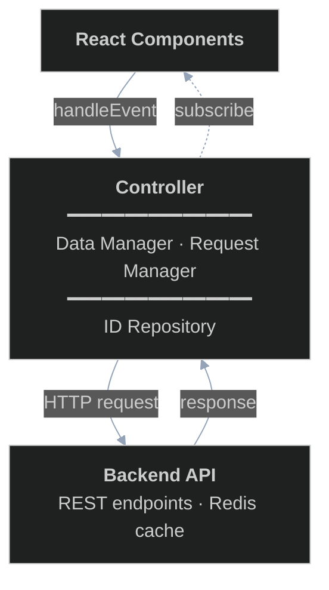
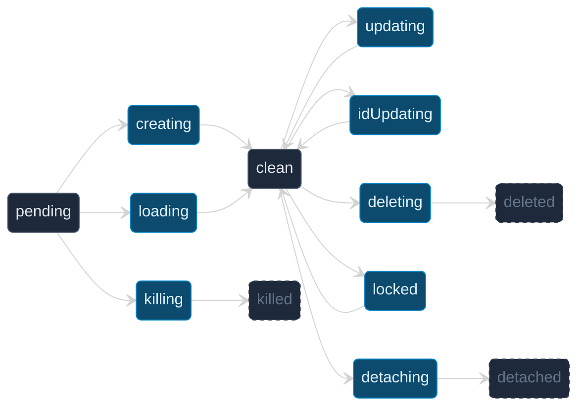

# The Controller

This is the second chapter in a series of chapters that describes how the editor works. This chapter describes how the controller works itself.

## Motivation

To display content and keep consistent data with the backend, the frontend needs to store certain data. Broadly speaking, when a user performs some editor action, the following sequence of events should be triggered:

1. User triggers an event
2. Various consumers convert the event to a corresponding readable format
3. Consumers process the readable event format

One such consumer is the data store. Specifically, what must happen when an event is triggered is that:

1. User triggers an event related to some data modification
2. Event gets converted to a **data transformation request**
3. Local copy of data gets updated
4. Request to update data gets sent to backend to be processed
5. Handle response

Note that we would like step 4 to be run asynchronously, so that the end user does not face any latency related to request-response latency from the backend when editing. As such, we must keep a queue of requests in addition to processing a user event synchronously.

There are several challenges to doing this. Here are some examples:

- We need to validate label operations on the frontend before passing requests to the backend. This means we effectively have to redefine the same data structure used on the backend for validating label groups and intercept requests to the backend if this happens.
- Consider what happens when a user decides to create a label group on the frontend and decides to add some labels to that group really quickly (faster than the backend can process the request). The frontend needs to keep track of a label group that has not yet been created on the backend yet (and hence has not yet been assigned an ID). 
- Consider what happens when a user creates a new label and goes to immediately click it. If the backend has not yet processed the creation of the label yet, how might the frontend keep track of it?

- Consider what happens when a user creates two label groups in quick succession. These two operations are "independent" of each other in the sense that there is no reason that we should wait for one request to the backend to complete before processing the other. We may want to send these two requests simultaneously.

These are fairly difficult problems. Specifically, these questions pertain to data storage and event validation on the frontend, as well as data synchronization with the backend. Furthermore, these problems do not really affect how the data is rendered. Naturally, we will try to isolate the solution to this problem, and we will do so through an interface called a **Controller**.

## Interface

Before we dive into any implementation details, we must specify what exactly we need from the controller. We make the following assumption:

> The lifetime of a controller is tied to the time that the user spends on a single chapter. A controller should be created when a user navigates to a specific chapter and destroyed when the user navigates to another chapter.

Refer to [README.md](./README.md) for the requirements on the page.

Categorically, for a given chapter/novel, we need to store the following four categories of objects, or **kinds**:

- Current chapter content
- Label groups for this novel
- Label datas for this chapter content
- Labels for each label data

We will then need to expose some of this data through getters. The way we will do this is to create a `ControllerGetters` type:
```typescript
type ControllerGetters = {
    ... // list of getter callback types
}
```

Then the controller will have an attribute `getters : ControllerGetters`. The exact fields in the `ControllerGetters` class will be elaborated on in subsequent chapters.

We furthermore need an interface through which to handle user events. The controller will accept certain data-friendly formats to process. We will list a snapshot of the event types below to give you an idea of what such an event is, but this list may grow.

```typescript
type UserEvent =
    | { eventType: "textOp"; op: TextOp } // text op
    | { eventType: "labelOp"; op: LabelOp; labelGroupId: string } // label op
    | { eventType: "addLabelGroup"; labelGroupName: string } // add a new label group
    | { eventType: "switchMode"; mode: EditorMode } // switch between text editing mode, label editing mode and view mode (no editing)
    | { eventType: "switchLabelGroup"; labelGroupId: string | null } // place focus on a specific label group
    | { eventType: "hoverPos"; pos: number | null } // hover on a specific position in text, or null to clear hover (only for ui purposes, does not affect the actual labels meaningfully)
    | { eventType: "clickPos"; pos: number | null } // click on a specific position in text, or null to clear click (only for ui purposes, does not affect the actual labels meaningfully)
    | { eventType: "loadGroup"; labelGroupId: string } // load a specific label group
    | { eventType: "toggleVisibility"; labelGroupId: string; visible: boolean }; // toggle visibility of a specific label group
```

Essentially, a `UserEvent` is a translated version of any event that the user takes that can have an effect on the data being displayed. For example, if a user hovers over a label, the colour of the label might darken (or some other effect might occur). This event will flow through the controller and be passed onto some component that will change the colour of the label.

The controller defines an event handler called `handleEvent` in its interface to handle such events. 

```typescript
handleEvent(event: UserEvent) => void
```

There are several downstream objects that may consume specific events. For example, the display for the list of label groups may want to be notified when a request to add a label group comes in or when the backend has finished adding a label group. The text/label display also wants to be notified when the text or labels are modified. To deal with this, the controller will expose a subscribe function.

We define a set of "trigger conditions":
```typescript
type TriggerType = "textChange" | "labelsChange" | "labelGroupsChange" | "all"
```
as well as a subscribe function:
```typescript
type Controller = {
    subscribe(
        callback : (
            triggers : TriggerType[], 
            getters : ControllerGetters, 
            event? : UserEvent
        ) => void
    ): () => void,
    ... // other functions
} 
```
The subscribe function returns an unsubscribe function that will detach the corresponding component from listening to controller updates. When specific events happen in the controller (e.g. postupdate to certain data), the controller will trigger all subscribed callbacks with that corresponding trigger.

Some examples of triggers are when a specific user event triggers or when a backend request completes and returns (successfully or unsuccessfully).

## High level architecture

There are three main components to the controller, which the controller acts as an orchestrator for.

1. ID repository: 
    - to get around being temporarily unsynced with the backend on certain requests (e.g. creating a label group and not knowing the new id, or making text edits and not knowing the new chapter content id), the frontend works with **provisional IDs**. The frontend must also store a mapping from provisional IDs to **server IDs**.
    - The ID repository also stores the (predicted) status of the backend for specific IDs. For example, when a label group gets created on the frontend, a new provisional ID is generated for this label group and the corresponding server ID is marked as null. A request is queued and the provisional ID is marked as pending. When a successful response comes back, the provisional ID is then marked as clean to indicate that the label group with this provisional ID has been created.
2. Data manager:
    - Broadly speaking, this manages and validates all the data. It keeps an authoritative copy of all frontend views and uses provisional IDs. It also creates requests to send to the backend upon user events.
    - The actual role that this component plays is fairly wide-stretching and will be described in greater detail below.
3. Request manager:
    - The request manager keeps a queue of requests to be sent to the backend and schedules requests. It also propagates responses to the controller for it to deal with.

The controller acts as a bridge between the data manager and the request manager. The data manager and request manager both have access to the ID repository.

To React components and the backend, these four pieces form a single logical unit. The architecture can be viewed in layers:



This chapter will cover the internals of the controller unit. We will cover the three major components, as well as how the controller ties everything together. 

## ID repository

The ID repository aims to serve the following purposes:

- Keep track of a list of canonical identifiers called provisional IDs used by frontend components
- Keep track of the server IDs for each provisional ID
- Keep track of the status on the backend for each provisional ID

We should perhaps first define what a status is. Before that, we need to give a brief overview about how the request manager schedules requests. Essentially, the request manager keeps a queue of callbacks and metadata associated with each callback. When sending requests to the backend, it picks up a callback and tries to see if this callback is "independent" from the other callbacks it has already picked up in the sense that the resources that this callback touches on the backend do not overlap with the resources that the other callbacks touch on the backend. Once the request manager can no longer do this, it sends all the requests that it has picked up at once and waits for a response from all of them before sending the next batch.

The crucial thing here is that for each resource (chapter content, label group, label data, label), the request manager must know whether a request to change a certain resource overlaps with another request to change that same resource. This is where the notion of assigning each provisional ID with a status comes in - broadly speaking, we say that a provisional ID is **in-flight** if its corresponding resource is being used for a request that is being sent by the request manager. Otherwise, we say that the provisional ID is **grounded**. Then a provisional ID can move from a grounded status to an in-flight status when a corresponding request that uses it is chosen to be sent to the backend by the request manager.

We will say in advance that the notions of in-flight and grounded states are not sufficient enough to describe the full scope of all possible requests. There are many different semantic states that a provisional ID can be in even within the grounded/in-flight categories. We will list some of these states below.


| **State** | **In-flight or grounded** | **Semantic meaning** | **Example** |
| --- | --- | --- | --- |
| `clean` | grounded | Frontend and backend are in sync. The provisional ID has a bound server ID and the resource exists on both sides. | A label group was successfully created and its server ID was bound |
| `pending` | grounded | Provisional ID exists on frontend but no server-side counterpart has been created yet. The server ID is not yet known. | `idRepo.newId()` is called for a new label group that hasn't been sent to the backend |
| `deleted` | grounded | The resource was successfully deleted from the backend. Terminal state — eligible for garbage collection. | The deletion request completed successfully; the provisional ID can be discarded |
| `detached` | grounded | The frontend reference has been successfully detached from the server object. The server object still exists. Terminal state — eligible for garbage collection. | Old labels from a reloaded group have been cleaned up |
| `killed` | grounded | The provisional ID has been discarded without ever having a server counterpart. Terminal state — eligible for garbage collection. | A failed creation cleanup completed; the provisional ID is removed |
| `updating` | in-flight | A request to modify this resource on the backend is currently being sent | A label's start/end position was changed by dragging; the update is in transit |
| `creating` | in-flight | A request to create this resource on the backend is currently being sent | A new label group is being created; the frontend waits for a server-assigned ID |
| `locked` | in-flight | Resource is temporarily reserved for a read operation. Multiple locks can be stacked (the resource stays locked until all are released). Prevents write operations from interfering with in-progress reads. | A label group's labels are being loaded from the backend while a text edit that would affect labels is waiting |
| `deleting` | in-flight | A request to delete this resource from the backend is currently being sent | A label was removed by the user; the deletion is in transit |
| `idUpdating` | in-flight | A request is in transit that will reassign this resource's server ID to a new value. Used during text operations, where the backend creates new copies of all label data entries and returns a mapping from old to new IDs. | After a text edit, all label data entries get new server IDs; the frontend updates its mapping |
| `loading` | in-flight | A provisional ID in `pending` state is being loaded with server data. Used when fetching an existing server resource into a new provisional ID. | A label group that exists on the server is being loaded for the first time into the frontend's tracking |
| `detaching` | in-flight | The frontend is detaching its tracking of this resource from the server object. The server object continues to exist, but the client will no longer reference it. Used when reloading a label group (old labels replaced with fresh data) or during failure cleanup of partially-created resources. | A label group is reloaded; old labels are detached before new ones are fetched |
| `killing` | in-flight | A provisional ID that never had a server counterpart is being discarded. Like `detaching` but for IDs still in `pending` state. Used in failure cleanup. | A label group creation request failed; the provisional ID is being cleaned up without ever having a server ID |

Having more granular states has the added side effect of grounded states only being able to transition to specific in-flight states and vice versa. To reduce the complexity of ground state/in-flight state transitions, we add the restriction that each in-flight state should only have one ground state that can transition into it and one ground state that it can transition to. For a given in-flight state, we call the ground state that transitions into it the **entry state** and the ground state that it transitions out of the **exit state**. We specify these transitions via two functions:

```typescript
function entryStatus(status: InFlightIdStatus): GroundIdStatus

function exitStatus(status: InFlightIdStatus): GroundIdStatus
```

It is important to keep the entry state unique for a given state to ensure that we can rollback to the entry state in case of failure.



- **Grounded** (dark): `pending`, `clean`, and the three terminal states (`deleted`, `detached`, `killed`)
- **In-flight** (blue): all transient states that reserve a resource during an active operation

In this way, we can think of transitioning to an in-flight state as reserving or locking specific resources. Hence the interface for an ID repository has functions fittingly named as follows:

```typescript
isReserveable(kind: Kind, id: ProvisionalId, desiredState: InFlightIdStatus): boolean;

reserveIdObjState(kind: Kind, id: ProvisionalId, desiredState: InFlightIdStatus): boolean;

releaseIdObjStateOnSuccess(kind: Kind, id: ProvisionalId): void;

releaseIdObjStateOnFailure(kind: Kind, id: ProvisionalId): void;
```

Semantically, `isReserveable(kind, id, desiredState)` will return `true` if the `desiredState` has entry state being the current state of `id`. Then `reserveIdObjState` will simply move `id` to the corresponding `desiredState`. There is one notable exception to this in the locked state: if `id` is already in the locked state and a request comes in to reserve the locked state for that id, `isReserveable` will return `true` and when calling `reserveIdObjState`, an internal `lock` counter will increment. The `id` will transition back to the `clean` state once all locks have been released (i.e. the lock count reaches 0).

To see the entire ID repository interface, see [idRepository.ts](../../frontend/src/edit/controller/idRepository.ts) and [types.ts](../../frontend/src/edit/controller/types.ts). The implementation is fairly straightforward once the interface is defined.

## Data manager and Request manager

As much as we would like to present the data manager and the request manager in isolation of each other, their tasks are too tightly coupled to be able to motivate either of these components without introducing the other.

### High-level ideas

The data manager serves two primary purposes:

1. To store an authoritative snapshot of the data as it appears on the frontend
2. To provide a convenient interface through which the controller can interact with the data

To understand exactly what type of interface the data manager must expose, consider what must happen when the user triggers some event that modifies data. First, the frontend must validate the event and trigger a synchronous instant update to the data and the views. Then the frontend must send one or more requests to the backend to update the data on that end.

It is a good time now to be precise with the notion of a request. In an ideal world, we would say that any asynchronous callback function is a request. In this way, we can queue up a list of asynchronous callbacks in the request manager and the request manager can simply schedule these one by one.

There are two problems with this. Firstly, doing this without adding additional information heavily restricts how the request manager can dispatch requests. Suppose we have two requests A and B, where A was queued before B, and furthermore, A and B use the same resources. Then request A must successfully complete (or fail) before request B runs at all. However, it may also be the case that request A and request B do not use the same resources at all, in which case we can dispatch them together. If we do not pass additional information about which request uses what, then the request manager has no way to tell whether two (or more) requests are independent. 

To solve this problem, we need to provide a protocol for the data manager to communicate what resources a given request wants to reserve. We will define a **reservation request** and see how it fits into passing requests.

A **reservation** is a triple

```typescript
type Reservation = {
    kind: Kind;
    id: ProvisionalId;
    desiredState: InFlightIdStatus;
};
```

An **idempotent callable with return type `T`** is an object with a single field `call` that takes no parameters such that 

1. The return type of `call` is `T`
2. Every invocation of `call` returns the same value.

The corresponding definition in typescript is
```typescript
declare const IDCTag: unique symbol;

type IdempotentCallable<T> = {
    call: () => T;
    readonly [IDCTag]: typeof IDCTag;
};

```

Here `IDCTag` serves as a certificate that an object is an `IdempotentCallable`. Given a pure function `f : () => T`, we can create an `IdempotentCallable` by simply caching the result of `f` on its first call. In typescript, we have the following helper function:

```typescript
function makeIdempotent<T>(fn: () => T): IdempotentCallable<T> {
    let called = false;
    let result: T;
    return {
        call: () => {
        if (!called) {
            result = fn();
            called = true;
        }
        return result!;
        },
    } as IdempotentCallable<T>;
}
```

A **lazy reservation request** is a triple
```typescript
type LazyReservationRequest = {
    reserveList: IdempotentCallable<Reservation[]>;
    skip?: () => boolean;
    wait: () => boolean;
};
```

We will expand on the term "lazy" later. 

At a high level, a reservation request aims to package data relevant to scheduling outgoing requests into a single package. To understand what each of the functions in a reservation request do, we will need to give a high-level overview into how the request manager schedules requests. For now, we will stick to the informal convention that a "request" consists of a callback and a reservation request. We will see later that this is not quite enough information.

The request manager effectively maintains a single list of outgoing requests along with FIFO queue of unprocessed requests. When the request manager is ready to send requests (i.e. no packets are in flight), the request manager picks out a list of outgoing requests according to the following algorithm:

1. Set `request` to be the next queue element.
2. If `request.reservationRequest.wait()` returns `false`:
    - Dequeue `request`.
    - If `request.skip()` returns `false`:
        - Add it to the outgoing requests.
        - Set `reservations = request.reservationRequest.reserveList.call()` and for each `reservation` in `reservations`, call `idRepo.reserveIdObjState(reservation.kind, reservation.id, reservation.desiredState)`.
3. Repeat steps 1 and 2 until `request.reservationRequest.wait()` returns `true` in step 2.

For now, we have ommitted most of the details for this algorithm, but the high-level idea is there.

Given that the request manager uses this algorithm, the `wait` function and the `reserveList` callable must be defined in such a way that if `wait` returns `false`, then either `skip` returns `true` or each reservation in `reserveList.call()` must be reserveable. The purpose of `skip` may not be immediately apparent here, but we will see that it holds some importance for error handling.

It will be a very common occurence (in fact, vastly more often than not) that the `reserveList` will simply be a predetermined array and the `wait` function simply returns whether each element in the `reserveList` is reserveable. We hence have first class support for this type of reservation request (called a **static reservation request**):

```typescript
export type StaticReservationRequest = {
    reserveList: Reservation[];
    skip?: () => boolean;
    wait?: never;
};
```

We group lazy reservation requests and static reservation requests under the umbrella term **reservation request**. 

The request manager guarantees that if two request events share any reserved resource, the first enqueued will fully complete (success or retries exhausted) before the second starts. This is enforced by the `isReserveable` check in the dequeue algorithm — overlapping reservations prevent the second request from being dequeued until the first releases its resources. Conversely, if two requests have disjoint reservation lists, the request manager may send them in the same batch, allowing independent operations to run concurrently.

To make use of this notion of reservation requests, we need to specify exactly what a prototypical interface function for the data manager does.

1. The controller receives some event.
2. The controller's `handleEvent` function calls some data manager interface function, say `dataManager.doSomething(...)`
    - `doSomething` runs some synchronous code to update the internal data for `dataManager`.
    - `doSomething` then returns a list of "requests" that the request manager can enqueue
3. The controller takes the result of `dataManager.doSomething(...)` and passes each one of the generated requests into `requestManager.enqueueRequest`.

Why do we need to be able to generate multiple requests? Consider what might happen when creating a new label group. In theory, we only need to send one API call to the backend. However, we will often already be on a certain chapter in the backend and the user will likely want to immediately create new labels. In this case, we may want to create a label data immediately after the label group has been created.

There are two approaches we can take: one is to reserve a lot of resources ahead of time and to send a single request that does two async backend API calls. This is undesireable for two reasons: firstly, we are effectively passing control of the callback lifecycle to the request manager after `doSomething` returns. Ideally, we would like `requestManager` to retain as much control over the generated request as possible. 

The second more concrete reason is that the request manager cannot wait for a given request to succeed forever. Having two backend API calls in a single callback will increase the potential latency of this single request and increase the risk that the function fails halfway with no proper error recovery.

We hence break a single "moral request" into smaller chunks, each with at most one backend API call.

One thing to note is that when a request is successfully processed and executed, we may wish to notify certain UI components that the request has finished executing. One example is the display for label groups. The user may wish to refresh a given label group to check that it is up to date with the backend. Then we must find a way for the request to communicate with the component that the request for refreshing the label group has completed. 

The way we accomplish this is through the use of a construct we call **signals**. A signal is really just a piece of data indicating what happened after a request completes successfully. The idea is to have a request callback return a signal on success, which the request manager will propagate up to the controller, which will notify all relevant subscribers to this signal type.

To summarize, a typical data manager interface functions does the following:

1. Performs synchronous data update
2. Returns a "request" that contains a reservation and an asynchronous callback
3. The callback within the request returns a signal

### RequestEvent interface

It is now time to introduce the full request type, which we have (perhaps inaptly) named a **request event**.

```typescript
export type BaseRequestEvent = {
    callback: (requestKey: string) => Promise<Signal>;
    reservationRequest: StaticReservationRequest | LazyReservationRequest;
    variant: RequestVariant;
    onFailure?: () => void;
    onFatalError?: (err: Error) => void;
    retries: number;
};
export type NoCachedRequestEvent = BaseRequestEvent & { handleCachedResult?: never };

export type CachedRequestEvent = BaseRequestEvent & {
    handleCachedResult: (cachedResult: CacheEntry, requestKey: string) => CachedResultOutput;
};

export type RequestEvent = CachedRequestEvent | NoCachedRequestEvent;
```

- `callback` is an asynchronous function that takes a `requestKey` (the idempotency key the backend uses to identify the request). The callback is responsible for calling an API endpoint and updating the data manager upon seeing the result. Since the request event is generated within the data manager, the data manager is within its closure and can update itself even when the callback is dispatched by the request manager.
- `reservationRequest` specifies which resources this request needs to reserve (see the preceding section).
- `variant` is a discriminant — one of `"addLabelGroup" | "textOp" | "labelOp" | "addLabelData" | "reloadGroup"` — used by the request manager for routing and debouncing.
- `onFailure` is called when the request exhausts all retries. Typically sets `skipRemaining = true` to cascade-discard subsequent requests in the same operation.
- `onFatalError` is called when the request encounters an unrecoverable error. Always set to the same handler as `onFailure` in practice.
- `retries` is the maximum number of retry attempts before `onFailure` fires.

A request event is either a `CachedRequestEvent` (with `handleCachedResult` for idempotency polling) or a `NoCachedRequestEvent` (without). The `handleCachedResult` function takes a cached server response and returns a `CachedResultOutput` — either `{ status: "success", signal, error: null }`, `{ status: "pending", signal: null, error: null }`, or `{ status: "failure", signal: null, error }`. If a request does not provide `handleCachedResult`, its callback should never throw a `CacheConflictError` and the request manager will never poll for its cached status.

#### Error contract

The callback may throw:

- `ConnectionError` — when the underlying network call fails (fetch rejects). The data manager wraps every API call in a `try/catch` and converts caught errors into `ConnectionError` with the original error as context.
- `CacheConflictError` — when the backend responds with `cacheConflict: true`, meaning the idempotency key is already in use. Retryable collision.
- `FatalError` — all other server-side failures: validation errors, missing resources, insufficient permissions.

The callback never throws `TimeoutError` or `NoCacheEntryError`. These are generated exclusively by the request manager:

- `TimeoutError` — produced by the `withTimeout()` wrapper. Every outgoing request is capped at 10 seconds; exceeding the deadline rejects the promise.
- `NoCacheEntryError` — produced when polling for a cached result and the server responds that no such entry exists, meaning the original request was likely lost in transit.

#### Signal types

A request callback returns a `Signal` on success — a piece of data indicating what happened. The request manager propagates the signal to the controller, which fans it to subscribers.

```typescript
type GroupLoadedSignal = {
  type: "groupLoaded";
  labelGroupId: string;
  getLabels: () => ProvisionalLabel[];
  mutable: boolean;
};
type ClearLabelsSignal = { type: "clearLabels"; labelIds: ProvisionalId[] };
type DetachedIdsSignal = { type: "detachedIds"; detachedIds: { id: ProvisionalId; kind: Kind }[] };

export type Signal = null | GroupLoadedSignal | ClearLabelsSignal | DetachedIdsSignal;
```

Most operations return `null` — they complete silently. Only `reloadGroup` produces signals to notify the UIManager that labels need to be cleared or re-rendered.

### Data manager event handlers

With the request event protocol defined, we turn to how the data manager uses it. A typical data manager interface function:

1. Runs synchronous code to update internal data (add/remove/update a label, insert/delete text).
2. Returns a list of `RequestEvent`s — each with a reservation list and a callback — that the controller passes to `requestManager.enqueueRequest`.

Recall that a single logical operation (e.g. reloading a label group) generates multiple request events. Each request event contains at most one backend API call. This keeps individual callback latencies small and gives the request manager full control over each call's retries and reservations.

The data manager uses a consistent set of reservation patterns across its operations:

- **Creating a resource** (new label group, new label): reserve the new provisional ID as `creating`, plus `locked` on any parent resources being read (the chapter content and label group). On success the callback binds the server-assigned ID and the entry transitions from `pending` to `clean`.
- **Updating a resource** (modify label, modify text): reserve the existing provisional ID as `updating` and its parent resources as `locked`. On success the ID returns to `clean`.
- **Text operations** (insert/delete): reserve the chapter content as `updating` and all affected label data entries as `idUpdating`. The backend responds with a mapping from old to new label data IDs, which the callback uses to rebind IDs. Affected labels that shift positions are reserved as `updating`.
- **Reloading a group**: a five-step pipeline. Step 1 reserves the label group as `updating` (fetch metadata). Step 2 reserves nothing (clear local labels). Step 3 detaches old label data and labels — this is the only operation that uses a `LazyReservationRequest` with `wait`, since the old resources must be grounded before being detached. Step 4 reserves the group as `locked` and a new label data as `loading`. Step 5 reserves the group, label data, and chapter content as `locked` and fetches fresh labels, returning a `groupLoaded` signal.
- **Failure cleanup**: each multi-step operation uses `skipRemaining`. If any step fails, subsequent steps find `skip()` returning `true` and are discarded without being sent.

### Request manager event loop

The request manager is the consumer of request events. It maintains three queues:

- **queued** — requests that have not yet been sent.
- **status queries** — requests that were sent but timed out. The manager polls the server for their cached result rather than resending.
- **retry** — requests that failed with a retryable error and will be re-sent with a fresh `requestKey`.

At a high level, `send()` groups a batch of non-conflicting request events from the three queues and dispatches them in one go. `start()` calls `send()` in a loop until all queues are empty. Both functions are described in detail below.

#### `send()` — batch and dispatch

`send()` processes one batch of outgoing work:

1. Dequeue requests from the front of the queued list while `wait()` returns `false` and either `skip()` returns `true` or all reservations are reservable. Requests where `skip()` returns `true` are discarded without being sent. All others are reserved (via `reserveIdObjState`) and added to the outgoing batch.
2. Poll for pending status queries (via `GET /cached/{requestKey}`).
3. Re-send retry requests.
4. Wait for all three channels to settle. For each response:
    - **Success**: release reservations via `releaseIdObjStateOnSuccess` and pass the returned signal to the controller via `passSignal`.
    - **Failure**: classify the error and move the request to the appropriate queue (status query or retry), or treat it as fatal.

`send()` returns either a delay in milliseconds before it should be called again, or `null` if it should be called immediately (because at least one request succeeded, suggesting no retry backoff is needed).

#### `start()` — outer loop

`start()` calls `send()` in a loop until all queues are empty:

1. If a debounce lock is active, wait 100ms and check again.
2. Call `send()`.
3. If `send()` returned a delay, wait that long before the next iteration.
4. If a fatal error escapes `send()`, surface it to the controller and stop.

The error dispatch policy:

| Error | Action |
|---|---|
| `TimeoutError` or `ConnectionError` | **Retry.** If the request has `handleCachedResult`, re-enqueue as a status query. Otherwise, re-enqueue as a full retry with a fresh `requestKey`. |
| `CacheConflictError` | **Retry.** Re-enqueue as a full retry with a new `requestKey`. Never polls for status. |
| `FatalError` or any other error | **Fail.** Release all reserved states via `releaseIdObjStateOnFailure`. Call `onFatalError`. Add to the error list. |

For status queries, the response is handled through `handleCachedResult()` rather than a thrown error. The handler returns a `status` (`"success"`, `"pending"`, or `"failure"`). Pending responses keep the request in the status query queue. A `CacheConflictError` or `NoCacheEntryError` in the result triggers a full retry. Any other error is fatal.

Each request carries a `retries` counter. It decrements on every retry attempt. When the counter drops below zero, the request is not retried — instead reservations are released via `releaseIdObjStateOnFailure` and `onFailure` fires, which sets `skipRemaining = true` to cascade-discard subsequent requests in the same multi-step operation.

#### Debouncing

The request manager debounces user events via `onUserEvent`. When a mutating event (`textOp`, `labelOp`, `addLabelGroup`, `loadGroup`, `switchMode`) arrives, the manager sets a 1-second debounce lock. If additional events arrive during that window, the timer resets. This prevents the manager from sending requests while the user is actively typing or making rapid edits — the queue fills up during the lock and drains in a batch once the user pauses.

At the top level, the `start()` loop catches any error that escapes `send()` and surfaces it to the controller. Rather than calling a React `setErrors` directly, the request manager propagates errors to the controller, which publishes an `"errors"` trigger through the subscription system (see the Interface section). Components managing error display subscribe to this trigger and control their own rendering state. The controller typically responds to fatal errors by forcing a page reload.

### Controller event handler

The controller is the orchestrator. Its `handleEvent` function is a router:

1. The user interaction is translated into a `UserEvent` (see the Interface section).
2. `handleEvent` inspects `event.eventType` and dispatches to the appropriate handler (e.g. `textOp` → `handleTextOpEvent`, `labelOp` → `handleLabelOpEvent`).
3. The handler calls one or more data manager functions, which return lists of `RequestEvent`s.
4. Each `RequestEvent` is passed to `requestManager.enqueueRequest`.
5. The handler also updates the UIManager (text changes via `segmentManager.insertTextAt/deleteTextAt`, label changes via `segmentManager.addLabel/updateLabel/removeLabel`).

After the handler completes, the controller does not manually fire subscribers. Instead, the data manager is constructed with a **proxy callback** — a function `onStateChange(triggers: TriggerType[])` provided by the controller during construction. Whenever the data manager mutates state (adding a label, creating a group, etc.), it calls `onStateChange` with the appropriate triggers. The proxy closes over the controller's getters and fires all subscribers whose trigger list overlaps with the published triggers. The data manager remains unaware of the subscription system — it simply announces that state changed.

For example, a `textOp` event flows through:

```
User types in Editor
    → onBeforeInput callback translates to { eventType: "textOp", op: { op: "insert", start: 3, text: "XX" } }
    → controller.handleEvent(event)
        → handleTextOpEvent
            → dataManager.insertTextAt(3, "XX")           (optimistic data update)
            → uiManager.segmentManager.insertTextAt(3, "XX")  (immediate render)
        → dataManager.flushTextOps() → [RequestEvent, ...]
        → requestManager.enqueueRequest(each)
```

The request manager eventually sends the batch. When responses return, signals propagate back:

```
Backend responds → request manager releases reservations
    → callback runs: updates DM (binds server IDs)
    → callback returns signal (or null)
    → request manager calls passSignal(signal)
    → controller.handleSignal(signal)
        → dataManager.handleSignal(signal)   (state cleanup)
        → uiManager.handleSignal(signal)     (render cleanup)
```

Throughout this process, each state mutation within the data manager triggers `onStateChange`, which fires the relevant subscribers. This completes the loop: user action → optimistic update → async backend sync → subscribers re-render.