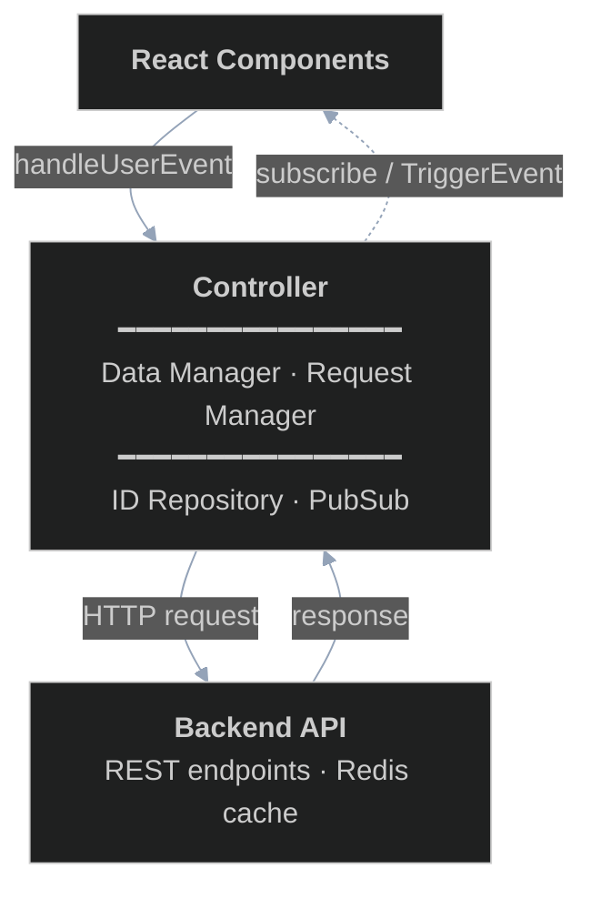
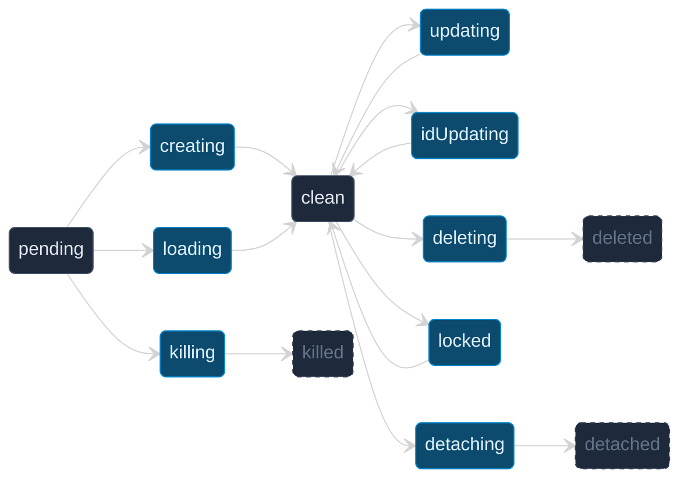

# The Controller

**Last updated:** 2026-06-28

This is the second chapter in a series of chapters that describes how the editor works. This chapter describes how the controller works itself.

> Implementation note: the controller is built on the [`effect`](https://effect.website/) library. Almost every function described below actually returns an `Effect.Effect<...>` rather than a plain value or `Promise`. To keep this chapter readable we describe behaviour conceptually and mostly omit the `Effect` wrappers; refer to the source for exact signatures.

## Motivation

To display content and keep consistent data with the backend, the frontend needs to store certain data. Broadly speaking, when a user performs some editor action, the following sequence of events should be triggered:

1. User triggers an event
2. Various consumers convert the event to a corresponding readable format
3. Consumers process the readable event format

One such consumer is the data store. Specifically, what must happen when an event is triggered is that:

1. User triggers an event related to some data modification
2. Event gets converted to a **data transformation request**
3. Local copy of data gets updated
4. Request to update data gets sent to backend to be processed
5. Handle response

Note that we would like step 4 to be run asynchronously, so that the end user does not face any latency related to request-response latency from the backend when editing. As such, we must keep a queue of requests in addition to processing a user event synchronously.

There are several challenges to doing this. Here are some examples:

- We need to validate label operations on the frontend before passing requests to the backend. This means we effectively have to redefine the same data structure used on the backend for validating label groups and intercept requests to the backend if this happens.
- Consider what happens when a user decides to create a label group on the frontend and decides to add some labels to that group really quickly (faster than the backend can process the request). The frontend needs to keep track of a label group that has not yet been created on the backend yet (and hence has not yet been assigned an ID).
- Consider what happens when a user creates a new label and goes to immediately click it. If the backend has not yet processed the creation of the label yet, how might the frontend keep track of it?
- Consider what happens when a user creates two label groups in quick succession. These two operations are "independent" of each other in the sense that there is no reason that we should wait for one request to the backend to complete before processing the other. We may want to send these two requests simultaneously.

These are fairly difficult problems. Specifically, these questions pertain to data storage and event validation on the frontend, as well as data synchronization with the backend. Furthermore, these problems do not really affect how the data is rendered. Naturally, we will try to isolate the solution to this problem, and we will do so through an interface called a **Controller**.

## Interface

Before we dive into any implementation details, we must specify what exactly we need from the controller. We make the following assumption:

> The lifetime of a controller is tied to the time that the user spends editing a single **novel**. A controller is created when the user opens a novel in the editor and destroyed when they leave it.

A single novel contains many chapters, so chapters are opened and closed *within* a controller's lifetime rather than being tied to it. The controller exposes `openChapter`/`closeChapter`/`addChapter` events for this. The top-level type is `NovelController` and it is built by `buildNovelController` (see [controller.ts](../../frontend/src/edit/controller/controller.ts)).

Refer to [README.md](./README.md) for the requirements on the page.

Categorically, for a given novel we track five categories of resource, or **kinds** (see `Kind` in [types/idTypes.ts](../../frontend/src/edit/controller/types/idTypes.ts)):

- Chapters
- Chapter content
- Label groups
- Label datas
- Labels

Some of this data is exposed through getters. The novel-level getters live on a `NovelGetters` object, and the controller surfaces them as `controller.getters`. Chapter-level reads (text, label data for a group) live on a separate `ChapterGetters` object obtained through the novel getters once a chapter is open. The exact fields are elaborated on in subsequent chapters; see [types/controllerTypes.ts](../../frontend/src/edit/controller/types/controllerTypes.ts).

We furthermore need an interface through which to handle user events. The controller accepts a `NovelUserEvent` — a data-friendly translation of any user action that can affect stored data. The current variants include text ops, label ops, adding a label group, loading label data for a group, and the chapter-lifecycle events (`openChapter`, `closeChapter`, `addChapter`). Note that purely cosmetic interactions (hovering, clicking, switching focus/mode, toggling visibility) are **not** handled here — they live in the UI/manager layer described in the [Managers and Hooks](./managers.md) chapter. Events carry branded provisional IDs (e.g. a chapter ID) rather than raw strings, and most are scoped to a specific chapter.

The controller handles these via:

```typescript
handleUserEvent(event: NovelUserEvent): Effect.Effect<void>
```

Events received before `start()` is called are ignored.

There are several downstream consumers that want to be notified when things happen — for example, the label-group list wants to know when a group is added, and the text/label display wants to know when text or labels change or when a backend sync completes. Rather than a coarse set of string triggers, the controller publishes a structured `TriggerEvent` (a discriminated union with variants such as `textChanged`, `labelChanged`, `labelGroupAdded`, `chapterAdded`, `chapterOpened`, `labelDataReloading`, `labelDataLoaded`, and `errorOccured`). Consumers attach a subscriber:

```typescript
subscribe(
    subscriberFn: (getters: NovelGetters, event: TriggerEvent) => Effect.Effect<void>,
    priority?: number,
): () => void
```

The subscriber receives a fresh getters snapshot and the trigger event on every publish, and `subscribe` returns an unsubscribe function. An optional `priority` controls ordering (lower runs first); this lets some consumers react before others. The pub/sub machinery itself is a small standalone helper, [utils/pubsub.ts](../../frontend/src/edit/utils/pubsub.ts).

Finally, because the controller owns an asynchronous request loop, it exposes `start()` (begin processing; events before this are ignored) and `stop()` (drain pending requests, after which `handleUserEvent` is a no-op).

## High level architecture

There are three main components, which the controller orchestrates.

1. ID repository:
    - to get around being temporarily unsynced with the backend on certain requests (e.g. creating a label group and not knowing the new id, or making text edits and not knowing the new chapter content id), the frontend works with **provisional IDs** and stores a mapping from provisional IDs to **server IDs**.
    - The ID repository also stores the (predicted) status of the backend for specific IDs. For example, when a label group is created on the frontend, a new provisional ID is generated and the corresponding server ID is marked null and `pending`. A request is queued, the ID moves to `creating`, and on a successful response it becomes `clean` with its server ID bound.
2. Data manager:
    - Stores an authoritative snapshot of all frontend data (using provisional IDs), validates operations, and creates requests to send to the backend on user events. Because the controller is novel-scoped, the data manager is split into a `NovelDataManager` (label groups, chapters, and the set of open chapters) and a per-chapter `ChapterDataManager` (a chapter's text and its labels). See [dataManager.ts](../../frontend/src/edit/controller/dataManager.ts).
3. Request manager:
    - Keeps queues of requests to be sent to the backend, schedules them, and propagates results back. See [requestmanager.ts](../../frontend/src/edit/controller/requestmanager.ts).

The controller bridges the data manager and the request manager, and publishes trigger events through the pub/sub. The data manager and request manager both have access to the ID repository.

To React components and the backend, these pieces form a single logical unit. The architecture can be viewed in layers:



This chapter will cover the internals of the controller unit. We will cover the three major components, as well as how the controller ties everything together.

## ID repository

The ID repository aims to serve the following purposes:

- Keep track of a list of canonical identifiers called provisional IDs used by frontend components
- Keep track of the server IDs for each provisional ID
- Keep track of the status on the backend for each provisional ID

We should perhaps first define what a status is. Before that, we need to give a brief overview about how the request manager schedules requests. Essentially, the request manager keeps queues of requests and metadata associated with each. When sending requests to the backend, it picks up a request and checks whether it is "independent" from the other requests it has already picked up, in the sense that the resources it touches on the backend do not overlap. Once the request manager can no longer do this, it sends all the requests it has picked up at once and waits for them before sending the next batch.

The crucial thing here is that for each resource (chapter, chapter content, label group, label data, label), the request manager must know whether a request to change a certain resource overlaps with another request to change that same resource. This is where assigning each provisional ID a status comes in — broadly speaking, a provisional ID is **in-flight** if its resource is being used for a request currently being sent, and **grounded** otherwise. A provisional ID moves from grounded to in-flight when a request that uses it is chosen to be sent.

The notions of in-flight and grounded are not enough to describe the full scope of all possible requests; there are several semantic states within each category. We list them below.

| **State** | **In-flight or grounded** | **Semantic meaning** | **Example** |
| --- | --- | --- | --- |
| `clean` | grounded | Frontend and backend are in sync. The provisional ID has a bound server ID and the resource exists on both sides. | A label group was successfully created and its server ID was bound |
| `pending` | grounded | Provisional ID exists on frontend but no server-side counterpart has been created yet. The server ID is not yet known. | `idRepo.newId()` is called for a new label group that hasn't been sent to the backend |
| `deleted` | grounded | The resource was successfully deleted from the backend. Terminal state — eligible for garbage collection. | The deletion request completed successfully; the provisional ID can be discarded |
| `detached` | grounded | The frontend reference has been successfully detached from the server object. The server object still exists. Terminal state — eligible for garbage collection. | Old labels from a reloaded group have been cleaned up |
| `killed` | grounded | The provisional ID has been discarded without ever having a server counterpart. Terminal state — eligible for garbage collection. | A failed creation cleanup completed; the provisional ID is removed |
| `updating` | in-flight | A request to modify this resource on the backend is currently being sent | A label's start/end position was changed by dragging; the update is in transit |
| `creating` | in-flight | A request to create this resource on the backend is currently being sent | A new label group is being created; the frontend waits for a server-assigned ID |
| `locked` | in-flight | Resource is temporarily reserved for a read operation. Multiple locks can be stacked (the resource stays locked until all are released). Prevents write operations from interfering with in-progress reads. | A label group's labels are being loaded from the backend while a text edit that would affect labels is waiting |
| `deleting` | in-flight | A request to delete this resource from the backend is currently being sent | A label was removed by the user; the deletion is in transit |
| `idUpdating` | in-flight | A request is in transit that will reassign this resource's server ID to a new value. Used during text operations, where the backend creates new copies of all label data entries and returns a mapping from old to new IDs. | After a text edit, all label data entries get new server IDs; the frontend updates its mapping |
| `loading` | in-flight | A provisional ID in `pending` state is being loaded with server data. Used when fetching an existing server resource into a new provisional ID. | A label group that exists on the server is being loaded for the first time into the frontend's tracking |
| `detaching` | in-flight | The frontend is detaching its tracking of this resource from the server object. The server object continues to exist, but the client will no longer reference it. Used when reloading a label group (old labels replaced with fresh data) or during failure cleanup of partially-created resources. | A label group is reloaded; old labels are detached before new ones are fetched |
| `killing` | in-flight | A provisional ID that never had a server counterpart is being discarded. Like `detaching` but for IDs still in `pending` state. Used in failure cleanup. | A label group creation request failed; the provisional ID is being cleaned up without ever having a server ID |

Having more granular states has the added side effect of grounded states only being able to transition to specific in-flight states and vice versa. To reduce the complexity of these transitions, we add the restriction that each in-flight state has exactly one ground state that can transition into it and one ground state it transitions to. For a given in-flight state, we call the ground state that transitions into it the **entry state** and the ground state it transitions out to the **exit state**. These are computed by `entryStatus` and `exitStatus` in [types/idTypes.ts](../../frontend/src/edit/controller/types/idTypes.ts).

It is important to keep the entry state unique for a given state to ensure that we can roll back to the entry state in case of failure: on success an in-flight state transitions to its exit state, and on failure it transitions back to its entry state.



- **Grounded** (dark): `pending`, `clean`, and the three terminal states (`deleted`, `detached`, `killed`)
- **In-flight** (blue): all transient states that reserve a resource during an active operation

In this way, we can think of transitioning to an in-flight state as reserving or locking specific resources. Hence the ID repository exposes functions named accordingly: `isReserveable`, `reserveIdObjState`, `releaseIdObjStateOnSuccess`, and `releaseIdObjStateOnFailure`. (As noted above, these are `Effect`-returning; for example `isReserveable` yields a `boolean` and the release functions yield an `ActionHappened` certificate.)

Semantically, `isReserveable(kind, id, desiredState)` is `true` when the entry state of `desiredState` is the current state of `id`; `reserveIdObjState` then moves `id` into `desiredState`. The one notable exception is the locked state: if `id` is already `locked` and another request reserves `locked`, `isReserveable` is `true`, `reserveIdObjState` increments an internal lock counter, and the ID only transitions back to `clean` once all locks are released (the count reaches 0).

To see the entire ID repository interface, see [idRepository.ts](../../frontend/src/edit/controller/idRepository.ts) and the [types/](../../frontend/src/edit/controller/types/) directory (in particular `idTypes.ts`). The implementation is fairly straightforward once the interface is defined.

## Data manager and Request manager

As much as we would like to present the data manager and the request manager in isolation of each other, their tasks are too tightly coupled to motivate either without introducing the other.

### High-level ideas

The data manager serves two primary purposes:

1. To store an authoritative snapshot of the data as it appears on the frontend
2. To provide a convenient interface through which the controller can interact with the data

To understand the interface the data manager must expose, consider what happens when the user triggers some event that modifies data. First, the frontend validates the event and applies a synchronous, instant update to the data and views. Then it sends one or more requests to the backend to update the data there.

It is a good time to be precise about a request. In an ideal world any asynchronous callback would be a request, and the request manager could simply schedule a list of callbacks one by one. The problem is dispatch order: if requests A and B both touch the same resource and A was enqueued first, A must complete (or fail) before B runs; but if A and B touch disjoint resources, they can be dispatched together. Without extra information the request manager can't tell these cases apart.

To solve this, the data manager communicates which resources a request wants to reserve. A **reservation** is a triple of a `kind`, a provisional `id`, and a `desiredState` (an in-flight status). Reservations are grouped by kind into a **`ReserveList`** — a record with one bucket per kind. See [types/requestTypes.ts](../../frontend/src/edit/controller/types/requestTypes.ts).

Because a reserve list is sometimes computed lazily (and must not be recomputed with differing results), it is wrapped in an **`IdempotentCallable`**: a branded zero-argument function whose result is cached on first call. You invoke it directly (`reserveList()`); every invocation returns the same value. See `IdempotentCallable` in [types/helperTypes.ts](../../frontend/src/edit/controller/types/helperTypes.ts).

A **reservation request** packages everything the scheduler needs:

- `reserveList`: an `IdempotentCallable<ReserveList>` of what to reserve.
- `skip`: a predicate; if it returns `true` the request is discarded without being sent (this matters for error handling — see below).
- `wait`: returns `true` when the request must wait (its dependencies are not yet reservable) and `false` when it may proceed.

There is no longer a separate "static" vs "lazy" distinction — there is a single `ReservationRequest` type. For the overwhelmingly common case where the reserve list is fixed and `wait` simply means "are all of these reservable?", the helper `makeReservationRequest(idRepo, reserveList, skip?)` in [types/helperTypes.ts](../../frontend/src/edit/controller/types/helperTypes.ts) builds one for you.

The request manager maintains a FIFO queue of requests. When it is ready to send a batch, it walks the front of the queue and, for each request, decides one of three actions:

1. If `skip()` is `true`, discard the request.
2. Otherwise if `wait()` is `true`, stop walking the queue (this request — and everything behind it — waits).
3. Otherwise reserve each entry in `reserveList()` (via `reserveIdObjState`), run the request's `preSend`, and add it to the outgoing batch.

It then dispatches the outgoing batch and waits for all of them to settle before forming the next batch. Consequently, if two requests share a reserved resource, the first enqueued completes (success or retries exhausted) before the second starts; if their reservations are disjoint, they may go out in the same batch and run concurrently.

To make use of all this, a prototypical data manager interface function does the following:

1. The controller receives some event and calls a data manager function (e.g. `chapterDM.insertTextAt(...)`).
2. That function runs synchronous code to update the data manager's internal data.
3. It returns a list of request events that the controller hands to `requestManager.enqueueRequest`.

Why multiple requests? Consider creating a new label group. In theory that is one API call, but the user will usually want to add labels immediately afterward, so we may want to create a label data right after the group. Rather than reserving a lot of resources up front and making one callback that issues several backend calls (which hands too much lifecycle control to the request manager and increases the chance of a half-failed request), we break a single "moral request" into smaller chunks, each with at most one backend API call.

### RequestEvent interface

The full request type is the **request event** (`RequestEvent` in [types/requestTypes.ts](../../frontend/src/edit/controller/types/requestTypes.ts)). Rather than one opaque callback, each request event splits its backend interaction into three phases (a `Sendable`):

- `preSend` — synchronous bookkeeping just before dispatch.
- `send(requestKey)` — issues the single API call and returns its raw response. `requestKey` is the idempotency key the backend uses to identify the request.
- `postSend(data)` — processes the response (e.g. binds server IDs, updates the data manager, raises trigger events). Since the request event is created inside the data manager, it closes over the data manager and can update it directly.

Alongside the `Sendable`, a request event carries:

- `reservationRequest` — which resources it needs to reserve (see above).
- `variant` — a discriminant used for logging/routing: one of `addLabelGroup`, `addChapter`, `textOp`, `labelOp`, `addLabelData`, `reloadGroup`, `openChapter`.
- `onFailure` — runs when the request exhausts its retries.
- `onFatalError(err)` — runs on an unrecoverable error. In practice it is set to the same handler as `onFailure`.
- `retries` — the maximum number of retry attempts.
- `active` — whether the request mutates backend state. **Active** requests (`active: true`) are dispatched with priority; **passive** requests (e.g. fetching/reloading data, or steps that depend on a passive request) are deferred and only flushed when an active request or an explicit flush comes along.
- `cached` — a boolean discriminant. A `cached: true` request is one whose result the backend caches under its `requestKey`, so a timed-out request can be resolved by polling for the cached result instead of resending. A `cached: false` request is never polled.

#### Error contract

The `send`/`postSend` phases may fail with:

- `ConnectionException` — the underlying network call failed. Retryable.
- `CacheConflictException` — the backend reports the idempotency key is already in use. Retryable collision.
- `FatalException` — all other server-side failures: validation errors, missing resources, insufficient permissions.

Two further errors are produced exclusively by the request manager, never by `send`:

- `TimeoutException` — every outgoing request is capped at 10 seconds; exceeding the deadline rejects.
- `NoCacheEntryException` — produced when polling for a cached result and the server reports no such entry, meaning the original request was likely lost in transit.

A `PendingException` is also used internally to represent a cached request the server has not finished processing yet. The error types live in [types/errors.ts](../../frontend/src/edit/controller/types/errors.ts).

#### Notifying consumers of completion

When a request finishes (or any time the data manager mutates state), interested UI components need to be told. There is **no separate "signal" channel** — the data manager simply publishes a `TriggerEvent` through the same pub/sub used for synchronous updates, via the `raiseTriggerEvent` callback it was constructed with. For example, reloading a group's labels ends with a `labelDataReloading` trigger when it starts and a `labelDataLoaded` trigger when fresh labels arrive; opening a chapter ends with a `chapterOpened` trigger. The data manager remains unaware of the subscription system — it just announces that something changed, and the controller's pub/sub fans the event out to subscribers.

### Data manager event handlers

With the request-event protocol defined, a typical data manager function:

1. Runs synchronous code to update internal data (add/remove/update a label, insert/delete text) and raises a trigger event for the optimistic change.
2. Returns a list of request events — each with a reservation request and a `Sendable` — that the controller passes to `requestManager.enqueueRequest`.

The data manager uses a consistent set of reservation patterns:

- **Creating a resource** (new label group, new chapter, new label): reserve the new provisional ID as `creating`. On success `postSend` binds the server-assigned ID and the entry moves from `pending` to `clean`.
- **Updating a resource** (modify a label, modify text): reserve the existing ID as `updating`, with parent resources as `locked` where reads must be protected. On success the ID returns to `clean`.
- **Text operations** (insert/delete): reserve the chapter content as `updating` and every affected label data entry as `idUpdating`; affected labels are reserved as `updating`. The backend returns a mapping from old to new label data server IDs, which `postSend` uses to rebind.
- **Reloading a group**: a single request event with a dynamically computed reserve list. It locks the label group, reserves a fresh label data as `loading`, and reserves the old label data and labels as `detaching` (or `killing` if they were never persisted). `postSend` swaps in the freshly fetched labels and emits `labelDataLoaded`.
- **Failure cleanup**: each operation supplies `onFailure`/`onFatalError` handlers that undo optimistic bookkeeping (e.g. decrementing an index entry), and the request manager releases the reservation back to its entry state.

### Request manager event loop

The request manager is the consumer of request events. It maintains three queues (see [requestmanager.ts](../../frontend/src/edit/controller/requestmanager.ts)):

- **request queue** — requests that have not yet been sent.
- **status queries** — cached requests that were sent but timed out (or are pending); the manager polls the server for their cached result rather than resending.
- **retry** — requests that failed with a retryable error and will be re-sent.

At a high level, `send()` forms one batch of non-conflicting work from these queues and dispatches it; `sendLoop()` runs `send()` forever (guarded by a mutex) until the manager is torn down.

#### `send()` — batch and dispatch

`send()` processes one batch:

1. Remove any exhausted status-query or retry request from its queue, release its reservations on failure, run its `onFailure`, and fail the batch.
2. Walk the front of the request queue using the skip / wait / reserve decision described earlier, reserving and `preSend`-ing the requests that proceed.
3. Fire the outgoing requests, the status-query polls (`GET /cached/{requestKey}`), and the retry re-sends concurrently, each capped at 10 seconds.
4. For each result:
    - **Success**: run `postSend`, then release reservations via `releaseIdObjStateOnSuccess`.
    - **Failure**: classify the error and route the request to the status-query or retry queue, or treat it as fatal (publishing an `errorOccured` trigger).

The request loop wakes every 500 ms so newly queued editor work remains responsive. Status
queries carry their own schedule: after each pending response they back off from 1 second to
2 seconds, then 4 seconds, and finally poll every 5 seconds. A status query is only sent when
its scheduled time is due.

The error dispatch policy:

| Error | Action |
|---|---|
| Cached request that timed out | **Poll.** Consume a retry and re-enqueue as a status query. |
| Cached request that is still pending | **Poll.** Re-enqueue as a status query without consuming a retry. |
| `ConnectionException` | **Retry** with the same `requestKey`. |
| `TimeoutException`, `CacheConflictException`, or `NoCacheEntryException` | **Retry** with a freshly regenerated `requestKey`. |
| `FatalException` or anything else | **Fail.** Release reservations via `releaseIdObjStateOnFailure`, run `onFatalError`, and publish an `errorOccured` trigger. |

Each request carries a `retries` counter that decrements on recoverable failures. A successful status query reporting `pending` does not decrement it. When the counter drops below zero, the request is removed from its queue, its reservations are released on failure, and `onFailure` fires exactly once.

`waitFlush()` uses the same status-query schedule, so shutting down the controller cannot
turn pending checks into a tight polling loop.

#### Debouncing

User events are debounced through the controller. After handling each user event, the controller calls `requestManager.debounce()`, which (re)opens a short latch — currently around half a second — so that the queue fills up while the user is actively typing or making rapid edits and drains in a batch once they pause.

When a fatal error escapes processing, the request manager does not poke React state directly. It publishes an `errorOccured` trigger through the subscription system; components that manage error display subscribe to it and control their own rendering. The controller typically responds to fatal errors by forcing a page reload.

### Controller event handler

The controller is the orchestrator. Its `handleUserEvent` is a router:

1. A UI interaction is translated into a `NovelUserEvent`.
2. `handleUserEvent` inspects `event.eventType` and, in an inline `switch`, calls the relevant data manager function (text ops and label ops go through the open chapter's `ChapterDataManager`; group/chapter operations go through the `NovelDataManager`).
3. Each call returns a list of request events, which a small `dispatch` helper enqueues onto the request manager (translating any data-manager error into an `errorOccured` trigger).
4. After dispatching, the controller calls `requestManager.debounce()`.

Crucially, the controller does **not** drive the UI directly. There is no UI/segment manager wired into the controller. Instead, every state mutation inside the data manager raises a `TriggerEvent` through the pub/sub (via the `raiseTriggerEvent` callback the data manager was constructed with), and subscribers — the managers and hooks described in the [Managers and Hooks](./managers.md) chapter — re-render in response. The data manager stays oblivious to the subscription system; it just announces what changed.

For example, a text-op event flows through:

```
User types in editor
    → onBeforeInput translates to { eventType: "textOp", op: { op: "insert", start: 3, text: "XX" }, chapterId }
    → controller.handleUserEvent(event)
        → chapterDM.insertTextAt(3, "XX")   (optimistic data update + "textChanged" trigger)
        → returns [RequestEvent, ...]        (the queued text op, flushed)
        → requestManager.enqueueRequest(each)
    → requestManager.debounce()
```

The request manager eventually sends the batch. When responses return:

```
Backend responds
    → postSend runs: binds server IDs / rebinds label-data IDs, raises any completion trigger
    → request manager releases reservations (releaseIdObjStateOnSuccess)
```

This completes the loop: user action → optimistic update (+ trigger) → async backend sync → reservations released and any completion trigger published → subscribers re-render.
