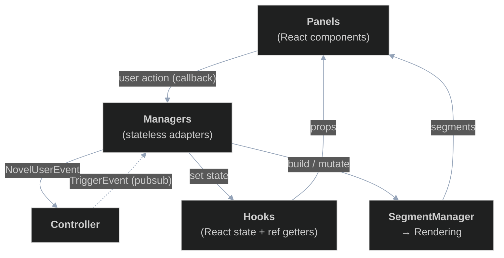

# Managers and Hooks

**Last updated:** 2026-06-28

This is the third chapter in the series describing how the editor works. The [Controller](./controller.md) chapter described a self-contained data engine: you feed it `NovelUserEvent`s through `handleUserEvent`, and it publishes `TriggerEvent`s back out through a subscription. This chapter describes the layer that sits between that engine and the React UI — the layer that turns controller trigger events into React state, and turns UI actions into controller user events.

> Implementation note: like the controller, this layer is built on the [`effect`](https://effect.website/) library, so the trigger-event handlers and getter reads are `Effect`-returning. We describe behaviour conceptually and mostly omit the `Effect` wrappers.

## Where this sits

The controller knows nothing about React. It does not hold component state, it does not render, and it does not know which panels exist. Conversely, the UI should not have to understand provisional IDs, reservation states, or the controller's getter slots. Something has to bridge the two, and that something is made of four kinds of pieces:

- **Hooks** hold the React state the UI renders from.
- **Managers** are stateless adapters that translate in both directions: UI action → controller user event, and controller trigger event → hook update.
- The **labeling source/sink** is a small contract that lets the labeling UX produce label operations and resolve which labels a click refers to.
- The **page** wires everything together and lays out the panels.

The single most important object that crosses the boundary into rendering is the **`SegmentManager`** (from the labeled-text library). The manager layer *builds and mutates* a segment manager; the [Rendering](./rendering.md) chapter describes how a segment manager is actually drawn. For this chapter, the segment manager is just "the thing the editor renders from."



Note the asymmetry: a user action flows *down* into the controller as a user event, but the resulting UI change comes *back up* as a trigger event. A manager's user-event handler usually just forwards to the controller; the optimistic update is applied later, when the controller publishes the corresponding `textChanged`/`labelChanged` trigger and the manager's subscriber reacts. There is no separate synchronous "also update the UI" call — the trigger path is the update path.

## Hooks

A hook is the data store for one slice of UI state. Each hook keeps two parallel copies of its data:

- A piece of **React state**, which components render from (and which drives re-renders).
- A **ref** holding the same data, which acts as a synchronous getter for code outside the React render cycle — chiefly the managers, which run inside `Effect`s triggered by controller events and need to read the latest value without waiting for a re-render.

Writes always go through the hook's setters, which update both the ref and the React state together. The hooks currently in use are:

- **`useEditorState`** ([useEditorState.ts](../../frontend/src/edit/hooks/useEditorState.ts)) — the open chapter's `data` (either `{ loading: true }` or `{ segmentManager, chapterId, caret }`) plus the editor `mode` (`view` / `edit` / `label`). It exposes `setLoading`, `setCaret`, `setMode`, and the `dataRef`/`modeRef` getters. This is the hook that owns the `SegmentManager`.
- **`useChapterList`** ([useChapterList.ts](../../frontend/src/edit/hooks/useChapterList.ts)) — the novel's chapter list, kept sorted by chapter number, with `addChapter`/`setChapter`/`removeChapter`.
- **`useTrackedLabelGroups`** ([useTrackedLabelGroups.ts](../../frontend/src/edit/hooks/useTrackedLabelGroups.ts)) — per-label-group view state (`LabelGroupView`: display name, colour, `visible`, `active`, and a load `status`). Its setter skips writes that would not change anything, to avoid redundant re-renders.

Hooks deliberately contain no business logic. They are dumb stores; all decisions about *what* to store live in the managers.

## Managers

A manager is a stateless factory. It is constructed with the dependencies it needs — a `controllerUserEvent` function for sending events to the controller, the relevant hook setters/refs, and sometimes the controller's getters — and returns an object with two kinds of members:

1. **User-event handlers** that panels call (e.g. `textOp`, `addChapter`, `toggleVisibility`). These translate a UI action into a `NovelUserEvent` and forward it via `controllerUserEvent`, usually after a quick guard (e.g. "only emit a text op in edit mode").
2. A **`handleControllerEvent(getters, event)`** subscriber that is plugged into `controller.subscribe`. It switches on the `TriggerEvent` type, reads whatever it needs from the controller getters, and writes the result into its hook(s) (and/or the segment manager).

> As described in [README.md](./README.md), managers are intended to be stateless — all state lives in the hooks. The one small exception in the current code is `labelGroupManager`, which keeps a single local `activeLabelGroup` pointer; everything else it touches lives in a hook.

As a worked example, `editorManager` ([editorManager.ts](../../frontend/src/edit/managers/editorManager.ts)) owns the editor's text and labels. On the way out, its `textOp`/`labelOp` handlers are mode-gated and forward the corresponding user events to the controller. On the way in, its `handleControllerEvent` subscriber applies the controller's `textChanged`/`labelChanged` triggers to the segment manager, and on `chapterOpened` builds a fresh segment manager for the chapter. Every manager follows this same shape — one concern, some user-event handlers, and one subscriber.

The managers in the codebase today are `editorManager`, `labelGroupManager` ([labelGroupManager.ts](../../frontend/src/edit/managers/labelGroupManager.ts)), `chapterManager` ([chapterManager.ts](../../frontend/src/edit/managers/chapterManager.ts)), and `errorManager` ([errorManager.ts](../../frontend/src/edit/managers/errorManager.ts)) — covering the editor surface, label-group view state, the chapter list, and error handling respectively. New concerns are expected to arrive as new managers of the same shape, so treat this as a snapshot rather than a fixed set.

### Translating controller data: `readers.ts`

Managers do not feed controller domain objects straight into the segment manager — the shapes differ. [readers.ts](../../frontend/src/edit/managers/readers.ts) holds the pure translation helpers: `makeStyledLabel` turns a controller `ProvLabel` plus a group's view (colour, active, visible) into the styled label the segment manager expects, and `gatherLabelData` walks a chapter's getter slots and collects the styled labels for every tracked group. Keeping this translation in one place means the managers only deal with "add this styled label" rather than the rendering library's representation.

## The labeling contract

Labeling is factored behind a small swappable seam, defined in [labeling/types.ts](../../frontend/src/edit/labeling/types.ts):

- A **`LabelSource`** is the read side: `labelsAt(pos)` resolves which labels a document offset refers to, and `addTargets()` lists the group(s) a new label could be added to.
- A **`LabelSink`** is the write side: `add` / `remove` emit label operations. The default sink forwards to `editorManager.labelOp`, so a label add ultimately becomes a `labelOp` user event.

The default source ([activeGroupLabelSource.ts](../../frontend/src/edit/labeling/activeGroupLabelSource.ts)) resolves only the *active* label group, hit-testing through the segment manager's `active` style flag so it needs no separate label-to-group index. Because the editor only depends on the `LabelSource`/`LabelSink` interfaces, this resolver can be swapped for a richer one (e.g. one that returns every overlapping group) without touching the editor, menu, or form.

Text edits enter through a related seam: [editorCallbacks.ts](../../frontend/src/edit/utils/editorCallbacks.ts) translates raw keyboard, pointer, and clipboard events on the editor surface into `TextOp`s (and caret updates), which it hands to `editorManager.textOp`. As with the labeling contract, this chapter is concerned with *what* those handlers emit; the DOM/caret mechanics belong to the [Rendering](./rendering.md) chapter.

## Wiring it together: the page

The edit-novel page ([EditNovelPage.tsx](../../frontend/src/edit/pages/EditNovelPage.tsx)) is mostly initialization. The lifecycle is:

1. **Fetch** the novel, chapters, and label groups through the generated API client.
2. **Build the controller** from that data (`buildNovelController`).
3. **Create the hooks** (empty to start).
4. **Create the managers**, injecting a `controllerUserEvent` sender, the hook setters/refs, and the controller getters where needed.
5. **Subscribe** each manager's `handleControllerEvent` to the controller. Subscription order matters here, so the editor manager subscribes with an explicit higher priority (see the ownership contract below).
6. **Seed the hooks** from the controller's getters, so the chapter list and tracked groups reflect the initial data.
7. **Start the controller** (`ctrl.start()`), which begins draining its request queue.
8. **Render the panels**, wiring each panel's callbacks to manager handlers and each panel's props to hook state.

The `controllerUserEvent` sender is a thin fire-and-forget adapter: it schedules `ctrl.handleUserEvent(event)` to run asynchronously so that a UI event handler never blocks on controller work. From the panels' point of view, the rule is simply: **props come from hooks, callbacks go to managers.** Panels never touch the controller directly.

## The ownership contract

[README.md](./README.md) imposes a key restriction:

> For a given hook and a given controller trigger event, there can be at most one submanager that updates that hook upon receiving that controller event.

This keeps reasoning about updates tractable: no two managers race to write the same hook in response to the same event. A single event may still fan out to several managers, as long as they each own a different hook. For instance, on `chapterOpened` the editor manager rebuilds the segment manager (the editor-state hook) while the label-group manager refreshes each group's load status (the tracked-groups hook) — two managers, one event, but different hooks, so the rule holds. The two are nonetheless ordered: the editor manager subscribes at a higher priority so that it populates the editor state (the new chapter id and segment manager) *before* the label-group manager reads that state. This is exactly what the controller's priority-ordered pub/sub (see the [Controller](./controller.md) chapter) is for.

### Future direction

Today this "one submanager per (hook, trigger event)" rule is enforced only by convention — nothing at the type level stops two managers from writing the same hook on the same event. A future improvement would be a typesafe mechanism for submanagers to declare (and thereby reserve) the hooks and trigger events they own, so the compiler enforces the invariant rather than the author. The exact shape of this is still undecided.

## Two end-to-end flows

**A keystroke in edit mode:**

```
Key pressed in editor
    → editorCallbacks translates it to a TextOp
    → editorManager.textOp(op)            (guarded on edit mode)
        → controllerUserEvent({ eventType: "textOp", op, chapterId })
    → controller applies the optimistic update and publishes "textChanged"
    → editorManager.handleControllerEvent("textChanged")
        → segmentManager.insertTextAt / deleteTextAt   (the editor re-renders)
```

**Adding a label:**

```
User confirms a label in the context menu
    → LabelSink.add(target, range, meta)
        → editorManager.labelOp({ op: "add", ... }, target)
            → controllerUserEvent({ eventType: "labelOp", ... })
    → controller applies the optimistic update and publishes "labelChanged"
    → editorManager.handleControllerEvent("labelChanged")
        → segmentManager.addLabel(...)   (the new label appears)
```

In both cases the manager's handler only *sends* the user event; the visible change arrives on the return trip as a trigger event. This is the defining shape of the layer: a unidirectional loop of **user action → controller → trigger → hook/segment-manager → render**.

## Boundaries

The following belong to the [Rendering](./rendering.md) chapter, not this one: the internals of the `SegmentManager` and the labeled-text library, the CodeMirror / dynamic-labeled-text rendering, the caret and DOM mechanics inside `editorCallbacks`, and the visual context menu and add-label form. This chapter stops at the point where a manager has updated a hook or built/mutated a segment manager, and where the labeling contracts are defined.
