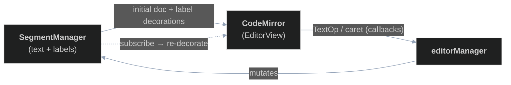

# Rendering

**Last updated:** 2026-06-28

This is the fourth and final chapter in the series describing how the editor works. The [Managers and Hooks](./managers.md) chapter ended with the manager layer building and mutating a **`SegmentManager`** — the in-memory model of a chapter's text and its labels. This chapter is about the other end of that handoff: how that model becomes an on-screen, editable document. Today the editing surface is [CodeMirror](https://codemirror.net/), and this chapter focuses on that integration.

> Historical note: the editor previously rendered through a small custom labeled-text component library. That rendering layer has been removed in favour of CodeMirror; what survives of the old library is only the framework-agnostic text/label model — the `SegmentManager` — now living at [frontend/src/edit/lib/text-model/](../../frontend/src/edit/lib/text-model/).

## Where rendering sits

The division of labour is deliberately lopsided:

- **CodeMirror owns the rendered document and the caret.** It is the source of truth for what the user sees and where their cursor is.
- **The `SegmentManager` is a read-only source for the editor.** CodeMirror seeds its document text from it and projects its labels onto the document as decorations, but CodeMirror never mutates the segment manager. All model changes still flow through the controller → manager → segment-manager path described in the previous chapters.

So the data crosses the boundary in two directions, but asymmetrically: text and label *edits* leave CodeMirror as events, and text and label *state* enters CodeMirror as document content and decorations.

The two panels involved are [EditorPanel.tsx](../../frontend/src/edit/panels/EditorPanel.tsx) — a thin wrapper that shows a loading state or mounts the editor — and [CodeMirrorEditor.tsx](../../frontend/src/edit/panels/CodeMirrorEditor.tsx), which holds all of the integration. The editor is keyed by the chapter id, so switching chapters tears down and rebuilds the `EditorView` against the new chapter's segment manager.

## Text and caret out

CodeMirror is configured with an update listener. On every transaction it inspects what happened:

- **Document changes** are translated into `TextOp`s. For each change range it emits a `delete` for any removed text and an `insert` for any inserted text, maintaining a running offset shift so that multiple changes in a single transaction map to correct absolute positions. Each op is handed to the `onTextOp` callback, which the page wires to `editorManager.textOp`.
- **Selection / focus changes** are reported through `onSetCaret` as a `{ anchor, focus, visible }` caret (visibility tracks editor focus).

Crucially, the editor does **not** mutate the segment manager when the user types. It only emits `TextOp`s. The optimistic update to the model happens later, when the controller processes the op and the manager applies the resulting `textChanged` trigger — exactly the round-trip described in the Managers chapter. The text the user sees momentarily lives only in CodeMirror until that trip completes.

## Labels in: decorations

Labels are rendered as CodeMirror **mark decorations** rather than as part of the document. The projection is a pure function of the segment manager:

- It walks `segmentManager.getSegments()`; each segment carries labels in *segment-relative* coordinates plus the segment's absolute `start`, so each label's range is `start + interval`.
- Invisible labels (per the label's view flags) are skipped.
- Each visible label becomes a mark styled with a translucent background and a coloured underline, using the label's colour.

These decorations are held in a CodeMirror `StateField`, updated by a `setDecorations` `StateEffect`. The field maps existing decorations through document changes automatically and replaces the whole set when a `setDecorations` effect arrives. To keep labels in sync, the editor **subscribes to the segment manager** on mount: whenever the model's labels change (because a `labelChanged` / `labelDataLoaded` trigger reached the manager and it mutated the segment manager), the subscription dispatches a fresh `setDecorations`. So label rendering rides the same controller → manager → segment-manager pathway as everything else — CodeMirror just reflects the model.

## Edit / view / label modes

Editability is controlled by a CodeMirror `Compartment` holding `EditorState.readOnly`. It is initialized from the editor `mode` (editable only in `edit` mode) and reconfigured live whenever the mode changes. In `view` and `label` modes the document is read-only, so stray keystrokes can't produce text ops; `label` mode instead routes interaction into the labeling UX below.

## Label-mode interaction

In `label` mode, a right-click opens the label context menu ([LabelContextMenu.tsx](../../frontend/src/edit/labeling/LabelContextMenu.tsx)). The editor resolves:

- the clicked position (`view.posAtCoords`) and any existing labels there, by asking the labeling **source** (`labelsAt`);
- the current text selection (from the DOM selection mapped back to document offsets via `view.posAtDOM`), and the candidate target group(s) via the source's `addTargets`.

Choosing **Add** opens the add-label form ([AddLabelForm.tsx](../../frontend/src/edit/labeling/AddLabelForm.tsx)) in a popover anchored at the selection's screen coordinates (`view.coordsAtPos`); submitting calls the labeling **sink**'s `add`, and deleting a label from the menu calls the sink's `remove`. As established in the [Managers and Hooks](./managers.md) chapter, those sink calls land on `editorManager.labelOp` and flow into the controller — the editor itself never edits the model directly. This is the concrete realization of the labeling source/sink contract that the previous chapter deferred to here.

## The `SegmentManager` as a data boundary

For rendering purposes, the segment manager ([segmentManager.ts](../../frontend/src/edit/lib/text-model/core/segmentManager.ts)) is just a contract with two halves:

- **Read** (used by CodeMirror): `getText()` for the initial document, `getSegments()` for projecting label decorations, `getLabel` / `labelsAt` for hit-testing in label mode, and `subscribe()` to be notified when labels change.
- **Write** (used by the manager layer, not the editor): `insertTextAt` / `deleteTextAt` / `addLabel` / `removeLabel` / `updateLabel`.

The manager layer writes; CodeMirror reads and re-renders. The model's internal segmentation logic lives under `edit/lib/text-model/` and is out of scope here.

## Boundaries

The non-editor panels — the chapter list, the label-group list, and the toolbar — are ordinary React components driven by hook state (see the [Managers and Hooks](./managers.md) chapter) and need no special rendering treatment. The `SegmentManager`'s internal segmentation algorithm is likewise out of scope for this chapter.
