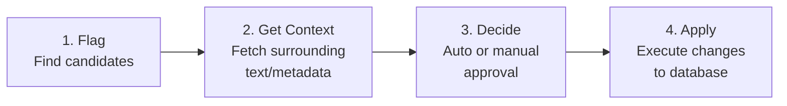
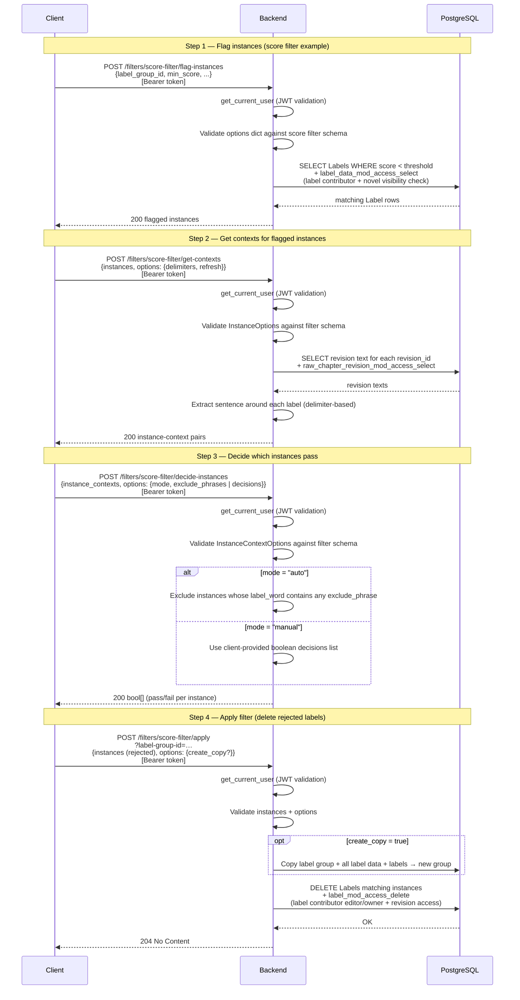

# Filter System

**Last Updated**: March 8, 2026  
**Status**: Complete

This document describes the Filter abstraction — a generic four-phase pipeline for processing and filtering labels, with support for automated (rule-based or LLM-assisted) and manual decision-making.

---

## Table of Contents

1. [Motivation](#motivation)
2. [Four-Phase Pipeline](#four-phase-pipeline)
3. [Filter Abstraction](#filter-abstraction)
4. [Examples](#examples)
5. [API Design](#api-design)
6. [Frontend Integration](#frontend-integration)
7. [Schema Communication](#schema-communication)
8. [Performance Considerations](#performance-considerations)
9. [Design Rationale](#design-rationale)

---

## Motivation

The novel translation pipeline starts by running a Named Entity Recognition (NER) model to label names and entities across potentially thousands of chapters. The raw output needs significant cleanup before it's useful. The original CLI pipeline handled this as a linear chain:

```
GlossaryBuilder: load_and_extract → normalize → flatten → build_frequency_table → apply_filter(s)
```

where `apply_filter` accepted simple functions like `filter_by_score`, `merge_adjacent_entities`, `filter_substrings`, and `filter_by_chapter_frequency`. These worked well from the command line, but they still had significant issues:

1. **False positives from NER** — Common words get misidentified as names. With hundreds of labels per chapter across 1000+ chapters, even a small error rate means tens of thousands of bad labels.

2. **Merge/split ambiguity** — Chinese has no spaces, so an NER model labeling "张三丰" might produce any combination of:
   - `张三丰` (correct, one name)
   - `张三` `丰` (incorrectly split)
   - `张` `三丰` (incorrectly split differently)

   The CLI `merge_adjacent_entities` handles this with `gap_tolerance` and `separators` heuristics, and `filter_substrings` replaces labels that are substrings of another label in the same position. But both operate blindly — they can't ask whether `张三` + `丰` should actually merge or whether `张三丰` should split. The same ambiguity appears in English ("George" + "Washington" — one person or two?), but Chinese's lack of word boundaries makes it far more common.

3. **Scale makes manual review infeasible** — 100+ chapters × 200 labels = 20,000+ potential reviews. Even sampling a fraction is costly for someone who may not know the source language.

4. **Context is essential** — A user who doesn't read the source language can't evaluate whether a flagged label is correct without seeing the surrounding sentence. But manually fetching context for thousands of labels is slower than the NER step itself.

### The Insight

Many label operations are **repetitive by type**. If the merge operation `merge("张", "三")` is correct in one instance, it's likely correct in most instances. This suggests:

1. **Group** flagged instances by value (e.g., all `("张", "三")` pairs)
2. **Sample** $O(\log n)$ representative examples per group, with context
3. **Decide** on the group (auto rules, LLM, or human review of samples)
4. **Apply** the operation to the entire group (or a user-approved subset)

This pattern generalizes across filter types — score thresholds, merge, split, deduplication — motivating a generic four-phase pipeline abstraction.

## Four-Phase Pipeline

Every filter implements four phases. The types flowing through the pipeline (`Instance`, `Context`, options) are generic — each filter specializes them for its operation:



### How types vary across filters

The pipeline is generic — each filter specializes the types. The table below shows the implemented filter and some planned filters that generalize operations from the original CLI glossary pipeline (`filter_by_score`, `merge_adjacent_entities`, `filter_substrings`, `filter_by_chapter_frequency`). New filters follow the same pattern: one file per filter in `backend/src/filters/`.

| Filter | Instance | Context | Apply operation |
|--------|----------|---------|------------------|
| **ScoreFilter** | `SingleLabel` (label + revision ID) | `SentenceContext` (sentence + positions) | Delete low-confidence labels |
| **MergeFilter** (planned) | `tuple[SingleLabel, SingleLabel]` (adjacent pair of labels) | `SentenceContext` | Combine into single label |
| **SplitFilter** (planned) | `tuple[SingleLabel, str, str]` (a label with a possible decomposition)| `SentenceContext` | Break into components |
| **Many more!** | ... | ... | ... |
### Phase 1: Flag Instances

**Purpose:** Identify candidate instances for filtering.

```
flag_instances(db, current_user, options) -> list[Instance]
```

Each filter defines its own flagging criteria via an options schema. The `Instance` type captures enough data for downstream phases (e.g., a label + its revision ID, or a pair of adjacent labels).

**Characteristics:**
- Fast database queries (should leverage indexes)
- Returns instances extending `InstanceBase`
- Permission checks applied at query level

### Phase 2: Get Contexts

**Purpose:** Retrieve surrounding text or metadata for each instance, enabling informed decisions.

```
get_contexts(db, current_user, instances, options) -> list[Context | None]
```

Context provides the information a human or LLM needs to evaluate an instance. What constitutes useful context varies — a sentence for score filtering, text between two labels for merge decisions, aggregate statistics for deduplication. Returns `None` for instances the user can't access.

**Characteristics:**
- Batched queries (e.g., deduplicates revision IDs into a single SELECT)
- Context type extends `ContextBase`
- Permission checks may restrict visible contexts

### Phase 3: Decide Instances

**Purpose:** Determine which flagged instances should have the filter operation applied.

```
decide_instances(db, current_user, instance_contexts, options) -> list[bool]
```

This is where the human-in-the-loop or automated decision happens. Filters can support:
- **Rule-based:** Simple heuristics (e.g., exclude common words by matching against a phrase list)
- **LLM-assisted:** Pass instance + context to an LLM for evaluation (planned)
- **Manual:** Client provides explicit `decisions: list[bool]` after reviewing instances with context

**Characteristics:**
- May involve external services (LLMs) — potentially async
- Returns one boolean per instance-context pair
- Optional phase (`supports_decide` flag on filter)

### Phase 4: Apply Filter

**Purpose:** Execute the actual database modifications on approved instances.

```
apply_filter(db, current_user, label_group_id, instances, options) -> None
```

Only the instances the client passes are affected — the frontend can filter the decide output to apply to a subset (see [Sampling Strategy](#sampling-strategy)). The `create_copy` option (from `ApplyFilterOptionsBase`) allows copying the label group before modifying, preserving the original data.

**Characteristics:**
- Atomic transaction (all or nothing)
- Permission checks through access control helpers
- Explicit instance list enables partial application
- Optional phase (`supports_apply` flag on filter)

## Filter Abstraction

### Generic Type Signature (PEP 695)

```python
Filter[
    FlagInstancesOptions : FlagInstancesOptionsBase,     # Phase 1 options schema
    GetContextsOptions : GetContextsOptionsBase,         # Phase 2 options schema
    DecideInstancesOptions : DecideInstancesOptionsBase,  # Phase 3 options schema
    ApplyFilterOptions : ApplyFilterOptionsBase,          # Phase 4 options schema
    Instance : InstanceBase,                              # Instance data type
    Context : ContextBase                                 # Context data type
]
```

All type parameters have upper bounds — implementations must extend the base Pydantic schemas.

### Protocol Definition

From `backend/src/filters/filter_base.py`:

```python
class Filter[FlagInstancesOptions : FlagInstancesOptionsBase,
             GetContextsOptions : GetContextsOptionsBase,
             DecideInstancesOptions : DecideInstancesOptionsBase,
             ApplyFilterOptions : ApplyFilterOptionsBase,
             Instance : InstanceBase,
             Context : ContextBase
            ](Protocol):

    description: str
    supports_decide: bool
    supports_apply: bool

    instance_schema: type[Instance]
    context_schema: type[Context]
    flag_instances_options_schema: type[FlagInstancesOptions]
    get_contexts_options_schema: type[GetContextsOptions]
    decide_instances_options_schema: type[DecideInstancesOptions]
    apply_filter_options_schema: type[ApplyFilterOptions]

    def flag_instances(self, db: Session, current_user: User, options: FlagInstancesOptions) -> list[Instance]: ...
    def get_contexts(self, db: Session, current_user: User, instances: list[Instance], options: GetContextsOptions) -> list[Context | None]: ...
    def decide_instances(self, db: Session, current_user: User, instance_contexts: list[tuple[Instance, Context | None]], options: DecideInstancesOptions) -> list[bool]: ...
    def apply_filter(self, db: Session, current_user: User, label_group_id: int, instances: list[Instance], options: ApplyFilterOptions) -> None: ...
```

Note: The registry (`FILTER_REGISTRY`) uses a separate `RegisteredFilter` non-generic protocol (in `types.py`) with `Any`-erased method signatures, since Python's generic protocols can't be stored in a homogeneous dict after type parameter specialization.

## Examples

Here are some illustrative examples about how filters are implemented in practice. Filter implementations can be found in `backend/src/filters/filter_name.py`.

### ScoreFilter

**Purpose:** Remove low-confidence NER labels based on score thresholds.

**Types:**
- **Instance:** `SingleLabel` — label + revision ID
- **Context:** `SentenceContext` — sentence text + `label_start_rel` / `label_end_rel` positions + revision ID

**Use Cases:**
- Remove obvious NER errors (score < 0.5)
- Filter out common words misidentified as names
- Clean up labels before manual review

#### Flag

```python
def flag_instances(
    self,
    db: Session,
    current_user: User,
    options: ScoreFlagInstancesOptions
) -> list[SingleLabel]:
    # SELECT Labels WHERE score < options.min_score
    # JOIN LabelData, RawChapterRevision, RawChapter
    # Filter by label_group_id, start/end chapter range, flag_dirty
    # Apply label_data_mod_access_select (permission check)
    return [SingleLabel(label=..., raw_chapter_revision_id=...) for ...]
```

Flags labels with `score < min_score` within a target label group and optional chapter range.

#### Context

```python
def get_contexts(
    self,
    db: Session,
    current_user: User,
    instances: list[SingleLabel],
    options: ScoreGetContextOptions
) -> list[SentenceContext | None]:
    # Batch-fetch revision texts for unique revision IDs
    # (with raw_chapter_revision_mod_access_select permission check)
    # For each instance, call find_sentence_around(text, label_start, label_end, delimiters)
    # Returns None if user doesn't have access to the revision
    return contexts
```

Uses `find_sentence_around()` with a configurable `delimiters` string. Batches revision fetches (single SELECT for all unique revision IDs).

#### Decide

```python
def decide_instances(
    self,
    db: Session,
    current_user: User,
    instance_contexts: list[tuple[SingleLabel, SentenceContext | None]],
    options: ScoreDecideInstancesOptions
) -> list[bool]:
    if options.mode == "auto":
        decisions: list[bool] = []
        for instance, _ in instance_contexts:
            # Note: checks instance.label.label_word, NOT context text
            if any(phrase in instance.label.label_word for phrase in options.exclude_phrases):
                decisions.append(False)
            else:
                decisions.append(True)
        return decisions
    else:  # manual
        if len(options.decisions) != len(instance_contexts):
            raise DecideLengthError("Length of decisions must match length of instance_contexts")
        return options.decisions
```

- **Auto mode:** Exclude if `instance.label.label_word` contains any `exclude_phrases` entry (checks the label text, not context)
- **Manual mode:** Client provides `decisions: list[bool]`; must match instance count exactly

**Future LLM integration:**

Add another **LLM mode** as an option. Then call the following function:

```python
async def decide_with_llm(instance: SingleLabel, context: SentenceContext, llm_params: dict) -> bool:
    prompt = f"Is '{instance.label.label_word}' a valid {instance.label.label_entity_group}? Context: {context.text}"
    response = await llm.ask(prompt)
    return response.lower() == "yes"
```

#### Apply

```python
def apply_filter(
    self,
    db: Session,
    current_user: User,
    label_group_id: int,
    instances: list[SingleLabel],
    options: ScoreApplyFilterOptions
) -> None:
    if options.create_copy:
        new_label_group = copy_label_group(db, current_user, label_group_id, str(options.new_label_group_name))
        label_group_id = new_label_group.label_group_id

    # Build tuple list for matching: (revision_id, start, end, word)
    instance_tuples = [
        (inst.raw_chapter_revision_id, inst.label.label_start, inst.label.label_end, inst.label.label_word)
        for inst in instances
    ]
    # DELETE Labels WHERE label_data in target group AND (revision, start, end, word) matches
    # + label_mod_access_delete permission check
    stmt = delete(Label).where(...).where(tuple_(...).in_(instance_tuples))
    stmt = label_mod_access_delete(stmt, current_user)
    db.execute(stmt)
    db.commit()
```

DELETEs matching labels via tuple-match on `(revision_id, start, end, word)`. Permission enforced via `label_mod_access_delete`. The `create_copy` option copies the entire label group first (via `copy_label_group`), then deletes from the copy.

#### Configuration

Each phase is a separate API call with its own options schema:

```json
{
  "flag": {
    "type": "score_filter_flag_instance_options",
    "label_group_id": 42,
    "min_score": 0.85,
    "start": 0,
    "end": 100,
    "flag_dirty": false
  },
  "context": {
    "type": "score_filter_get_context_options",
    "delimiters": ".!?。！？\n",
    "refresh": false
  },
  "decide": {
    "type": "score_filter_decide_instances_options",
    "mode": "auto",
    "exclude_phrases": ["他", "她", "的", "说"]
  },
  "apply": {
    "type": "score_filter_apply_filter_options",
    "create_copy": false,
    "new_label_group_name": null
  }
}
```

## API Design

### Endpoints

```
GET    /filters/schemas                      # Get OpenAPI schemas for all filters
POST   /filters/{filter_name}/flag-instances  # Phase 1: Flag instances
POST   /filters/{filter_name}/get-contexts    # Phase 2: Get contexts
POST   /filters/{filter_name}/decide-instances # Phase 3: Decide instances
POST   /filters/{filter_name}/apply           # Phase 4: Apply filter
```

### Example Flow

The following diagram shows the full pipeline using the **score filter** as a concrete example. The router accepts generic `dict`/`InstanceOptions`/`InstanceContextOptions` payloads and delegates validation to each filter implementation. Permission checks cascade through upstream label and novel access.



The HTTP examples below show the same flow with concrete request/response bodies:

**1. Flag instances:**
```http
POST /filters/score-filter/flag-instances
{
  "label_group_id": 42,
  "min_score": 0.85,
  "type": "score_filter_flag_instance_options"
}

Response: 200 OK
[
  {
    "type": "single_label",
    "label": {"label_word": "他", "label_start": 5, "label_end": 6, "label_score": 0.6, "label_entity_group": "PER", "label_dirty": false},
    "raw_chapter_revision_id": 10
  }
]
```

**2. Get contexts:**
```http
POST /filters/score-filter/get-contexts
{
  "instances": [
    {"type": "single_label", "label": {"label_word": "他", "label_start": 5, "label_end": 6, "label_score": 0.6, "label_entity_group": "PER", "label_dirty": false}, "raw_chapter_revision_id": 10}
  ],
  "options": {"type": "score_filter_get_context_options", "delimiters": "。！？"}
}

Response: 200 OK
[
  {
    "type": "sentence",
    "text": "他说：「你好吗？」",
    "label_start_rel": 0,
    "label_end_rel": 1,
    "label": null,
    "raw_chapter_revision_id": 10
  }
]
```

**3. Decide (manual):**
```http
POST /filters/score-filter/decide-instances
{
  "instance_contexts": [
    [
      {"type": "single_label", "label": {"label_word": "他", "label_start": 5, "label_end": 6, "label_score": 0.6, "label_entity_group": "PER", "label_dirty": false}, "raw_chapter_revision_id": 10},
      {"type": "sentence", "text": "他说：「你好吗？」", "label_start_rel": 0, "label_end_rel": 1, "label": null, "raw_chapter_revision_id": 10}
    ]
  ],
  "options": {"type": "score_filter_decide_instances_options", "mode": "manual", "decisions": [true]}
}

Response: 200 OK
[true]
```

**4. Apply:**
```http
POST /filters/score-filter/apply?label-group-id=42
{
  "instances": [
    {"type": "single_label", "label": {"label_word": "他", "label_start": 5, "label_end": 6, "label_score": 0.6, "label_entity_group": "PER", "label_dirty": false}, "raw_chapter_revision_id": 10}
  ],
  "options": {"type": "score_filter_apply_filter_options", "create_copy": false}
}

Response: 204 No Content
```

## Frontend Integration

### UI Workflow

1. **User selects filter** from dropdown
2. **Configure options** - Set min_score, chapter range, etc.
3. **Preview instances** - Show sample flagged labels with contexts
4. **Review decisions** - Approve/reject in batches or individually
5. **Apply filter** - Execute changes to database

### Sampling Strategy

Instead of showing all 10,000 flagged labels:

1. **Group by instance value** - e.g., all instances of "他"
2. **Sample O(log n)** - Show ~10 representative examples per group
3. **User reviews samples** - If all samples look correct, assume group is correct
4. **Apply to all** - Filter entire group, not just samples

### State Management

Frontend tracks:
- Current filter and phase
- Flagged instances (paginated)
- User decisions per instance/group
- Applied vs. pending filters

## Schema Communication

### OpenAPI Integration

Filters expose Pydantic schemas that automatically generate OpenAPI specs:

```python
class ScoreFlagInstancesOptions(FlagInstancesOptionsBase):
    type: Literal["score_filter_flag_instance_options"] = "score_filter_flag_instance_options"
    label_group_id: int = Field(..., description="ID of the label group to consider.")
    start: int | None = Field(default=None, ge=0, description="Minimum chapter number (inclusive) to consider.")
    end: int | None = Field(default=None, ge=0, description="Maximum chapter number (exclusive) to consider.")
    flag_dirty: bool = Field(default=False, description="Whether to include dirty labels when flagging instances.")
    min_score: float = Field(..., ge=0.0, le=1.0)
```

Frontend can:
- Fetch schemas for all registered filters via `GET /filters/schemas`
- Render dynamic forms from the JSON Schema
- Validate input client-side

### Type Discriminator

Each schema has a `type` field for runtime type checking:

```python
type: Literal["score_filter_flag_instance_options"]
```

This solves type erasure at REST API boundary.

## Performance Considerations

Listed below are some estimations on performance. These can vary by filter. These estimates have not been verified in testing or production yet.

### Flag Phase

- **Typical:** 50ms for 10K labels (indexed query)
- **Optimization:** Add indexes on score, entity_group

### Context Phase

- **Typical:** 200ms for 100 instances (joined query)
- **Optimization:** Batch queries, cache chapter text per request

### Decide Phase

- **Typical:** 10ms for rule-based, 2-5s for LLM per instance
- **Optimization:** Batch LLM requests, parallel API calls

### Apply Phase

- **Typical:** 100ms for 100 deletions (batched DELETE)
- **Optimization:** Use `DELETE IN (...)` instead of loop

## Design Rationale

### Why Four Phases?

Separation of concerns:
- **Flag** is fast, database-focused
- **Context** is I/O-bound, benefits from batching
- **Decide** may involve external services (LLMs)
- **Apply** is transactional, requires atomicity

### Why Generic Types?

Different filters need different instance structures:
- ScoreFilter: Single label
- MergeFilter: Label pair
- SplitFilter: Label + candidates

Generics provide type safety without code duplication.

### Why Partial Application?

User may want to:
- Review samples and apply to subset
- Merge some groups but not others
- Test filter on small batch first

Passing explicit instance list enables flexibility.

## Relevant Files

- `backend/src/filters/filter_base.py` - Base protocol definition
- `backend/src/filters/score_filter.py` - ScoreFilter implementation
- `backend/src/filters/service.py` - Service layer (routes filter calls, filter registry)
- `backend/src/filters/router.py` - API endpoints
- `backend/src/filters/types.py` - Type definitions (discriminated unions)
- `backend/src/filters/schemas.py` - Pydantic schema base classes
- `backend/src/filters/utils.py` - Helper functions (`find_sentence_around`, `copy_label_group`)
- `tests/filters/` - Filter tests

## See Also

- [architecture.md](architecture.md) - Filter service overview
- [database-schema.md](database-schema.md) - Label table constraints
- [api-design.md](api-design.md) - Filter API endpoint patterns
- [ui-requirements.md](ui-requirements.md) - Frontend component specs
- [conventions.md](conventions.md) - Filter naming conventions