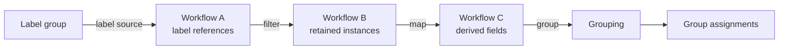

# Filters

**Last updated:** 2026-07-28

The filter subsystem builds typed, repeatable data-processing pipelines over
NovelTL data. Its first implemented pipeline starts with the current labels in
a label group, filters or transforms those labels, and groups the resulting
instances for later review.

The implementation is intentionally constrained: persisted descriptions select
from a closed set of typed function nodes and never contain arbitrary Python,
JavaScript, SQL, or other executable code.

## Current status

The backend currently implements:

- flat, tagged workflow schemas and instance values;
- immutable text-span and label references;
- a composable function abstract syntax tree (AST);
- structural type checking and external-resource dependency resolution;
- a Python compiler and execution context;
- label-source, map, filter, and group runners;
- persistence models for stages, instances, function definitions, groupings,
  and group assignments;
- bounded batch execution with job ownership and failure statuses.

The read API is exposed through FastAPI, but the frontend and mutation or
runner-execution endpoints are not implemented yet. Alembic migrations create
the filter persistence tables and workflow permission-scope associations. The
runners are registered as Celery worker tasks, while public operation services
still need to create their target rows and enqueue those tasks.

The read API contract is documented in [endpoints.md](endpoints.md). The
planned mutation and runner API is specified in
[write-endpoints.md](write-endpoints.md).

## Pipeline model

In the current implementation, a `Workflow` is one materialized pipeline
stage—not the entire user-facing review process.

Source, map, and filter runners populate output workflow stages. A group runner
does not create another workflow; it attaches a grouping definition and one
derived key per instance to an existing stage.

The current code does not persist parent-stage relationships or a complete
pipeline definition. Callers create workflows, function definitions, and
groupings before invoking the appropriate runner.

## Main concepts

### Schemas and instances

Every workflow stores one flat record schema as JSON. Every `Instance` stores a
tagged record value intended to conform to that schema. Scalar values are
strictly typed, and references retain immutable source identities.

See [data-types.md](data-types.md).

### Function definitions

A function definition stores a composition of built-in AST nodes. Runners
validate the persisted composition before use, and each parsed node computes
its signature from its configuration. Composite nodes bind arguments,
construct or extend records, and combine elementary operations without
evaluating user-supplied source code.

See [functions.md](functions.md).

### Runners and persistence

Runners claim pending work using a job ID, validate the source and output
schemas, process instances in bounded batches, and update the target status.
Their retry behavior differs by operation; grouping can resume from missing
assignments, while output-producing runners require an empty target stage.

See [runners.md](runners.md).

## Implemented example

The integration tests exercise this sequence:

1. Materialize the latest labels from a label group.
2. Read each label's score and retain values below a threshold.
3. Read each retained label's word and extend the instance with it.
4. Rename the derived `word` field to `term`.
5. Group instances by `term`.

This covers the foundation of low-score label cleanup, but sampling, review,
and applying decisions back to NovelTL are future work.

## Code guide

- [`data_types.py`](../../backend/src/filters/data_types.py): schema and value
  models
- [`functions.py`](../../backend/src/filters/functions.py): function AST and
  signatures
- [`dependencies.py`](../../backend/src/filters/dependencies.py): external
  resource dependency resolution
- [`compilers/python.py`](../../backend/src/filters/compilers/python.py):
  Python compiler
- [`context/python.py`](../../backend/src/filters/context/python.py): batched
  NovelTL resource loading
- [`models.py`](../../backend/src/filters/models.py): persistence models
- [`runners/python/`](../../backend/src/filters/runners/python/): current
  runners
- [`backend/tests/filters/`](../../backend/tests/filters/): unit and pipeline
  tests
- [API endpoint design](endpoints.md): draft public routes, pagination, and
  permission behavior

## Future design

The original design remains useful as product direction, but it describes
capabilities beyond the current code:

- [Future workflow product](design/workflows.md): sampling, review,
  annotation, staleness handling, application, and shared UI
- [Future type-system extensions](design/data-types.md): recursive records,
  versioned registries, semantic contexts, and editable key paths

Future-facing documents are requirements and design notes, not descriptions of
the current API.
