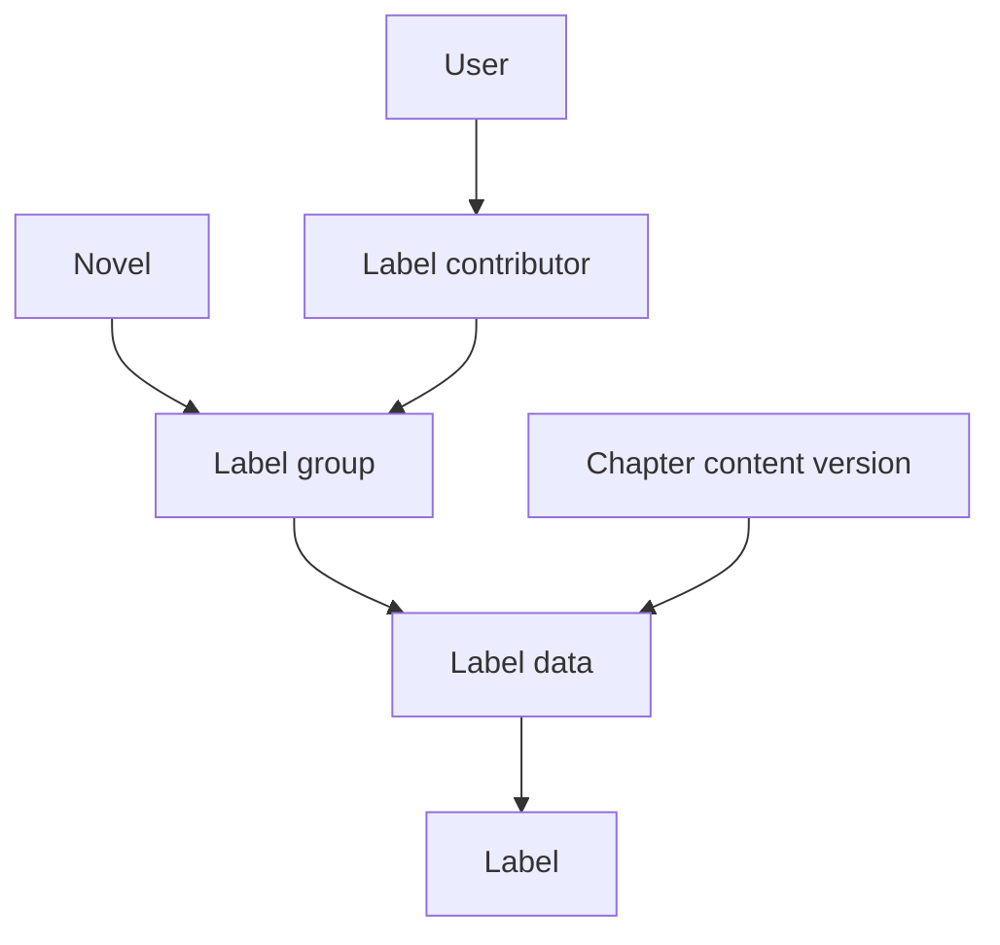

# Labels

**Last updated:** 2026-07-28

The labels service stores structured annotations over chapter text. Labels are
used by the editor, autolabel pipeline, and future translation tooling to keep
track of names, places, terminology, and other text spans that need consistent
treatment.

This document describes the service's data model and invariants. For exact
request and response shapes, refer to
[`backend/src/labels/schemas.py`](../backend/src/labels/schemas.py) and the
generated OpenAPI schema.

## Data model

### Label groups

A **label group** is a named, novel-wide collection of related labels. A group
might represent a human review pass, one autolabel run promoted for editing, or
another coherent annotation set. Label groups belong to one novel and have
their own contributor list.

The user who creates a label group becomes its owner. Other users may be
granted viewer or editor roles. Novel access is still enforced underneath
label-group access: membership in a label group does not make an otherwise
inaccessible novel visible.

### Label data

**Label data** connects one label group to one immutable chapter-content
version. A group can have at most one label-data record for a particular
content version. The record acts as the parent collection for that version's
individual labels.

This extra layer is important because chapter text is versioned. Labels do not
point only to a chapter; they point to the exact text revision whose character
offsets they describe.

### Labels

A **label** identifies a half-open text range `[start, end)` inside its parent
chapter content. It stores:

- the exact word found at that range;
- an entity group or category;
- a confidence score between zero and one;
- a `dirty` flag used to distinguish manually touched data from raw automated
  output.

The word and offsets are validated against the chapter text for every streamed
add, update, or delete operation. Labels within the same label-data record may
not overlap; PostgreSQL enforces this with an exclusion constraint.

Different label groups may annotate the same range. This allows users to view
or compare independent annotation sets without merging them prematurely.

## Editing and versioning

Label changes are sent as ordered streams of add, update, and delete
operations. Each operation carries the expected word and range, allowing the
backend to reject stale or mismatched edits rather than applying them to the
wrong text.

Editing chapter text creates a new `ChapterContent` version instead of changing
the existing row. The novels service ports every label-data collection to the
new content version and adjusts labels according to the text operations.
Labels invalidated by a deletion are omitted. The response includes a mapping
from old label-data IDs to their replacements so the frontend controller can
continue synchronizing against the new version.

See the [editor documentation](editor/README.md) for the higher-level
synchronization protocol.

## Autolabel integration

Autolabel results are stored separately while inference is running and during
review. A completed run can be promoted into a label group for a selected
chapter range. Promotion creates ordinary label-data and label records, after
which the editor treats them like any other annotation set.

Keeping generated results separate until promotion prevents incomplete jobs
from appearing as editable label data. See [autolabels.md](autolabels.md) for
the worker and review flow.

## Permissions

Label permissions are layered:

- the underlying novel and chapter content must be visible to the user;
- label-group viewers may read a group;
- label-group editors and owners may change the group and its data;
- administrators bypass normal contributor checks.

Permission filters are applied directly to database statements. A missing
resource and an inaccessible resource may therefore produce the same
not-found-style result, avoiding disclosure of private data.

## Code guide

- [`backend/src/labels/models.py`](../backend/src/labels/models.py): database
  relationships and constraints
- [`backend/src/labels/service.py`](../backend/src/labels/service.py): queries,
  mutations, and autolabel promotion
- [`backend/src/labels/permissions.py`](../backend/src/labels/permissions.py):
  database-level access filters
- [`backend/src/labels/utils.py`](../backend/src/labels/utils.py): validation
  and application of streamed label operations
- [`backend/src/labels/router.py`](../backend/src/labels/router.py): HTTP
  endpoints
