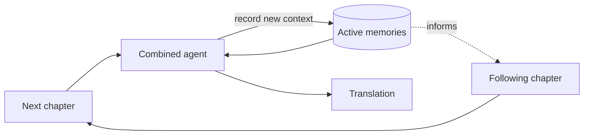
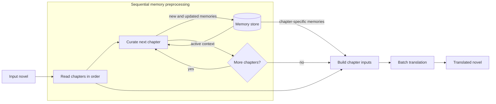

# Memories

This folder documents the memory feature.

- [data-model.md](data-model.md): Memory and plugin data models
- [ui-overview.md](ui-overview.md): Proposed memory-panel hierarchy and wireframes

## Motivation

The end goal of this project is to make an automated translation agent. To motivate our approach to solving this problem, we will consider how a human reads a novel. In the most abstract sense possible, a reader will read the novel *sequentially* and remember more recent events with greater emphasis. They will also remember different terms across the novel with greater emphasis on often-occurring characters. We can model this very abstractly by saying that at the time of reading a certain chapter, the reader should have a list of active memories associated with this chapter. 

Realistically, a human will not stop and figure out where a term they have forgotten comes from (sometimes, you will see translator notes like "(character A) last appeared (N hundred chapters ago) during (B arc) doing (C)" and barely anyone will remember what the translator is talking about). The issue with this approach for translation is that especially for Chinese, names can be translated inconsistently. Thus a translator should have memories of every relevant character already seen when translating a chapter. 

A real translator might hence record notes about each character that appears in the hopes that it will become useful sometime in the future, or they might simply look up unfamiliar terms in the novel that they have seen before. They will do this while translating.

We could model this workflow through an agent:

There are some issues to this approach. Firstly, feeding in one chapter at a time will mean that the next chapter's input depends only on the memories that the agent wrote and not the translation. Secondly, having the agent perform multiple tasks at once may (testing and eval needed) degrade the performance of the agent for each task.

On the flip side, if we perform a preprocessing step of recording all relevant memories before translating all chapters, we will incur double the input token cost due to inputting the same chapter in twice instead of once per chapter. There is one great advantage we gain from batch translation though - many LLM providers provide a batch API endpoint which costs 50% less than streaming/chat interfaces per token. Since output tokens cost several times more than input tokens (varies by provider), this should lead to a net decrease in costs without any performance degradation (in theory). Given the scale of the novels we intend to translate with this project, batch translation is both more cost-efficient and achieves greater throughput than streamed translations due to the increased parallelization we can achieve from the provider. Most providers have guarantees that batch translations finish within 24 hours, which will likely be the timeframe we are looking at for sequential/small amounts of parallelization.

We hence model the workflow as follows:

## Objectives

We list high-level objectives here and detail exactly how we plan to achieve them in subsequent documents.  

- Create an agent to automate this process
- Make the types of memories the agent can record extensible (e.g. memories relating to terms, arc boundaries, etc. things that a human might remember while reading a novel)
- Provide an interface to display the memories of a given chapter to the user alongside the actual chapter text
- Provide an interface for the user to modify memories as they see fit
- Provide an interface for the user to look though all memories of a novel
