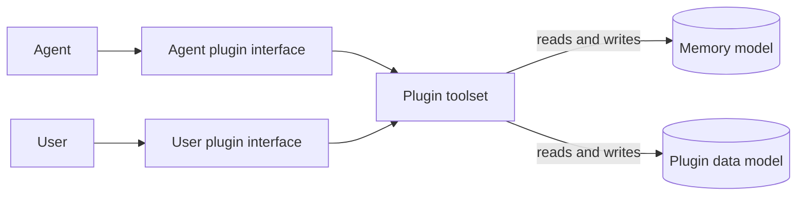
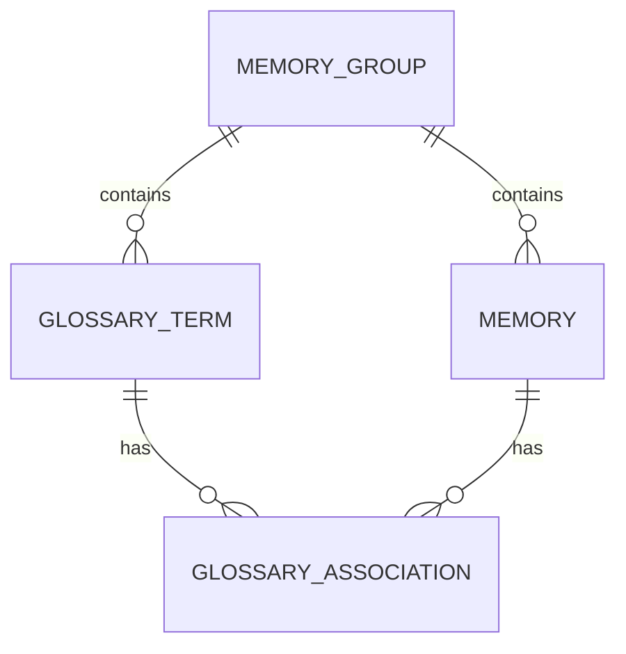

# Memory data model

## `memories`

Memories are grouped into memory groups, which are stored in the `memory_groups` table.

Generally speaking, a request to get relevant memories will occur within some context, which we detail a tuple consisting of the chapter id and memory group id. We hence need to quantify exactly what it means when we say memory A is accessible within a given context.

- `memory_id`
- `memory_group_id`
- `memory_type` - what is this memory describing (e.g. event, relation between terms, etc.)
- `mark` - an optional application-defined category used to narrow retrieval. The database does not restrict its values; the interface creating a memory may do so.
- `memory_observed_in` - which chapter content the memory was recorded on. Purely for tracking purposes.
- `memory_start_num` - the first chapter (inclusive) this memory should be available to access. Cannot be null.
- `memory_end_num` - the last chapter (exclusive) this memory should be available to access. If null, then this memory has no point at which it becomes invalid.
- `supersedes_memory_id` - if memory A corrects/updates information in memory B, then we should have A.supersedes_memory_id = B.memory_id.
- `memory_content` - Self-explanatory.
- `memory_review_status` - Convenience to approve or deny memories.
- `creator_type` - Who created this memory (currently relevant options are USER and AGENT).
- `plugin_name` - Will be explained later.

As you may have guessed, we say a memory is accessible within a context if its memory group id matches the context's memory group id and the context's chapter number lies within the range specified by `memory_start_num` and `memory_end_num`.

## Plugins

Memories are typically not recorded in a vacuum - when recording a memory, there is generally a specific domain associated with that memory. For example, recording a memory could be to remember the definition of a term, something that happened to a character, a significant event in the novel, etc.

Depending on the domain, memories should be recorded at different times. For example, we should record the start of a new arc a lot less often than we should record the actions of our main character. For each of these different possibilities, we should specify rules for when to record such a thing. 

The way we accomplish this is through an auxiliary interface that we call a plugin. Very abstractly, a plugin provides an external data model that is linked by some association to the memories of a given novel, as well as a set of tools to modify memory indirectly through this auxiliary tool and some context for when the use of these tools is appropriate. Interaction with the memory data will then take place through a plugin.

This is quite abstract, so we should give an example of a specific plugin.

## Glossary

Some memories are recorded for the explicit purpose of being associated with a character. This plugin gives us the tools to do so.

### Data model

The glossary plugin introduces two tables. The `glossaries` table stores terms
that appear in the source text:

- `term_id`
- `term`
- `term_kind` - optional semantic classification such as person, place,
  organization, technique, item, concept, title, species, or other. Existing and
  human-created terms may remain uncategorized, while the agent must classify
  every term it creates.
- `memory_group_id`
- `review_status`

A term is unique within its memory group. The same text may still be recorded
in different memory groups, since those groups may serve different languages
or translation workflows.

The `glossary_associations` table links terms to memories:

- `term_id`
- `memory_id`

Together, these columns form the table's primary key. This creates a
many-to-many relationship: one term may accumulate multiple memories over the
course of a novel, and one memory may describe a relationship involving
multiple terms.

### User interface

The glossary plugin should provide two complementary ways to inspect its data.
When a chapter is open, users should be able to see the glossary memories that
are active for that chapter alongside the chapter text. A novel-wide glossary
view should let users search terms and inspect the memories associated with
each term across the novel.

Users should also be able to add or rename terms, change the review status of
terms and memories, edit memory content and marks, change the terms associated with a
memory, expire memories, and delete incorrect data. The interface should retain
the distinction between a term and a memory: approving a term does not
implicitly approve every memory associated with it, or vice versa.

### Agent interface

At the beginning of a chapter, the glossary plugin gives the agent the known
glossary terms that occur in that chapter. Memories are retrieved separately
and only when the agent has identified a concrete piece of information that
may duplicate, continue, or supersede existing context.

The glossary plugin exposes complementary toolsets that can be enabled
independently:

- `glossary_terms` exposes `add_term`, which records and classifies a new
  source-language term.
- `glossary_definitions_read` retrieves definitions, while
  `glossary_definitions_write` creates, supersedes, or expires them.
- `glossary_relations_read` retrieves categorized relations, including stored
  aliases, while `glossary_relations_write` creates, supersedes, or expires
  non-alias relations.
- `glossary_aliases_write` creates, supersedes, or expires durable pairwise
  identity aliases. It is independently selectable and requires
  `glossary_relations_read`; generic relation writes cannot mutate aliases.
- `glossary_character_read` exposes the shared `character_state_memories`
  reader and the separate directional `gender_perception_memories` query.
- `glossary_character_write` maintains age stage, species, abilities, and
  limitations of individual characters.
- `glossary_appearance_write` maintains physical identifying features and
  recurring attire, using `appearance.<field>` marks. It can supersede or expire
  older unstructured `appearance` records without an automatic migration.
- `glossary_cultivation_write` maintains one completed level per named track,
  preserving the existing `cultivation_level` mark.
- `glossary_gender_advanced_facts_write` maintains body, self-identity,
  presentation, and change rules. `glossary_gender_advanced_relations_write`
  maintains directional observer beliefs. Both require the shared character reader.
- `glossary_events_read` retrieves events, while `glossary_events_write`
  creates or supersedes them.
- Advanced gender fact, perception, and event toolsets keep body state,
  self-identity, presentation, change rules, observer beliefs, and bounded
  gender-related occurrences separate.

Every character writer requires `glossary_character_read`; other write toolsets
require their corresponding readers. The dependency is
validated when a job is created; selecting a write toolset does not implicitly
add its reader.

Optional guidance toolsets add genre- or subject-specific recording rules
without exposing additional tools:

- `glossary_gender_transformation` requires the advanced gender fact and
  observer-perception writers plus `glossary_character_read`.
- Cultivation is now a scoped writer, not an instruction-only extension.
  The untested system guidance is not selectable; a system writer is deferred.
- `glossary_artifacts` requires definition read/write toolsets.

Guidance toolsets are disabled unless selected for a job. Their dependencies
are validated when the job is created.

Each retrieval tool returns a page of one memory type. Definition and all
non-shared readers operate on one exact term. The shared character-state and
generic relation readers expand an exact source form through active pairwise
alias links, returning the links in an `aliases` field alongside `count` and
`rows`; original terms and marks on every returned memory remain unchanged.
Expansion is transitive only while every required link is active at the
requested chapter, and is deterministically capped at 32 reached terms and 64
alias edges. `aliases_truncated` signals that a cap was reached, so callers
must not treat the component as complete. Rejected terms and alias memories do
not participate. Legacy alias memories associated with more than two terms do
not expand retrieval; they are retained but not interpreted as a clique.
Definition, relation,
and character-state retrieval operates on one exact term. Relation retrieval
requires one literal category. Relation searches combine
`rank`, `membership`, `service`, and `organizational_hierarchy`; searches for
`alliance` or `commercial_partnership` combine that pair. Other categories
retrieve only their selected mark. The agent no longer exposes
`trait` as a fact category; existing stored marks are not migrated. Definitions
retrieve only unmarked memories. These tools can filter by a literal,
case-insensitive piece of memory text, and all filters apply before pagination.

The explicit `glossary_character_read` selection exposes
`character_state_memories`. It returns a bounded, newest-first
page of current core, appearance, cultivation, and gender facts for one exact term, retaining original
marks and agent-facing memory IDs. The total count covers all matching rows;
`skip` and `limit` paginate the combined result. Read scope does not depend on
enabled writers. Events and observer beliefs remain separate queries. Legacy
`gender` facts remain identifiable as such; this reader does not migrate them
or authorize specialized writers to mutate them.

Core character fact eligibility is limited by its prompt to individual characters.
Object and technique functions and intrinsic constraints belong in definitions;
a character's particular access to a capability may be a separate fact.
Appearance covers stable identifying physical features, apparent age, and
recurring attire; it excludes routine outfit changes, temporary transformation
looks, and gendered state. Gender
change rules own character-specific gender transformation mechanics. These are
prompt eligibility rules, not database restrictions on term kinds. Mutation
marks are enforced by each writer. Structured form contexts remain future work.

### Updating older job configurations

The previous `glossary_facts_read`, `glossary_gender_read`,
`glossary_gender_advanced_facts_read`, and
`glossary_gender_advanced_relations_read` selections are replaced by one
`glossary_character_read`. Replace `glossary_facts_write` with the desired
combination of core, appearance, and cultivation writers. Replace basic
`glossary_gender_write` with the advanced gender fact writer; legacy `gender`
records remain readable but are not automatically converted. The old
`glossary_cultivation` guidance becomes `glossary_cultivation_write`.
Remove `glossary_system` until a scoped system writer is defined.

Old selections are rejected by validation rather than silently granting new
writer capabilities. Saved run artifacts and database memory rows are not
rewritten; update local run configurations explicitly before starting new jobs.

The definition, relation, fact, and gender write toolsets each have their own
type-specific expiry tool. This prevents a job configured for one memory type
from expiring a different type.

Fact supersession names the replacement's exact primary term. Normally this is
the original term. When an established alias or name change introduces a new
recurring term, the ended fact remains associated with the old term while its
active replacement is associated with the new term.

Facts and relations receive a separate `mark` chosen from the categories
allowed by their respective toolsets. Legacy gender memories use `gender`;
current gender state uses the `gender.*` marks.

An alias states only that two source-language terms identify one person or
identity during its active interval. It does not merge stored records or make
form-specific facts interchangeable: an adult name and a magical-girl persona
may retain conflicting appearance or presentation memories under their
original terms. Alias links always use persistent scope and end only through
the normal explicit chapter-bounded expiry lifecycle.
Definitions remain unmarked. The mark is metadata and is not included in
`memory_content`.

Generic event memories are unmarked. Advanced gender events use namespaced
marks for transformations, body swaps, possessions, and reveals. Advanced
event searches for body swaps or possessions return both kinds together while
retaining their marks. Writers remain scoped; related retrieved events do not
automatically qualify as the same occurrence or allow cross-kind supersession.
Advanced transformation writes retain, per exact subject, the configured union of the
first N occurrences and a FIFO window containing the newest N occurrences.
Older agent-created occurrences are ended rather than deleted, so historical
retrieval remains possible. Superseding corrections remain part of the same
occurrence.

The term itself remains in the source language, while memory content is written
in the language configured by the memory group. The agent processes chapters
in order so memories written for one chapter can become context for later
chapters.

## Continuity summaries

The optional continuity capability records one `summary` memory with plugin
`continuity` for each processed chapter-content version in a memory group. It
is independent of glossary terms and associations. Its structured output is a
nonempty rolling handoff of at most 1500 characters; it retains unresolved
translation-relevant continuity rather than serving as a durable fact store.

For a chapter, the capability considers only the immediately preceding existing
source chapter by chapter number. It injects that chapter's summary only when
the summary is non-rejected, still active, and tied to that chapter's latest
content version. If it is absent or ineligible, no older summary is used.
Editing a source chapter therefore makes its old summary ineligible; invalidating
descendant summaries is intentionally deferred.

Rerunning the same group and source content updates only its pending,
agent-created summary. Approved, user-created, and rejected summaries are
preserved rather than overwritten. Summaries are staged during the agent run
and commit only with successful chapter-task completion.
