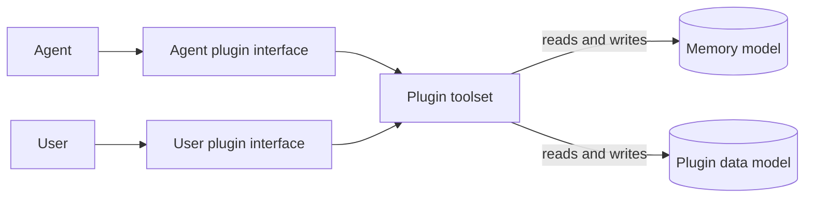
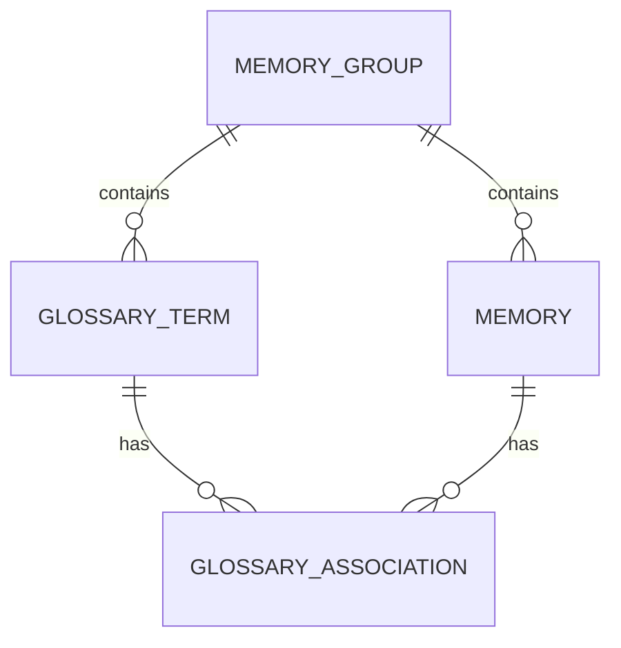

# Memory data model

## `memories`

Memories are grouped into memory groups, which are stored in the `memory_groups` table.

Generally speaking, a request to get relevant memories will occur within some context, which we detail a tuple consisting of the chapter id and memory group id. We hence need to quantify exactly what it means when we say memory A is accessible within a given context.

- `memory_id`
- `memory_group_id`
- `memory_type` - what is this memory describing (e.g. event, relation between terms, etc.)
- `mark` - an optional application-defined category used to narrow retrieval. The database does not restrict its values; the interface creating a memory may do so.
- `memory_observed_in` - which chapter content the memory was recorded on. Purely for tracking purposes.
- `memory_start_num` - the first chapter (inclusive) this memory should be available to access. Cannot be null.
- `memory_end_num` - the last chapter (exclusive) this memory should be available to access. If null, then this memory has no point at which it becomes invalid.
- `supersedes_memory_id` - if memory A corrects/updates information in memory B, then we should have A.supersedes_memory_id = B.memory_id.
- `memory_content` - Self-explanatory.
- `memory_review_status` - Convenience to approve or deny memories.
- `creator_type` - Who created this memory (currently relevant options are USER and AGENT).
- `plugin_name` - Will be explained later.

As you may have guessed, we say a memory is accessible within a context if its memory group id matches the context's memory group id and the context's chapter number lies within the range specified by `memory_start_num` and `memory_end_num`.

## Plugins

Memories are typically not recorded in a vacuum - when recording a memory, there is generally a specific domain associated with that memory. For example, recording a memory could be to remember the definition of a term, something that happened to a character, a significant event in the novel, etc.

Depending on the domain, memories should be recorded at different times. For example, we should record the start of a new arc a lot less often than we should record the actions of our main character. For each of these different possibilities, we should specify rules for when to record such a thing. 

The way we accomplish this is through an auxiliary interface that we call a plugin. Very abstractly, a plugin provides an external data model that is linked by some association to the memories of a given novel, as well as a set of tools to modify memory indirectly through this auxiliary tool and some context for when the use of these tools is appropriate. Interaction with the memory data will then take place through a plugin.

This is quite abstract, so we should give an example of a specific plugin.

## Glossary

Some memories are recorded for the explicit purpose of being associated with a character. This plugin gives us the tools to do so.

### Data model

The glossary plugin introduces two tables. The `glossaries` table stores terms
that appear in the source text:

- `term_id`
- `term`
- `term_kind` - optional semantic classification such as person, place,
  organization, technique, item, concept, title, species, or other. Existing and
  human-created terms may remain uncategorized, while the agent must classify
  every term it creates.
- `memory_group_id`
- `review_status`

A term is unique within its memory group. The same text may still be recorded
in different memory groups, since those groups may serve different languages
or translation workflows.

The `glossary_associations` table links terms to memories:

- `term_id`
- `memory_id`

Together, these columns form the table's primary key. This creates a
many-to-many relationship: one term may accumulate multiple memories over the
course of a novel, and one memory may describe a relationship involving
multiple terms.

### User interface

The glossary plugin should provide two complementary ways to inspect its data.
When a chapter is open, users should be able to see the glossary memories that
are active for that chapter alongside the chapter text. A novel-wide glossary
view should let users search terms and inspect the memories associated with
each term across the novel.

Users should also be able to add or rename terms, change the review status of
terms and memories, edit memory content and marks, change the terms associated with a
memory, expire memories, and delete incorrect data. The interface should retain
the distinction between a term and a memory: approving a term does not
implicitly approve every memory associated with it, or vice versa.

### Agent interface

At the beginning of a chapter, the glossary plugin gives the agent the known
glossary terms that occur in that chapter. Memories are retrieved separately
and only when the agent has identified a concrete piece of information that
may duplicate, continue, or supersede existing context.

The glossary plugin exposes complementary toolsets that can be enabled
independently:

- `glossary_terms` exposes `add_term`, which records and classifies a new
  source-language term.
- `glossary_definitions_read` retrieves definitions, while
  `glossary_definitions_write` creates, supersedes, or expires them.
- `glossary_relations_read` retrieves categorized relations, while
  `glossary_relations_write` creates, supersedes, or expires them.
- `glossary_facts_read` retrieves categorized attributes other than gender,
  while `glossary_facts_write` creates, supersedes, or expires them.
- `glossary_gender_read` retrieves gender-related state, while
  `glossary_gender_write` creates, supersedes, or expires it.
- `glossary_events_read` retrieves events, while `glossary_events_write`
  creates or supersedes them.
- Advanced gender fact, perception, and event toolsets keep body state,
  self-identity, presentation, change rules, observer beliefs, and bounded
  gender-related occurrences separate.

Every write toolset requires its corresponding read toolset. The dependency is
validated when a job is created; selecting a write toolset does not implicitly
add its reader.

Optional guidance toolsets add genre- or subject-specific recording rules
without exposing additional tools:

- `glossary_gender_transformation` requires gender and relation read/write
  toolsets.
- `glossary_cultivation` and `glossary_system` require fact read/write
  toolsets.
- `glossary_artifacts` requires definition read/write toolsets.

Guidance toolsets are disabled unless selected for a job. Their dependencies
are validated when the job is created.

Each retrieval tool returns a page of one memory type. Definition, relation,
and fact retrieval operates on one exact term. Relation and fact retrieval also
requires one literal category, which becomes the retrieval mark; definitions
retrieve only unmarked memories. These tools can filter by a literal,
case-insensitive piece of memory text, and all filters apply before pagination.

The definition, relation, fact, and gender write toolsets each have their own
type-specific expiry tool. This prevents a job configured for one memory type
from expiring a different type.

Fact supersession names the replacement's exact primary term. Normally this is
the original term. When an established alias or name change introduces a new
recurring term, the ended fact remains associated with the old term while its
active replacement is associated with the new term.

Facts and relations receive a separate `mark` chosen from the categories
allowed by their respective toolsets. Gender memories use the `gender` mark.
Definitions remain unmarked. The mark is metadata and is not included in
`memory_content`.

Generic event memories are unmarked. Advanced gender events use namespaced
marks for transformations, body swaps, possessions, and reveals. Advanced
transformation writes retain, per exact subject, the configured union of the
first N occurrences and a FIFO window containing the newest N occurrences.
Older agent-created occurrences are ended rather than deleted, so historical
retrieval remains possible. Superseding corrections remain part of the same
occurrence.

The term itself remains in the source language, while memory content is written
in the language configured by the memory group. The agent processes chapters
in order so memories written for one chapter can become context for later
chapters.
