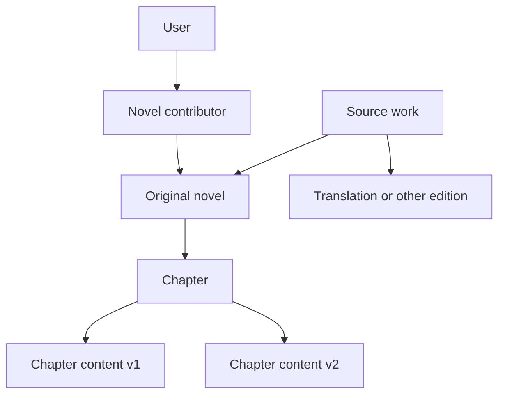

# Novels and chapters

**Last updated:** 2026-07-28

The novels service owns source works, novel editions, chapters, and immutable
chapter-content versions. It provides the structural data used by the reader,
editor, labels service, and autolabel worker.

This document focuses on the domain model. Exact endpoint and schema details
live in [`backend/src/novels/`](../backend/src/novels/) and the generated
OpenAPI schema.

## Data model

### Source works and novels

A **source work** groups novels that represent the same underlying work. For
example, a Chinese source novel and its English translation are separate
novels attached to one source work. This lets each edition have its own
language, metadata, chapters, visibility, and labels while preserving their
conceptual relationship.

A **novel** is one concrete edition. Its type is `original`, `translation`, or
`other`, and it references a seeded two-letter language code. Creating a novel
without choosing an existing source work automatically creates one using the
novel's title.

### Chapters and chapter content

A **chapter** stores stable metadata: its number, title, publication flag, and
parent novel. Chapter numbers are unique within a novel.

The actual text lives in **chapter content** rows. Content is append-only and
versioned independently from chapter metadata:

- a new chapter starts with an empty version 1;
- each text edit reads the latest version and creates the next version;
- an edit based on an older content ID is rejected as stale;
- earlier versions remain addressable.

This model gives labels and background jobs an immutable text identity. They
can refer to a specific revision without silently changing meaning when a
chapter is edited.

Text updates are expressed as ordered insert and delete operations. When a new
content version is created, the labels service ports compatible annotation
data to it. See [labels.md](labels.md) and the
[editor backend documentation](editor/backend.md) for those flows.

## Visibility and contributors

Novel visibility has four levels: private, restricted, unlisted, and public.
Unlisted and public novels can be discovered without contributor access;
private and restricted novels require the appropriate authenticated access.
Chapter publication is checked separately, so a visible novel may still
contain non-public chapters.

Novel contributors have viewer, editor, or owner roles:

- viewers can access contributor-visible data;
- editors can update novel metadata and create or edit chapters;
- owners can additionally perform owner-only actions such as deleting
  chapters;
- administrators bypass normal contributor checks.

The creator of a novel is automatically recorded as its owner. Access rules
are composed into SQLAlchemy statements in the permissions module, including
when another service queries novels or chapter content.

## Imports and bulk creation

The HTTP API supports both individual chapter creation and bulk chapter
uploads. Import parsing is kept separate from the core service so supported
file formats can validate and normalize their input before database writes.

For repeatable test fixtures, the repository also contains a versioned
test-data format under
[`backend/tests/test_data/schema/`](../backend/tests/test_data/schema/). That
format is test infrastructure rather than the public novels API.

## Code guide

- [`backend/src/novels/models.py`](../backend/src/novels/models.py): database
  relationships and constraints
- [`backend/src/novels/service.py`](../backend/src/novels/service.py): domain
  queries, mutations, and content versioning
- [`backend/src/novels/permissions.py`](../backend/src/novels/permissions.py):
  visibility and contributor filters
- [`backend/src/novels/imports.py`](../backend/src/novels/imports.py): bulk
  chapter upload parsing
- [`backend/src/novels/router.py`](../backend/src/novels/router.py): HTTP
  endpoints
