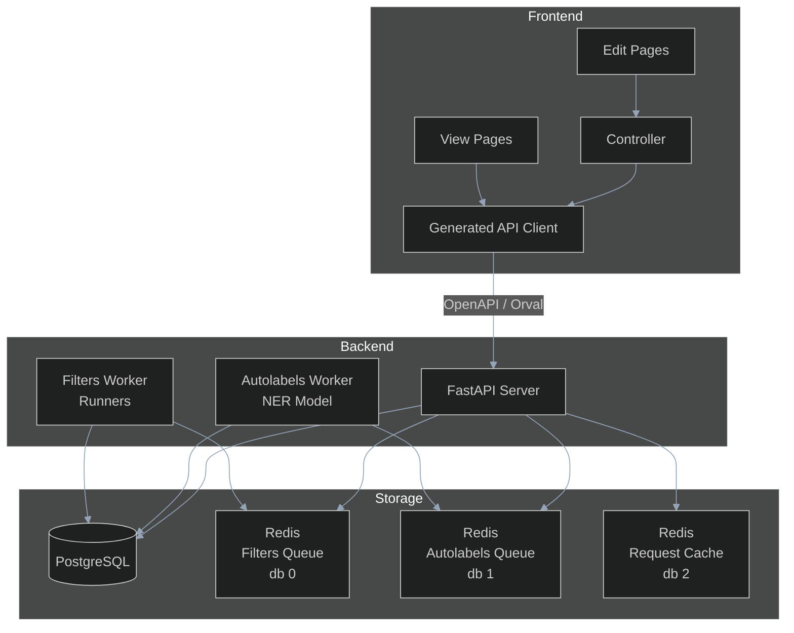

# Project Structure

**Last updated:** 2026-08-04

This project is separated into a frontend and a backend. The backend is stateless and takes all data from either a Postgres database or a Redis cache. The backend can employ workers by sending tasks to the Redis cache, where the workers will pick up. Currently this project uses Celery to perform task queueing, with one Celery application per worker class. See [workers and task queues](#workers-and-task-queues) below.



## Tools/technologies

The backend consists of a FastAPI server instance that connects to a Postgres database using SQLAlchemy and uses Pydantic for data validation. The backend also has worker instances that run longer background jobs. The autolabels worker performs named entity recognition using a pretrained BERT model ([found here](https://huggingface.co/uer/roberta-base-finetuned-cluener2020-chinese)). Since this model is from 2020, we plan to find a newer model, train our own, or explore LLM based solutions sometime in the future. These worker instances, along with the FastAPI server, connect to a Redis instance that serves as a task queue using [Celery](https://docs.celeryq.dev/).

We use [uv](https://docs.astral.sh/uv/) as package manager, [Pyrefly](https://pyrefly.org/) for type checking, and [Ruff](https://docs.astral.sh/ruff/) for linting. We prefer stricter type checking so Pyright with strict type checking would be ideal, but Pyright is much slower than Pyrefly especially on slower hardware.

The frontend is written in Typescript and uses React and ShadCN for the component library. We use pnpm for our package manager.

The frontend and backend are synchronized using FastAPI's OpenAPI generation capabilities and [Orval](https://orval.dev/) to convert OpenAPI schema to typescript.

We use pytest for backend testing, Vitest for frontend unit testing, and Playwright for end-to-end testing.

## Backend structure

Broadly speaking, the backend is divided into services, where each service handles a specific class of problems. The current existing services are as follows:

- Auth: self-explanatory. For now the project mostly just implements security described in the [fastapi docs](https://fastapi.tiangolo.com/tutorial/security/).
- Autolabels: Automatically labeling text. More details in [autolabel docs](autolabels.md)
- Filters: Compile and run typed bulk operations over novel data. The read and write APIs are exposed through the HTTP API and runner jobs are dispatched to the filters worker, but no frontend consumes them yet. See the [filter docs](filters/README.md).
- Editing: Serve initial data required for user editing. Details for what this does can be found in the [editor docs](editor/)
- Labels: Store and serve label data for chapters. Core functionality. Details can be found in [labeling docs](labels.md)
- Novels: Store and serve novels/chapters. Details can be found in [novels docs](novels.md)
- Languages: Store and serve supported languages. Very small service so no docs, refer to [source code](../backend/src/languages/) instead.
- Requests: Specialized service for caching "real-time" operations when editing chapters. Refer to [editor docs](editor/) for details.

The source code for the backend is in [`backend/src`](../backend/src/). Related configuration is in [`backend/pyproject.toml`](../backend/pyproject.toml).

Any given service is found in `backend/src/service_name/`. A service typically consists of some subset of the following:
- `router.py`: APIRouter object with routes attached
- `service.py`: Business logic
- `models.py`: SQLAlchemy models
- `schemas.py`: Pydantic schemas
- `permissions.py`: Permissions handling
- `exceptions.py`: Custom exceptions
- `dependencies.py`: FastAPI dependencies

The exact files a certain service contains varies. At the top level, the backend contains the following files:
- [`main.py`](../backend/src/main.py): Entry point. Includes all routers into one app object. To run, start the `backend` service in [`compose.yaml`](../compose.yaml) or run one of the following commands from [`backend/`](../backend/):
    - `uv run --no-sync uvicorn src.main:app` (for more command line options see [here](https://uvicorn.dev/#command-line-options))
    - `uv run python -m src.main --no-sync` (starts the backend with the configured parameters)
    - Note that the backend requires a working connection to a redis instance or else it will crash on startup. The backend is currently configured to run within the compose network. You can change the configuration in the `.env` file. 
- [`database.py`](../backend/src/database.py): Database connection.
- [`models.py`](../backend/src/models.py): Base SQLAlchemy models.
- [`config.py`](../backend/src/config.py): Global settings, including the database, Redis, auth, and logging configuration.
- [`schemas.py`](../backend/src/schemas.py) Base Pydantic models.

The Redis connection used by the request cache lives in [`requests/redis_conn.py`](../backend/src/requests/redis_conn.py) rather than at the top level.

## Workers and task queues

Background jobs run in separate worker processes rather than in the FastAPI process. Each worker class is its own Celery application with its own broker, so a saturated or crashed worker of one kind cannot stall the other.

| Worker | Celery app | Redis database | Dockerfile target |
| --- | --- | --- | --- |
| Autolabels | [`src/autolabels/celery_app.py`](../backend/src/autolabels/celery_app.py) | `AUTOLABELS_DATABASE` (default 1) | `autolabels-worker` |
| Filters | [`src/filters/celery_app.py`](../backend/src/filters/celery_app.py) | `FILTERS_DATABASE` (default 0) | `filters-worker` |

The editor's request-idempotency cache is a third consumer of the same Redis instance, on `REQUESTS_DATABASE` (default 2). All three settings are defined in [`config.py`](../backend/src/config.py) and none of the Compose files override them, so the defaults apply in every environment. Keeping them distinct is what stops the two queues from consuming each other's tasks.

Both workers load a `celeryconfig` module with the same settings: the `prefork` pool, `worker_concurrency = 2`, and `worker_prefetch_multiplier = 1`. The low prefetch multiplier matters because both workloads are long-running relative to a typical web request, and fair dispatch is worth more here than throughput.

The two worker images differ substantially in size. `autolabels-worker` installs the `worker` dependency group (torch and transformers) and bakes the pinned CLUENER model weights into the image at build time. `filters-worker` needs neither: nothing reachable from its Celery app imports FastAPI or torch, so it installs only the base project dependencies.

### Running a worker

Both workers sit behind the `manual` Compose profile in the development stack, so `docker compose up -d` does not start them:

```bash
docker compose --profile manual up -d autolabels-worker
docker compose --profile manual up -d filters-worker
```

These pull published images. To build from local sources instead, layer in [`compose.local.yaml`](../compose.local.yaml), which overrides each service to build its Dockerfile target:

```bash
docker compose -f compose.yaml -f compose.local.yaml --profile manual up -d --build filters-worker
```

Or run one directly from [`backend/`](../backend/), outside Docker:

```bash
uv run --no-sync celery -A src.autolabels.celery_app worker --loglevel=info
uv run --no-sync celery -A src.filters.celery_app worker --loglevel=info
```

Pushes to `master` publish four production images to GHCR: `noveltl-backend`, `noveltl-autolabels-worker`, `noveltl-filters-worker`, and `noveltl-frontend`. See [onboarding](onboarding.md#production-deployment) for deployment.

## Frontend structure

The frontend is divided into a view side and an edit side. These can be found respectively in [frontend/src/view](../frontend/src/view/) and [frontend/src/edit](../frontend/src/edit/). The view side of the application should be purely for displaying novels for reading and should hence be kept as static as possible. Meanwhile, the edit side should be as dynamic as possible to reduce latency from user actions. Routes to different pages are centralized in [frontend/src/routes.ts](../frontend/src/routes.ts).

The view side of the application is relatively straightforward and can be understood simply by reading the source code. The edit side consists of a navigation page primarily to switch between novels, as well as a [novel editor](../frontend/src/edit/pages/EditNovelPage.tsx). It uses a controller found in [frontend/src/edit/controller](../frontend/src/edit/controller/) to synchronize the backend and frontend state using (some homemade version of) [operational transformations](https://en.wikipedia.org/wiki/Operational_transformation). Rendering is handled by [CodeMirror](https://codemirror.net/), backed by a text/label model found in [frontend/src/edit/lib/text-model/](../frontend/src/edit/lib/text-model/). Real time collaboration is not supported (yet). All corresponding documentation can be found in the [editor docs](editor/).
