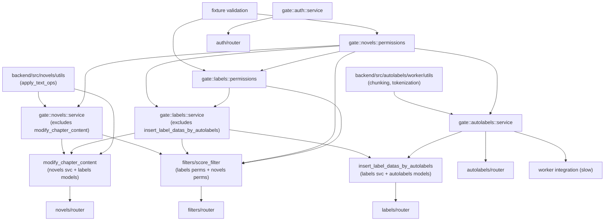

# Testing Architecture

**Last Updated**: April 05, 2026    
**Status**: Draft

This document defines the test layer structure, dependency graph, fixture bundling approach, and naming conventions for the backend test suite. It replaces the ad-hoc test organization with a structured system where test layers form a partial order (poset) enforced by `pytest-dependency` gates.

Read [backend-testing.md](backend-testing.md) first for existing test infrastructure (DB reset, fixtures, markers). This doc builds on top of that foundation.

---

## Table of Contents

1. [Motivation](#motivation)
2. [Layer Definitions](#layer-definitions)
3. [Dependency Graph](#dependency-graph)
4. [Gate Pattern](#gate-pattern)
5. [Naming Conventions](#naming-conventions)
6. [Fixture Bundles](#fixture-bundles)
7. [Test Class Structure](#test-class-structure)
8. [Running Tests](#running-tests)
9. [Migration Plan](#migration-plan)

---

## Motivation

The test suite grew organically and needs a reset. The main issues:

- **Bloated and disorganized**: Test files were added without a clear structure. Some files mix permission tests with service tests with integration tests. Names don't follow a pattern (`test_modify_revision_text_data.py`?). It's hard to know what's tested and what isn't.
- **No explicit ordering**: Tests that depend on upstream services (e.g., labels depending on novels) fail with confusing errors when the upstream is broken, rather than skipping cleanly.
- **Fixture assembly is guesswork**: Creating a `LabelData` requires knowing to also request `sf_user`, `sf_novel`, `sf_chapter`, `sf_chapter_content`, `sf_label_group`, and `sf_contributor`. There's no documentation or type safety for which fixtures compose together.
- **Inconsistent structure**: Some test files use classes (`test_text_ops.py`), others are single giant functions (`test_novels_service_permissions.py`). No convention for either.
- **Silent data issues**: Fixtures that load from disk (`chinese_xianxia_small_test_chapters`) return empty lists when test data files are missing, causing cryptic failures far from the root cause.

The proposed architecture addresses these with layered test gates, fixture bundles, and consistent naming.

## Layer Definitions

Tests are organized into layers. Each layer has a clear purpose and explicit dependencies on lower layers.

### Layer 0a: Pure Utils

Functions with no database dependency. The boundary is: **no `Session` parameter**.

Split by module:
- `novels/utils` — `apply_text_ops`, text manipulation
- `autolabels/worker` — chunking, tokenization
- `labels/utils` — overlap detection (if applicable)
- `filters/utils` — `find_sentence_around`, `copy_label_group`

These tests have no fixtures beyond basic Python objects. They run first and independently.

### Layer 0b: Fixture Validation

Asserts that shared fixtures produce non-empty, internally consistent, and nontrivial data. This includes loaders returning real fixture files, and bundle/scenario fixtures creating linked DB rows rather than placeholder shells.

Runs in parallel with Layer 0a (no dependency between them).

### Layer 1: Permissions

SQL-level permission helpers tested directly by applying them to raw SQLAlchemy statements and verifying which rows are returned for each user role.

Per-module:
- `novels/permissions` — `novel_mod_access_select`, `chapter_mod_access_select`, `chapter_content_mod_access_select`, `chapter_mod_access_insert`, etc.
- `labels/permissions` — `label_group_mod_access_select`, `label_data_mod_access_select`, `label_mod_access_delete`, etc.

Dependencies:
- All depend on Layer 0b (fixtures must work)
- `labels/permissions` may depend on `novels/permissions` since label permission helpers join through novel tables

### Layer 2: Service

Business logic tested by calling service functions directly against `test_db`.

Per-module:
- `novels/service` — chapter CRUD, chapter content operations, contributor management
- `labels/service` — label group CRUD, label data insertion, copy operations
- `autolabels/service` — autolabel insertion, querying
- `auth/service` — authentication (standalone, no cross-module dependencies)

Dependencies:
- Each module depends on its own permissions gate
- Cross-module dependencies where applicable:
  - `labels/service` depends on `novels/permissions` gate (labels FK to chapter content)
  - `autolabels/service` depends on `novels/permissions` gate

### Layer 3: Integration

Cross-service workflows that exercise multiple services together.

- `modify_chapter_content` — touches novels service + labels (label offset adjustment)
- `filters` — score filter pipeline (flag → context → decide → apply), depends on labels + novels
- `insert_label_datas_by_autolabels` — spans autolabels and labels

Dependencies:
- Depends on relevant service gates from Layer 2

### Layer 4: Router / API

HTTP layer tests via `TestClient`. Verify status codes, request/response shapes, auth requirements.

Per-module:
- `novels/router`
- `labels/router`
- `autolabels/router`
- `auth/router`
- `filters/router`

Dependencies:
- Each depends on its module's service gate from Layer 2

### Special: Worker Integration

ARQ worker tests (marked `slow`). Async, test full enqueue → process → verify pipeline.

Dependencies:
- Depends on `autolabels/service` gate

## Dependency Graph

The following graph was derived from actual import analysis of the backend source (April 2026). Edges represent real cross-module dependencies, not assumptions.

**Key findings from import analysis:**
- `backend/src/novels/utils.py` imports `labels.schemas.Label` (Pydantic type for `apply_text_ops`) — pure function but depends on label schema
- `backend/src/labels/utils.py` is NOT pure — imports models, permissions, uses Session. Belongs in service layer testing.
- `backend/src/filters/utils.py` is NOT pure — imports auth.models, uses Session. Belongs in service layer testing.
- `backend/src/autolabels/worker/utils.py` IS pure — only internal imports, no Session
- `backend/src/novels/service.py` imports `labels.models` and `labels.schemas` — specifically in `modify_chapter_content` (integration-level function living in novels service)
- `backend/src/labels/service.py` imports `autolabels.models` and `autolabels.constants` — for `insert_label_datas_by_autolabels`



Arrows point from dependency → dependent. Only router and worker nodes have no outgoing edges (leaf nodes). A test at any layer skips if any of its upstream gates have not passed.

## Gate Pattern

Gates are lightweight test functions that serve as synchronization points between layers. Gates use a **two-tier** structure: each test class has a **class gate** that aggregates its tests, and each file has a **file gate** that aggregates its class gates. This keeps maintenance local — adding a test means updating only its class gate, adding a class means updating only the file gate.

### How it works

Every test class ends with a `test_class_gate` that depends on all tests in the class. The file ends with a `test_gate` that depends on all class gates:

```python
# test_novels_permissions.py

import pytest

pytestmark = pytest.mark.dependency(
    depends=["gate::fixture_validation"],
    scope="session",
)

class TestNovelModAccessSelect:
    @pytest.mark.dependency(name="novels::permissions::guest_sees_public", scope="session")
    def test_guest_sees_public_and_unlisted(self, ...): ...

    @pytest.mark.dependency(name="novels::permissions::contributor_sees_restricted", scope="session")
    def test_contributor_sees_own_restricted(self, ...): ...

    # Class gate — aggregates all tests in this class
    @pytest.mark.dependency(
        name="gate::novels::permissions::novel_mod_access_select",
        depends=[
            "novels::permissions::guest_sees_public",
            "novels::permissions::contributor_sees_restricted",
        ],
        scope="session",
    )
    def test_class_gate(self):
        pass


class TestNovelModAccessUpdate:
    @pytest.mark.dependency(name="novels::permissions::owner_can_update", scope="session")
    def test_owner_can_update(self, ...): ...

    @pytest.mark.dependency(
        name="gate::novels::permissions::novel_mod_access_update",
        depends=["novels::permissions::owner_can_update"],
        scope="session",
    )
    def test_class_gate(self):
        pass


# --- File gate: depends only on class gates ---
@pytest.mark.order("last")
@pytest.mark.dependency(
    name="gate::novels::permissions",
    depends=[
        "gate::novels::permissions::novel_mod_access_select",
        "gate::novels::permissions::novel_mod_access_update",
    ],
    scope="session",
)
def test_gate():
    """All novels permissions tests must pass before downstream layers run."""
    pass
```

Downstream tests depend on the file gate:

```python
# test_novels_service.py

import pytest

pytestmark = pytest.mark.dependency(
    depends=["gate::novels::permissions"],
    scope="session",
)

class TestInsertChapter:
    @pytest.mark.dependency(name="novels::service::insert_chapter", scope="session")
    def test_basic(self, ...): ...
```

### Rules

1. **Scope is always `session`**. Both producer (`name=`) and consumer (`depends=`) must use the same scope. Since gates are cross-file, everything uses `scope="session"`.

2. **File gate names follow `gate::{module}::{layer}`** format (e.g., `gate::novels::permissions`, `gate::labels::service`).

3. **Class gate names follow `gate::{module}::{layer}::{class_description}`** format (e.g., `gate::novels::permissions::novel_mod_access_select`). The class description is lowercase snake_case derived from the class name.

4. **Test names follow `{module}::{layer}::{description}`** format (e.g., `novels::permissions::guest_select`, `labels::service::insert_label_data`).

5. **Only file gates get `@pytest.mark.order("last")`**. Class gates don't need ordering — they naturally run after the tests they depend on.

6. **Class gates take only `self`** — no fixtures, body is just `pass`.

7. **File gates depend on class gates only**. Never list individual test names in the file gate.

8. **Multi-gate dependencies are allowed**. A test can depend on gates from multiple modules:
   ```python
   pytestmark = pytest.mark.dependency(
       depends=["gate::novels::permissions", "gate::labels::permissions"],
       scope="session",
   )
   ```

### Tradeoffs

- **Skip cascades**: If a low-level gate fails, many downstream tests skip. This is intentional — it surfaces the root cause clearly ("1 failed, 80 skipped") but hides which downstream tests would have independently failed. Use `--ignore-unknown-dependency` to run everything regardless (see [Running Tests](#running-tests)).
- **Gate maintenance**: Adding a new test requires updating its class gate. Adding a new class requires updating the file gate. Forgetting either means the gate could pass even if that test fails.
- **Cross-module coupling**: `labels/service` depending on `gate::novels::permissions` means you can't run label tests in isolation without also running novel tests. The `--ignore-unknown-dependency` flag addresses this for local development.

## Naming Conventions

### File naming

```
test_{module}_{layer}.py
```

Examples:
- `test_novels_permissions.py` — novels module, permissions layer
- `test_novels_service.py` — novels module, service layer
- `test_labels_service.py` — labels module, service layer
- `test_novels_router.py` — novels module, router layer
- `test_filters_integration.py` — filters module, integration layer
- `test_novels_utils.py` — novels module, pure utils layer

### Dependency name format

```
{module}::{layer}::{brief_description}
```

For gates:
```
gate::{module}::{layer}
```

Examples:
- `novels::permissions::guest_sees_public` — individual test
- `novels::service::insert_chapter_basic` — individual test
- `gate::novels::permissions` — gate
- `gate::labels::service` — gate

### Test class naming

Classes group tests by function-under-test:

```
Test{FunctionUnderTest}
```

Examples:
- `TestInsertChapter` — tests for `insert_chapter` service function
- `TestNovelModAccessSelect` — tests for `novel_mod_access_select` permission helper
- `TestModifyChapterContent` — tests for `modify_chapter_content` service function

### Test method naming

Methods describe the scenario:

```
test_{scenario}
```

Examples:
- `test_basic` — happy path
- `test_permissions_denied` — user lacks access
- `test_not_found` — resource doesn't exist
- `test_outdated_version` — optimistic concurrency failure

## Fixture Bundles

Bundles should model real database structure closely enough to act as drag-and-drop database replacements in tests.

The key distinction is:
- Bundles represent persisted structure and relationships
- Fixture builders vary scenario shape and role assignments

### Bundle design

The canonical fixture should be a universal scenario bundle containing a coherent DB snapshot:
- users and admins
- source works
- novels
- novel contributors
- chapters
- chapter contents / versions
- label groups
- label contributors
- label datas
- labels

This top-level bundle should preserve one-to-many relationships instead of collapsing them into a single happy-path row per table.

### Universal plus granular bundles

Use one canonical universal bundle as the source of truth, then provide smaller projections for tests that want less surface area.

For example:
- `scenario_bundle` — full DB snapshot
- `novel_bundle` — one novel plus contributors, chapters, and related labeling state
- `chapter_bundle` — one chapter plus all content versions and attached label groups
- `label_group_bundle` — one label group plus contributors and label data versions

Granular bundles should be views into the same graph shape where possible, not independent ad hoc fixture families.

### Access model is part of the bundle

For this codebase, a useful DB replacement must include both resource rows and permission rows. A bundle is incomplete if it contains a novel but not the users and contributor rows needed to explain who can see or modify it.

That means bundles should expose:
- users by role or name
- contributor rows grouped by novel / label group
- convenience lookups for common actors such as owners, editors, viewers, and admins

### Usage in tests

Tests should be able to navigate the bundle the same way the schema is navigated conceptually, for example:

```python
actor = scenario_bundle.users.by_name["alice"]
novel = scenario_bundle.novels[0]
chapter = novel.chapters[0]
latest_content = chapter.contents[-1]
label_group = chapter.label_groups[0]
```

### When to use individual fixtures

Use focused fixtures or scenario builders when a test needs:
- deliberately invalid or partial state
- a very specific edge case that would make the shared bundle noisy
- a tiny unit-level setup where the universal graph would add more ceremony than value

The default should still be to prefer schema-aligned bundles for integration-style tests.

## Test Class Structure

Each test file contains:
1. Imports and `pytestmark` (layer dependencies)
2. Test classes grouped by function-under-test, each ending with a `test_class_gate`
3. File-level gate at the bottom depending on class gates

```python
"""
Tests for novels service layer.
"""
import pytest
from sqlalchemy.orm import Session

from src.auth.models import User
from src.novels import schemas, service

# All tests in this file depend on the novels permissions gate
pytestmark = pytest.mark.dependency(
    depends=["gate::novels::permissions"],
    scope="session",
)


class TestInsertChapter:
    """Tests for service.insert_chapter."""

    @pytest.mark.dependency(name="novels::service::insert_chapter_basic", scope="session")
    def test_basic(self, test_db: Session, novel_bundle: NovelFixtureBundle):
        chapter, cc = service.insert_chapter(
            test_db, novel_bundle.user, novel_bundle.novel.novel_id,
            schemas.CreateChapter(chapter_num=1)
        )
        assert chapter.chapter_num == 1
        assert cc.chapter_content_version == 1

    @pytest.mark.dependency(name="novels::service::insert_chapter_denied", scope="session")
    def test_permissions_denied(self, test_db: Session, novel_bundle: NovelFixtureBundle, other_user: User):
        with pytest.raises(NovelNotFoundException):
            service.insert_chapter(
                test_db, other_user, novel_bundle.novel.novel_id,
                schemas.CreateChapter(chapter_num=1)
            )

    @pytest.mark.dependency(
        name="gate::novels::service::insert_chapter",
        depends=[
            "novels::service::insert_chapter_basic",
            "novels::service::insert_chapter_denied",
        ],
        scope="session",
    )
    def test_class_gate(self):
        pass


class TestQueryChapterById:
    """Tests for service.query_chapter_by_id."""

    @pytest.mark.dependency(name="novels::service::query_chapter_found", scope="session")
    def test_found(self, ...): ...

    @pytest.mark.dependency(name="novels::service::query_chapter_not_found", scope="session")
    def test_not_found(self, ...): ...

    @pytest.mark.dependency(
        name="gate::novels::service::query_chapter_by_id",
        depends=[
            "novels::service::query_chapter_found",
            "novels::service::query_chapter_not_found",
        ],
        scope="session",
    )
    def test_class_gate(self):
        pass


# --- File gate: depends on class gates only ---
@pytest.mark.order("last")
@pytest.mark.dependency(
    name="gate::novels::service",
    depends=[
        "gate::novels::service::insert_chapter",
        "gate::novels::service::query_chapter_by_id",
    ],
    scope="session",
)
def test_gate():
    """All novels service tests must pass before downstream layers run."""
    pass
```

## Running Tests

### Full suite (CI)

```bash
pytest backend/
```

Runs with the full dependency DAG enforced. If a gate fails, all downstream tests skip.

### Isolated module (local dev)

```bash
pytest backend/tests/labels/ --ignore-unknown-dependency
```

The `--ignore-unknown-dependency` flag (built into `pytest-dependency`) treats missing gates as passed, so tests run even without upstream gates. Useful for working on a single module without running the entire suite.

### Including slow tests

```bash
pytest backend/ -m "slow or not slow"
```

## Migration Plan

This is a phased migration from the current test structure. Each phase can be merged independently.

### Phase 1: Naming and reorganization

- Rename test files to `test_{module}_{layer}.py` convention
- Split giant test functions into classes grouped by function-under-test
- No behavioral changes — just restructuring

### Phase 2: Schema-aligned scenario bundles

- Redesign bundle dataclasses around real DB structure and access relationships
- Introduce one universal scenario bundle as the canonical shared fixture
- Add granular bundle projections for novels, chapters, label groups, and label data
- Keep specialized fixtures for intentionally narrow or invalid setups

### Phase 3: Gate infrastructure

- Add `pytest.mark.dependency` with `name=` and `scope="session"` to all tests
- Add gate tests at the bottom of each file
- Add `pytestmark` dependencies to downstream files
- Verify the DAG works: break a low-level test and confirm downstream tests skip

### Phase 4: Fixture validation layer

- Keep explicit fixture validation tests for shared bundles and loaders
- Expand nontriviality assertions beyond non-empty data to cover relationship integrity and useful scenario shape
- Ensure universal bundles validate both resource rows and access-control rows

## Relevant Files

- `backend/tests/conftest.py` — Core fixtures, DataLoader, pytest_plugins registration
- `backend/tests/fixtures/populators/` — Fixture population files
- `backend/tests/fixtures/password_hash.py` — Hash fixtures
- `backend/tests/fixtures/filters.py` — Filter object fixtures
- `backend/pyproject.toml` — Pytest configuration
- `backend/src/novels/utils.py` — Pure utils (apply_text_ops)
- `backend/src/autolabels/utils.py` — AutoLabel utils
- `backend/src/labels/utils.py` — Label utils
- `backend/src/filters/utils.py` — Filter utils (find_sentence_around, copy_label_group)
- `backend/src/auth/utils.py` — Auth utils

## See Also

- [backend-testing.md](backend-testing.md) — Existing test infrastructure, DB reset, fixtures, markers
- [conventions.md](conventions.md) — Code naming conventions
- [architecture.md](architecture.md) — Service architecture and module boundaries
- [permissions.md](permissions.md) — Permission system design
