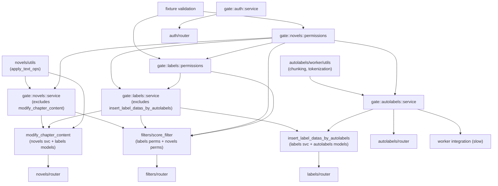

# Testing Architecture

**Last Updated**: April 04, 2026    
**Status**: Draft

This document defines the test layer structure, dependency graph, fixture bundling approach, and naming conventions for the backend test suite. It replaces the ad-hoc test organization with a structured system where test layers form a partial order (poset) enforced by `pytest-dependency` gates.

Read [backend-testing.md](backend-testing.md) first for existing test infrastructure (DB reset, fixtures, markers). This doc builds on top of that foundation.

---

## Table of Contents

1. [Motivation](#motivation)
2. [Layer Definitions](#layer-definitions)
3. [Dependency Graph](#dependency-graph)
4. [Gate Pattern](#gate-pattern)
5. [Naming Conventions](#naming-conventions)
6. [Fixture Bundles](#fixture-bundles)
7. [Test Class Structure](#test-class-structure)
8. [Running Tests](#running-tests)
9. [Migration Plan](#migration-plan)

---

## Motivation

The test suite grew organically and needs a reset. The main issues:

- **Bloated and disorganized**: Test files were added without a clear structure. Some files mix permission tests with service tests with integration tests. Names don't follow a pattern (`test_modify_revision_text_data.py`?). It's hard to know what's tested and what isn't.
- **No explicit ordering**: Tests that depend on upstream services (e.g., labels depending on novels) fail with confusing errors when the upstream is broken, rather than skipping cleanly.
- **Fixture assembly is guesswork**: Creating a `LabelData` requires knowing to also request `sf_user`, `sf_novel`, `sf_chapter`, `sf_chapter_content`, `sf_label_group`, and `sf_contributor`. There's no documentation or type safety for which fixtures compose together.
- **Inconsistent structure**: Some test files use classes (`test_text_ops.py`), others are single giant functions (`test_novels_service_permissions.py`). No convention for either.
- **Silent data issues**: Fixtures that load from disk (`chinese_xianxia_small_test_chapters`) return empty lists when test data files are missing, causing cryptic failures far from the root cause.

The proposed architecture addresses these with layered test gates, fixture bundles, and consistent naming.

## Layer Definitions

Tests are organized into layers. Each layer has a clear purpose and explicit dependencies on lower layers.

### Layer 0a: Pure Utils

Functions with no database dependency. The boundary is: **no `Session` parameter**.

Split by module:
- `novels/utils` — `apply_text_ops`, text manipulation
- `autolabels/worker` — chunking, tokenization
- `labels/utils` — overlap detection (if applicable)
- `filters/utils` — `find_sentence_around`, `copy_label_group`

These tests have no fixtures beyond basic Python objects. They run first and independently.

### Layer 0b: Fixture Validation

Asserts that fixture bundles actually create data. Each populator's nontriviality check lives here — for example, verifying that `chapter_loader` returns non-empty results, or that a fixture bundle successfully creates all its DB objects.

Runs in parallel with Layer 0a (no dependency between them).

### Layer 1: Permissions

SQL-level permission helpers tested directly by applying them to raw SQLAlchemy statements and verifying which rows are returned for each user role.

Per-module:
- `novels/permissions` — `novel_mod_access_select`, `chapter_mod_access_select`, `chapter_content_mod_access_select`, `chapter_mod_access_insert`, etc.
- `labels/permissions` — `label_group_mod_access_select`, `label_data_mod_access_select`, `label_mod_access_delete`, etc.

Dependencies:
- All depend on Layer 0b (fixtures must work)
- `labels/permissions` may depend on `novels/permissions` since label permission helpers join through novel tables

### Layer 2: Service

Business logic tested by calling service functions directly against `test_db`.

Per-module:
- `novels/service` — chapter CRUD, chapter content operations, contributor management
- `labels/service` — label group CRUD, label data insertion, copy operations
- `autolabels/service` — autolabel insertion, querying
- `auth/service` — authentication (standalone, no cross-module dependencies)

Dependencies:
- Each module depends on its own permissions gate
- Cross-module dependencies where applicable:
  - `labels/service` depends on `novels/permissions` gate (labels FK to chapter content)
  - `autolabels/service` depends on `novels/permissions` gate

### Layer 3: Integration

Cross-service workflows that exercise multiple services together.

- `modify_chapter_content` — touches novels service + labels (label offset adjustment)
- `filters` — score filter pipeline (flag → context → decide → apply), depends on labels + novels
- `insert_label_datas_by_autolabels` — spans autolabels and labels

Dependencies:
- Depends on relevant service gates from Layer 2

### Layer 4: Router / API

HTTP layer tests via `TestClient`. Verify status codes, request/response shapes, auth requirements.

Per-module:
- `novels/router`
- `labels/router`
- `autolabels/router`
- `auth/router`
- `filters/router`

Dependencies:
- Each depends on its module's service gate from Layer 2

### Special: Worker Integration

ARQ worker tests (marked `slow`). Async, test full enqueue → process → verify pipeline.

Dependencies:
- Depends on `autolabels/service` gate

## Dependency Graph

The following graph was derived from actual import analysis of the backend source (April 2026). Edges represent real cross-module dependencies, not assumptions.

**Key findings from import analysis:**
- `novels/utils.py` imports `labels.schemas.Label` (Pydantic type for `apply_text_ops`) — pure function but depends on label schema
- `labels/utils.py` is NOT pure — imports models, permissions, uses Session. Belongs in service layer testing.
- `filters/utils.py` is NOT pure — imports auth.models, uses Session. Belongs in service layer testing.
- `autolabels/worker/utils.py` IS pure — only internal imports, no Session
- `novels/service.py` imports `labels.models` and `labels.schemas` — specifically in `modify_chapter_content` (integration-level function living in novels service)
- `labels/service.py` imports `autolabels.models` and `autolabels.constants` — for `insert_label_datas_by_autolabels`



Arrows point from dependency → dependent. Only router and worker nodes have no outgoing edges (leaf nodes). A test at any layer skips if any of its upstream gates have not passed.

## Gate Pattern

Gates are lightweight test functions that serve as synchronization points between layers. A gate test is the **last test in its file** (enforced by `pytest-order`) and depends on all other tests in the same file via `pytest-dependency`.

### How it works

Every test file that needs to act as a dependency for downstream tests includes a gate at the end:

```python
# test_novels_permissions.py

import pytest

# --- All actual test classes above ---

class TestNovelModAccessSelect:
    @pytest.mark.dependency(name="novels::permissions::novel_select", scope="session")
    def test_guest_sees_public_and_unlisted(self, ...): ...

    @pytest.mark.dependency(name="novels::permissions::novel_select_2", scope="session")
    def test_contributor_sees_own_restricted(self, ...): ...

# ... more test classes ...


# --- Gate: must be last ---
@pytest.mark.order("last")
@pytest.mark.dependency(
    name="gate::novels::permissions",
    depends=[
        "novels::permissions::novel_select",
        "novels::permissions::novel_select_2",
        # ... all test names in this file
    ],
    scope="session",
)
def test_gate():
    """Gate for novels permissions layer. All tests above must pass."""
    pass
```

Downstream tests depend on the gate:

```python
# test_novels_service.py

import pytest

pytestmark = pytest.mark.dependency(
    depends=["gate::novels::permissions"],
    scope="session",
)

class TestInsertChapter:
    @pytest.mark.dependency(name="novels::service::insert_chapter", scope="session")
    def test_basic(self, ...): ...
```

### Rules

1. **Scope is always `session`**. Both producer (`name=`) and consumer (`depends=`) must use the same scope. Since gates are cross-file, everything uses `scope="session"`.

2. **Gate names follow `gate::{module}::{layer}`** format (e.g., `gate::novels::permissions`, `gate::labels::service`).

3. **Test names follow `{module}::{layer}::{description}`** format (e.g., `novels::permissions::guest_select`, `labels::service::insert_label_data`).

4. **Gates depend on closing gates only**. A downstream file depends on one or more upstream gates. There are no "opening gates" — the `depends=` on `pytestmark` or individual tests handles the "all of these must pass" semantics.

5. **Multi-gate dependencies are allowed**. A test can depend on gates from multiple modules:
   ```python
   pytestmark = pytest.mark.dependency(
       depends=["gate::novels::permissions", "gate::labels::permissions"],
       scope="session",
   )
   ```

### Tradeoffs

- **Skip cascades**: If a low-level gate fails, many downstream tests skip. This is intentional — it surfaces the root cause clearly ("1 failed, 80 skipped") but hides which downstream tests would have independently failed. Use `--ignore-unknown-dependency` to run everything regardless (see [Running Tests](#running-tests)).
- **Gate maintenance**: Each gate must list all test names in its file. Forgetting to add a new test to the gate's `depends=` means the gate could pass even if that test fails. Consider a conftest hook or naming convention to mitigate this.
- **Cross-module coupling**: `labels/service` depending on `gate::novels::permissions` means you can't run label tests in isolation without also running novel tests. The `--ignore-unknown-dependency` flag addresses this for local development.

## Naming Conventions

### File naming

```
test_{module}_{layer}.py
```

Examples:
- `test_novels_permissions.py` — novels module, permissions layer
- `test_novels_service.py` — novels module, service layer
- `test_labels_service.py` — labels module, service layer
- `test_novels_router.py` — novels module, router layer
- `test_filters_integration.py` — filters module, integration layer
- `test_novels_utils.py` — novels module, pure utils layer

### Dependency name format

```
{module}::{layer}::{brief_description}
```

For gates:
```
gate::{module}::{layer}
```

Examples:
- `novels::permissions::guest_sees_public` — individual test
- `novels::service::insert_chapter_basic` — individual test
- `gate::novels::permissions` — gate
- `gate::labels::service` — gate

### Test class naming

Classes group tests by function-under-test:

```
Test{FunctionUnderTest}
```

Examples:
- `TestInsertChapter` — tests for `insert_chapter` service function
- `TestNovelModAccessSelect` — tests for `novel_mod_access_select` permission helper
- `TestModifyChapterContent` — tests for `modify_chapter_content` service function

### Test method naming

Methods describe the scenario:

```
test_{scenario}
```

Examples:
- `test_basic` — happy path
- `test_permissions_denied` — user lacks access
- `test_not_found` — resource doesn't exist
- `test_outdated_version` — optimistic concurrency failure

## Fixture Bundles

Individual fixtures remain available for tests that need unusual setups. Bundles are a **convenience layer on top** — not a replacement.

### Bundle design

A bundle is a dataclass that aggregates the fixtures needed for a common test scenario:

```python
from dataclasses import dataclass
from src.auth.models import User
from src.novels.models import Chapter, ChapterContent, Novel, NovelContributor, SourceWork


@dataclass
class NovelFixtureBundle:
    """Everything needed to test novel-level operations."""
    user: User
    source_work: SourceWork
    novel: Novel
    contributor: NovelContributor
    chapter: Chapter
    chapter_content: ChapterContent
```

A single fixture returns the bundle:

```python
@pytest.fixture
def novel_bundle(test_db: Session, no_hash: Hash) -> NovelFixtureBundle:
    user = User(user_name="test_user", user_hashed_password=no_hash.hash("pass"), user_type=UserType.USER)
    test_db.add(user)
    test_db.commit()
    # ... create all objects ...
    return NovelFixtureBundle(
        user=user,
        source_work=sw,
        novel=novel,
        contributor=contributor,
        chapter=chapter,
        chapter_content=cc,
    )
```

### Usage in tests

```python
class TestInsertChapter:
    def test_basic(self, test_db: Session, novel_bundle: NovelFixtureBundle):
        chapter, cc = insert_chapter(
            test_db, novel_bundle.user, novel_bundle.novel.novel_id,
            CreateChapter(chapter_num=2)
        )
        assert chapter.chapter_num == 2
```

### Bundle hierarchy

Bundles can compose:

```python
@dataclass
class LabelFixtureBundle:
    """Everything needed to test label operations."""
    novel: NovelFixtureBundle
    label_group: LabelGroup
    label_contributor: LabelContributor
    label_data: LabelData
    labels: list[Label]
```

### When NOT to use bundles

- Tests that need specific visibility levels (private, restricted, unlisted)
- Tests that need multiple users with different roles
- Tests that deliberately create invalid/partial state
- Permission tests that test different user perspectives on the same data

For these cases, use individual fixtures or purpose-built populators.

## Test Class Structure

Each test file contains:
1. Imports and `pytestmark` (layer dependencies)
2. Test classes grouped by function-under-test
3. Gate test at the bottom

```python
"""
Tests for novels service layer.
"""
import pytest
from sqlalchemy.orm import Session

from src.auth.models import User
from src.novels import schemas, service

# All tests in this file depend on the novels permissions gate
pytestmark = pytest.mark.dependency(
    depends=["gate::novels::permissions"],
    scope="session",
)


class TestInsertChapter:
    """Tests for service.insert_chapter."""

    @pytest.mark.dependency(name="novels::service::insert_chapter_basic", scope="session")
    def test_basic(self, test_db: Session, novel_bundle: NovelFixtureBundle):
        chapter, cc = service.insert_chapter(
            test_db, novel_bundle.user, novel_bundle.novel.novel_id,
            schemas.CreateChapter(chapter_num=1)
        )
        assert chapter.chapter_num == 1
        assert cc.chapter_content_version == 1

    @pytest.mark.dependency(name="novels::service::insert_chapter_denied", scope="session")
    def test_permissions_denied(self, test_db: Session, novel_bundle: NovelFixtureBundle, other_user: User):
        with pytest.raises(NovelNotFoundException):
            service.insert_chapter(
                test_db, other_user, novel_bundle.novel.novel_id,
                schemas.CreateChapter(chapter_num=1)
            )


class TestQueryChapterById:
    """Tests for service.query_chapter_by_id."""

    @pytest.mark.dependency(name="novels::service::query_chapter_found", scope="session")
    def test_found(self, ...): ...

    @pytest.mark.dependency(name="novels::service::query_chapter_not_found", scope="session")
    def test_not_found(self, ...): ...


# --- Gate ---
@pytest.mark.order("last")
@pytest.mark.dependency(
    name="gate::novels::service",
    depends=[
        "novels::service::insert_chapter_basic",
        "novels::service::insert_chapter_denied",
        "novels::service::query_chapter_found",
        "novels::service::query_chapter_not_found",
    ],
    scope="session",
)
def test_gate():
    """All novels service tests must pass before downstream layers run."""
    pass
```

## Running Tests

### Full suite (CI)

```bash
pytest backend/
```

Runs with the full dependency DAG enforced. If a gate fails, all downstream tests skip.

### Isolated module (local dev)

```bash
pytest backend/tests/labels/ --ignore-unknown-dependency
```

The `--ignore-unknown-dependency` flag (built into `pytest-dependency`) treats missing gates as passed, so tests run even without upstream gates. Useful for working on a single module without running the entire suite.

### Including slow tests

```bash
pytest backend/ -m "slow or not slow"
```

## Migration Plan

This is a phased migration from the current test structure. Each phase can be merged independently.

### Phase 1: Naming and reorganization

- Rename test files to `test_{module}_{layer}.py` convention
- Split giant test functions into classes grouped by function-under-test
- No behavioral changes — just restructuring

### Phase 2: Fixture bundles

- Define bundle dataclasses in `backend/tests/fixtures/bundles.py`
- Create bundle fixtures in populators
- Migrate tests to use bundles where appropriate (keep individual fixtures available)

### Phase 3: Gate infrastructure

- Add `pytest.mark.dependency` with `name=` and `scope="session"` to all tests
- Add gate tests at the bottom of each file
- Add `pytestmark` dependencies to downstream files
- Verify the DAG works: break a low-level test and confirm downstream tests skip

### Phase 4: Fixture validation layer

- Add nontriviality assertions to all data-loading fixtures
- Create explicit fixture validation tests if needed

## Relevant Files

- `backend/tests/conftest.py` — Core fixtures, DataLoader, pytest_plugins registration
- `backend/tests/fixtures/populators/` — Fixture population files
- `backend/tests/fixtures/password_hash.py` — Hash fixtures
- `backend/tests/fixtures/filters.py` — Filter object fixtures
- `backend/pyproject.toml` — Pytest configuration
- `backend/src/novels/utils.py` — Pure utils (apply_text_ops)
- `backend/src/autolabels/utils.py` — AutoLabel utils
- `backend/src/labels/utils.py` — Label utils
- `backend/src/filters/utils.py` — Filter utils (find_sentence_around, copy_label_group)
- `backend/src/auth/utils.py` — Auth utils

## See Also

- [backend-testing.md](backend-testing.md) — Existing test infrastructure, DB reset, fixtures, markers
- [conventions.md](conventions.md) — Code naming conventions
- [architecture.md](architecture.md) — Service architecture and module boundaries
- [permissions.md](permissions.md) — Permission system design
