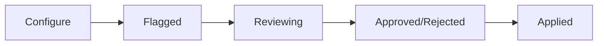

# UI Requirements

**Last Updated**: March 7, 2026  
**Status**: Draft

This document specifies the frontend components for the NovelTL platform, including the chapter viewer, navigation, filters, and glossary management.

**Implementation Status:** Most components described here are **design specifications** for planned features. The current frontend implements basic novel browsing, chapter reading, login, and simple label group management. Components marked with "✅ Implemented" exist in code; all others are planned.

---

## Table of Contents

1. [Overview](#overview)
2. [Core Components](#core-components)
   - [Chapter Viewer](#chapter-viewer)
   - [Chapter Navigator](#chapter-navigator)
   - [Dual Chapter View](#dual-chapter-view)
   - [Filter Workflow Panel](#filter-workflow-panel)
   - [Label Sidebar](#label-sidebar)
   - [Glossary Panel](#glossary-panel)
3. [Component Hierarchy](#component-hierarchy)
4. [Design Patterns](#design-patterns)
5. [Responsive Design](#responsive-design)
6. [Accessibility](#accessibility)
7. [Performance Optimizations](#performance-optimizations)
8. [Future Enhancements](#future-enhancements)

---

## Overview

The frontend is built with React 19 and React Router v7, providing an interactive interface for:
- Viewing and editing novel chapters
- Managing labels (named entities)
- Running automated filters
- Maintaining glossaries and translations

All components emphasize keyboard navigation, tooltips, and responsive design.

## Core Components

### Chapter Viewer

A rich text viewer for displaying novel chapters with inline labels (named entities).

**Display:**

- Renders chapter text with labels highlighted (colorized by entity type)
- Tooltip on hover: Shows entity group, confidence score, label ID
- Visual indicators: Highlight current selection, dim low-confidence labels
- Text formatting: Preserve whitespace, paragraph breaks
- Label styling: Underline or border (configurable)

**Interactions:**

- **Click label** → Open label editor (entity group dropdown, delete button)
- **Double-click text** → Create new label (select start/end positions)
- **Hover** → Subtle highlight + tooltip with metadata

**Scroll sync:**

- Exposes `scrollTo(position)` method for external control
- Emits `onScroll(position)` event for synchronization with other viewers

**Props:**

```typescript
interface ChapterViewerProps {
  revisionId: number;
  labels: Label[];
  editable: boolean;
  onLabelClick: (labelId: number) => void;
  onLabelCreate: (start: number, end: number, word: string) => void;
  onScroll?: (position: number) => void;
  highlightLabelIds?: number[];  // External highlighting
}
```

**State:**

- Current scroll position
- Selected label ID
- Hover state

### Chapter Navigator

A sidebar or panel for navigating between chapters.

**Display:**

- Dropdown list of chapters (by chapter number)
- Previous/Next navigation buttons
- Default behavior: Load primary revision, or most recent revision if primary doesn't exist
- Status indicators:
  - Has labels (icon or badge)
  - Has revisions (icon or badge)
  - Translation status (Draft/Review/Complete)
- Current chapter highlighted

**Interactions:**

- Click chapter → Load chapter in viewer
- Previous/Next buttons → Navigate sequentially

**Props:**

```typescript
interface ChapterNavigatorProps {
  novelId: number;
  currentChapter: number;
  onChapterChange: (chapterNum: number) => void;
}
```

**API Integration:**

```http
GET /novels/{novel_id}/chapters
Response: [
  {
    "chapter_num": 1,
    "has_labels": true,
    "has_revisions": true,
    "status": "complete"
  },
  ...
]
```

### Dual Chapter View

A layout component that renders two ChapterViewer instances side by side for comparison.

**Use Cases:**

- Compare different revisions
- View original vs. translation
- Review before/after filter application

**Properties:**

```typescript
interface DualChapterViewProps {
  leftRevisionId: number;
  rightRevisionId: number;
  syncScroll: boolean;
}
```

**Sync Scrolling Approach:**

Three options considered:

1. **Option A: Pixel-based**
   - Scroll positions match exactly (same pixel offset)
   - Simplest to implement
   - Breaks alignment if content lengths differ

2. **Option B: Paragraph-based** ✅ **Recommended**
   - Align by paragraph index (e.g., paragraph 5 on left aligns with paragraph 5 on right)
   - Handles different-length translations gracefully
   - Good balance of precision and complexity

3. **Option C: Label-based**
   - Align by label positions (precise semantic alignment)
   - Complex implementation (requires label position mapping)
   - Best for label-heavy workflows

**Current Status:** Option A implemented for simplicity. Option B is the sweet spot for future enhancement.

**Implementation Notes:**

```typescript
// Option A (current)
const handleScroll = (position: number) => {
  if (syncScroll) {
    leftViewerRef.current.scrollTo(position);
    rightViewerRef.current.scrollTo(position);
  }
};

// Option B (future)
const handleScroll = (paragraphIndex: number) => {
  if (syncScroll) {
    leftViewerRef.current.scrollToParagraph(paragraphIndex);
    rightViewerRef.current.scrollToParagraph(paragraphIndex);
  }
};
```

### Filter Workflow Panel

The UI for running and reviewing filter operations (see [filter-system.md](filter-system.md)).

**Display:**

- **Filter selector** - Dropdown or list of available filters
- **Options form** - Dynamic form rendered from filter schema
- **Groups table** - Shows:
  - Instance value (e.g., "他")
  - Count (e.g., 200 occurrences)
  - Sample decisions (preview of flagged instances)
  - Status (Pending/Approved/Rejected)
- **Expandable rows** - Click to show sampled contexts and decisions

**Interactions:**

1. **Select filter** → Fetch filter schema
2. **Configure options** → Fill form (min_score, chapter range, etc.)
3. **Run filter** → POST to `/filters/{name}/flag-instances`
4. **Preview instances** → Populate groups table
5. **Expand group** → POST to `/filters/{name}/get-contexts` for sampled instances
6. **Approve/reject group** → Mark entire group or individual instances
7. **Apply filter** → POST to `/filters/{name}/apply` with approved instances

**Workflow States:**



**Props:**

```typescript
interface FilterWorkflowPanelProps {
  novelId: number;
  labelGroupId: number;
  onFilterApplied: () => void;
}
```

**State Management:**

```typescript
interface FilterWorkflowState {
  selectedFilter: string | null;
  flagOptions: Record<string, any>;
  flaggedInstances: Instance[];
  instanceGroups: Map<string, Instance[]>;  // Group by instance value
  groupDecisions: Map<string, 'approved' | 'rejected' | 'pending'>;
  expandedGroups: Set<string>;
}
```

**Sampling Strategy:**

Instead of showing all 10,000 flagged labels:

1. **Group by instance value** - e.g., all instances of "他"
2. **Sample O(log n)** - Show ~10 representative examples per group
3. **User reviews samples** - If all samples look correct, assume group is correct
4. **Apply to all** - Filter entire group, not just samples

**Example Group Display:**

```
+---------------------------------------------------------------+
| 他 (200 occurrences)                       [Approve] [Reject] |
+---------------------------------------------------------------+
| Sample 1: "他说：「你好吗？」"                            ❌  |
| Sample 2: "他们一起去了北京。"                           ❌  |
| Sample 3: "他是一个好人。"                               ❌  |
| ... [Show 7 more samples]                                     |
+---------------------------------------------------------------+
```

### Label Sidebar

A panel showing all labels in the current chapter (or across chapters).

**Display:**

- List of labels with columns:
  - Word (e.g., "张三")
  - Entity group (e.g., "PER")
  - Position (character offset)
  - Score (confidence 0-1)
- Sortable by: Position, entity group, score, word
- Filters:
  - Entity group (multi-select dropdown)
  - Search by word (text input)
  - Score threshold (slider)

**Interactions:**

- **Click label** → Scroll chapter viewer to that position
- **Edit inline** → Editable fields for word, entity group
- **Delete** → Delete button with confirmation

**Props:**

```typescript
interface LabelSidebarProps {
  revisionId: number;
  labels: Label[];
  onLabelClick: (labelId: number) => void;
  onLabelUpdate: (labelId: number, updates: Partial<Label>) => void;
  onLabelDelete: (labelId: number) => void;
}
```

**State:**

```typescript
interface LabelSidebarState {
  sortBy: 'position' | 'entity_group' | 'score' | 'word';
  sortOrder: 'asc' | 'desc';
  filterEntityGroups: string[];
  searchQuery: string;
  minScore: number;
}
```

**Example Display:**

```
╔════════════════════════════════════════════════════════╗
║ Labels (42)                         [+ New Label]      ║
╠════════════════════════════════════════════════════════╣
║ Filter: [PER] [LOC] [ORG]   Search: [____]            ║
║ Sort by: [Position ▼]                                 ║
╠════════════════════════════════════════════════════════╣
║ 张三        PER    0.95   Ch1:150    [Edit] [Delete]  ║
║ 北京        LOC    0.87   Ch1:230    [Edit] [Delete]  ║
║ 清华大学    ORG    0.92   Ch1:310    [Edit] [Delete]  ║
║ ...                                                    ║
╚════════════════════════════════════════════════════════╝
```

### Glossary Panel

Aggregated view of unique terms across the novel (step 3 in the translation pipeline).

**Purpose:** 

Manage translations for recurring terms, ensuring consistency across chapters.

**Display:**

- Table with columns:
  - Term (original text)
  - Entity group (PER/LOC/ORG/etc.)
  - Occurrence count (across all chapters)
  - Translation (user-provided)
  - Status (Unreviewed/Reviewed/Verified)
- Sortable by all columns
- Filterable by:
  - Entity group
  - Status
  - Has translation (yes/no)

**Interactions:**

- **Click term** → Show all contexts (across chapters) in modal
- **Click context** → Jump to that position in chapter viewer
- **Edit translation** → Inline editable field
- **Mark as reviewed/verified** → Status toggle

**Props:**

```typescript
interface GlossaryPanelProps {
  novelId: number;
  glossaryEntries: GlossaryEntry[];
  onEntryUpdate: (entryId: number, updates: Partial<GlossaryEntry>) => void;
  onShowContexts: (entryId: number) => void;
}

interface GlossaryEntry {
  entry_id: number;
  term: string;
  entity_group: string;
  occurrence_count: number;
  translation: string | null;
  status: 'unreviewed' | 'reviewed' | 'verified';
}
```

**Context Modal:**

When user clicks a term, show modal with all occurrences:

```
╔════════════════════════════════════════════════════════╗
║ Contexts for "张三" (PER)                    [Close]   ║
╠════════════════════════════════════════════════════════╣
║ Ch1: "张三说：「你好吗？」"               [Jump]      ║
║ Ch1: "张三和李四一起去了北京。"           [Jump]      ║
║ Ch2: "「你就是张三吗？」王五问道。"       [Jump]      ║
║ Ch5: "张三的父亲是一位著名的学者。"       [Jump]      ║
║ ... (38 more)                                          ║
╚════════════════════════════════════════════════════════╝
```

**API Integration:**

```http
GET /novels/{novel_id}/glossary
Response: [
  {
    "entry_id": 1,
    "term": "张三",
    "entity_group": "PER",
    "occurrence_count": 42,
    "translation": "Zhang San",
    "status": "reviewed"
  },
  ...
]

GET /novels/{novel_id}/glossary/{entry_id}/contexts
Response: [
  {
    "chapter_num": 1,
    "revision_id": 123,
    "context": "张三说：「你好吗？」",
    "position": 150
  },
  ...
]
```

## Component Hierarchy

```
App
├── Navbar
│   ├── User menu
│   └── Novel selector
├── NovelWorkspace
│   ├── ChapterNavigator (sidebar)
│   ├── MainContent
│   │   ├── ChapterViewer (single)
│   │   └── DualChapterView (comparison mode)
│   └── RightPanel (tabbed)
│       ├── LabelSidebar
│       ├── FilterWorkflowPanel
│       └── GlossaryPanel
└── Footer
```

## Design Patterns

### Dynamic Form Rendering

Filters expose Pydantic schemas via API. Frontend renders forms dynamically:

```typescript
interface FieldElement {
  field_name: string;
  field_type: 'int' | 'float' | 'string' | 'bool' | 'Label' | FieldElement[];
  is_list: boolean;
  options: FieldOptions;
}

interface FieldOptions {
  default?: any;
  min?: number;
  max?: number;
  enum?: string[];
  description?: string;
  // ... see filter-system.md for full list
}
```

**Rendering Logic:**

```typescript
function renderField(field: FieldElement): JSX.Element {
  switch (field.field_type) {
    case 'int':
    case 'float':
      return <NumberInput {...field} />;
    case 'string':
      return field.options.enum 
        ? <Dropdown options={field.options.enum} {...field} />
        : <TextInput {...field} />;
    case 'bool':
      return <Checkbox {...field} />;
    case 'Label':
      return <LabelPicker {...field} />;
    default:
      if (Array.isArray(field.field_type)) {
        return <NestedForm fields={field.field_type} {...field} />;
      }
  }
}
```

### State Management

Use React Context for:
- Current novel ID
- Current chapter/revision
- User permissions
- Language data (✅ implemented as `LanguageContext`)

Use local state for:
- Component-specific UI (expanded/collapsed, sort order)
- Form inputs

**Planned:** React Query (TanStack Query) for API data fetching, caching, and invalidation. Not yet installed.

### Keyboard Shortcuts

| Shortcut | Action |
|----------|--------|
| `Ctrl+N` | Next chapter |
| `Ctrl+P` | Previous chapter |
| `Ctrl+F` | Focus search |
| `Ctrl+L` | Focus label sidebar |
| `Ctrl+G` | Focus glossary |
| `Escape` | Close modal/cancel edit |
| `Ctrl+S` | Save (if editing) |

## Responsive Design

**Breakpoints:**

- Desktop (>1200px): Full layout with sidebar and right panel
- Tablet (768-1200px): Collapsible panels
- Mobile (<768px): Stacked layout, panels as bottom sheets

**Mobile Adaptations:**

- ChapterNavigator → Bottom sheet or dropdown
- LabelSidebar → Swipe-up panel
- GlossaryPanel → Full-screen modal
- DualChapterView → Tabs instead of side-by-side

## Accessibility

- Semantic HTML (`<nav>`, `<main>`, `<aside>`)
- ARIA labels for interactive elements
- Keyboard navigation (tab order, focus management)
- Color contrast (WCAG AA minimum)
- Screen reader support (announce filter status, label changes)

## Performance Optimizations

### Virtualization

For long lists (labels, glossary entries):
- Use react-window or react-virtualized
- Render only visible items
- Lazy load contexts on demand

### Code Splitting

- Lazy load filters (only load ScoreFilter when selected)
- Lazy load modals (context viewer, glossary details)
- Route-based splitting (chapter view vs. novel list)

### Debouncing

- Search inputs (300ms debounce)
- Scroll sync (throttle to 60fps)

## Future Enhancements

### Collaboration Features

- Real-time label updates (WebSocket)
- User cursors in chapter viewer
- Comment threads on labels

### Advanced Filtering

- Visual filter builder (drag-and-drop)
- Filter templates (save common configurations)
- Batch operations (apply filter to multiple chapters)

### Translation Assistance

- Inline LLM suggestions
- Translation memory integration
- Glossary auto-population from translations

### Undo/Redo

- Track filter applications as operations
- Rollback to previous state
- Operation history panel

## Relevant Files

**Existing:**
- `frontend/src/components/layout/` - Layout and Navbar components
- `frontend/src/components/novels/` - Novel-related components (NovelCard, NovelHeader, CreateNovelForm, RevisionContentDisplay, RevisionSidebar)
- `frontend/src/components/common/Modal.tsx` - Modal component
- `frontend/src/pages/` - ChapterReaderPage, DashboardPage, EditNovelsPage, LoginPage, NovelDetailsPage, NovelsPage
- `frontend/src/api/` - API client functions (auth, novels, labels, languages)
- `frontend/src/types/` - TypeScript type definitions (label, language, novel)
- `frontend/src/contexts/` - LanguageContext and LanguageProvider
- `frontend/src/routes.ts` - Route definitions

**Planned (not yet implemented):**
- `frontend/src/components/ChapterViewer.tsx` - Chapter viewer component
- `frontend/src/components/ChapterNavigator.tsx` - Chapter navigation
- `frontend/src/components/FilterWorkflowPanel.tsx` - Filter UI
- `frontend/src/components/LabelSidebar.tsx` - Label management
- `frontend/src/components/GlossaryPanel.tsx` - Glossary interface
- `frontend/src/pages/NovelWorkspace.tsx` - Main workspace layout

## See Also

- [filter-system.md](filter-system.md) - Filter abstraction and API design
- [architecture.md](architecture.md) - Overall system architecture
- [api-design.md](api-design.md) - REST API specifications
- [database-schema.md](database-schema.md) - Database models
